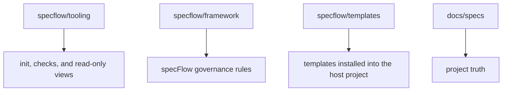

<p>
  
  
  
  
</p>

**English** · [简体中文](./README.zh-CN.md)

[Add To Your Repository](#add-to-your-repository) · [Quick Start](#quick-start) · [Core Concepts](#core-concepts) · [Commands](#commands) · [Workflow](#workflow) · [Reader](#reader)

---

`specFlow` makes AI-assisted development feel like engineering again: instead of letting requirements dissolve into chat logs, code diffs, and personal memory, it gives every governed unit a current truth and a clear path from idea to verified change. Humans and agents can move fast together while the repository still knows what is true, what is changing, and what is ready to ship.

## What Problem It Solves

> When code moves fast, truth must not drift.

Many AI-assisted projects eventually hit the same problems:

- the real requirement only exists in chat history
- different people or agents understand the same feature differently
- code changed, but nobody can clearly state the official behavior now
- work moves quickly in the moment, but later it is hard to know whether the change actually closed

`specFlow` handles that directly:

- put behavior truth in repository files
- make the agent read current truth before moving work forward
- keep design, implementation, verification, and promotion aligned to the same truth

The point is not to add documentation burden.
The point is to stop the project from depending only on chat memory and reverse-engineering intent from code.

## How specFlow Is Used

`specFlow` is a governance layer that works together with an agentic runtime, such as Claude Code or OpenCode.

In plain language:

- `specFlow` defines how work should move inside the repository
- the runtime reads those rules through automatic hook injection and performs file edits, code changes, and verification
- humans state the goal, confirm important boundaries, and accept or redirect the result

Your project's `specflow/framework/concepts.md` is automatically injected into the agent's context at session startup via platform hooks (Claude Code, OpenCode). The agent always knows the framework rules without needing to read an entry file.

You will need to learn a few core concepts and the basic workflow. Once those are clear, you can drive most work with a few triggers (`spec_validate`, `spec_verify`, `spec_promote`). Natural language is the safety net.

## Add To Your Repository

For most teams, the simplest first-time setup is to run the installer from your project root:

```bash
curl -fsSL https://raw.githubusercontent.com/Bingordinary/SpecFlow/main/tooling/scripts/install.sh | bash
```

Windows PowerShell:

```powershell
irm https://raw.githubusercontent.com/Bingordinary/SpecFlow/main/tooling/scripts/install.ps1 | iex
```

The installer does:

1. clone this repository into `./specflow`
2. add `specflow/` to `.gitignore`
3. install the current platform's `specflowctl`, `specflow-reader`, and `SHA256SUMS`
4. run `specflowctl init` (installs framework files and platform hooks)

After this, platform hooks will automatically inject specFlow rules into your agent's context on session start. No entry file maintenance is needed.

Manual setup:

1. clone this repository into a directory named `specflow`: `git clone https://github.com/Bingordinary/SpecFlow.git specflow`
2. add `specflow/` to `.gitignore` if desired
3. run `specflowctl init` from your project root

After setup, your project should contain paths such as:

- `specflow/framework/`
- `specflow/templates/`
- `specflow/tooling/`

## Prepare Local Binaries

`specflow/tooling/bin/` is not committed to git.
If you used the installer, this step is already complete.
After manual setup, or when refreshing an existing local `specflow/` checkout, run:

```bash
specflow/tooling/scripts/pull_with_release.sh
```

Windows PowerShell:

```powershell
.\specflow\tooling\scripts\pull_with_release.ps1
```

The script runs a fast-forward pull for `specflow/`, computes the current tooling fingerprint, and installs the current platform's `specflowctl`, `specflow-reader`, and `SHA256SUMS` when needed.

## Quick Start

After `init`, the framework is ready. Start your agent in the project root — platform hooks automatically load specFlow rules.

The workflow is:

```
specflowctl next --unit <name>      →  discover unit files
edit candidate spec + code          →  no gate before this step
spec_validate {unit}                →  read-only subagent checks spec quality
spec_verify {unit}                  →  read-only subagent checks implementation
spec_promote {unit}                 →  runs validate then verify, then promotes to stable
```

Example session:

```
You: Let's add a rate limiter to auth.
Agent: I don't see a candidate spec for this. Let me understand the design...
  [creates docs/specs/units/candidate/c_unit_auth_rate_limit.md]
  [implements code]
  Ready to promote to stable?
You: Run validate first.
Agent: [runs read-only subagent with validate checklist]
  Validate passed.
  Ready to verify?
You: Yes.
Agent: [runs read-only subagent with verify checklist]
  Verify passed.
  Ready to promote?
You: Go ahead.
Agent: [runs specflowctl promote...]
  Promoted to stable.
```

## Core Concepts

**File existence is state.** No state machine, no status table, no lifecycle phases. A candidate spec exists = being edited. No candidate spec = not being edited.

| Directory | Meaning |
|-----------|---------|
| `docs/specs/units/stable/` | Accepted, promoted design truth |
| `docs/specs/units/candidate/` | Design currently being edited |
| `docs/specs/rules/stable/` | Accepted shared rules |
| `docs/specs/rules/candidate/` | Rules being edited |

`promote` is the only gate. It copies candidate files to stable — everything else is done by the agent directly.

**unit** — one independently governable engineering responsibility. A unit owns its own behavior truth (Spec), implementation, and verification.

**rule** — formally reusable truth shared across objects. A global rule (`g_`) applies repository-wide. A bound rule (`b_`) applies only to units that reference it through `rule_refs`.

## Commands

### Tool Commands (specflowctl)

| Command | What it does |
|---------|-------------|
| `specflowctl next --unit <name>` | Discover unit files, specs, rules, and dependencies |
| `specflowctl promote --unit <name>` | Validate format + copy candidate→stable (only gate) |
| `specflowctl init` | Install framework files and platform hooks |
| `specflowctl doctor` | Diagnose project setup |
| `specflowctl migrate` | Update hook files and check tooling version |
| `specflowctl rule *` | Rule governance |
| `specflowctl validate` | Validate file write permissions |

### Agent Triggers (said to the agent)

| Trigger | What agent does |
|---------|-----------------|
| `spec_validate {unit}` | Open read-only subagent with validate checklist. Checks spec quality. |
| `spec_verify {unit}` | Open read-only subagent with verify checklist. Checks implementation. |
| `spec_promote {unit}` | Runs validate then verify. If both pass, calls `specflowctl promote`. |
| `spec_flow_migrate` | Runs migration tooling then checks project document format. |

The agent also proactively suggests these at natural transition points: "Shall I run validate?" / "Shall I run verify?" / "Ready to promote?"

## Workflow

### Your Role

1. **Maintain spec documents** — write and update behavior truth in `docs/specs/units/`. These are the source of truth.
2. **Confirm actions** — when the agent asks "Shall I run validate/verify/promote?", confirm or decline with a simple response.
3. **Judge acceptance** — confirm candidate truth is correct before promotion.

### The Agent's Role

1. **Read** — `specflowctl next --unit <name>` to discover unit files
2. **Edit and implement** — update candidate spec and code. No gate before this step.
3. **Validate** — when you say `spec_validate {unit}` or confirm the agent's suggestion, opens a read-only subagent with a structured checklist (frontmatter, acceptance items, reference integrity, cross-unit consistency). Reports PASS/FAIL per check.
4. **Verify** — when you say `spec_verify {unit}` or confirm, opens a read-only subagent with a verify checklist (per-item implementation check, scope check, code quality). Reports PASS/FAIL per item.
5. **Promote** — when you say `spec_promote {unit}` or confirm, runs validate then verify, then calls `specflowctl promote --unit {name}`. Only promote writes files.

### When to Use Natural Language

Natural language is the fallback. Use it when you are unsure which trigger to use, the request spans multiple units, or you want the agent to explore before deciding.

Describe your goal in plain language. The agent reads repository truth and proposes the next action.

## Reader

`specflow-reader` is a read-only local view for inspecting project state. Start it from the repo root:

```bash
<specflow-reader-binary> --repo-root . --addr 127.0.0.1:17863
```

Reader answers: which unit and rule objects exist, which have accepted truth, and how Specs connect. See [tooling/README.md](./tooling/README.md) for details.

## When It May Be Too Heavy

specFlow may not be the right fit if: the project is very small, the team does not want formal behavior truth in files, or you do not need humans and AI agents to follow the same long-term collaboration model.

## Maintenance

After updating `specflow/`, update hooks and check project document format:

- If hooks are working: tell your agent `spec_flow_migrate`
- If hooks are not yet installed: tell your agent "Read `framework/operations/migration.md` and follow the procedure"

The migration procedure updates hook files, checks the binary version, and verifies project document format.

For framework governance: `spec_flow_review` (scoped by default), `spec_flow_review:full` (deep audit), and `spec_flow_design_review` (design quality review). Enter these through natural language.

### Project Structure


