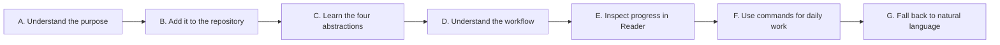
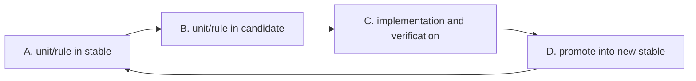
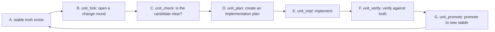
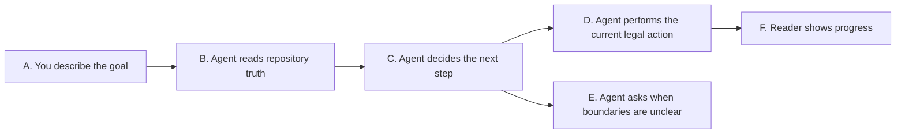
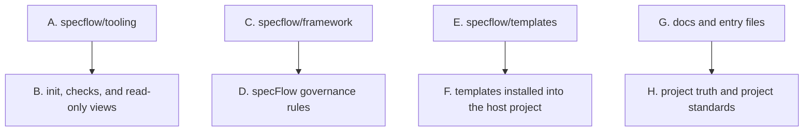

<p>
  
  
  
  
</p>

**English** · [简体中文](./README.zh-CN.md)

[Add To Your Repository](#add-to-your-repository) · [Quick Start](#quick-start) · [Core Concepts](#core-concepts) · [Development Workflow](#development-workflow) · [Reader Progress View](#reader-progress-view) · [Standard Commands](#standard-commands) · [Natural-Language Guidance](#natural-language-guidance) · [Advanced Usage](#advanced-usage)

---

`specFlow` makes AI-assisted development feel like engineering again: instead of letting requirements dissolve into chat logs, code diffs, and personal memory, it gives every governed unit a current truth, a next truth, and a clear path from idea to verified change. Humans and agents can move fast together while the repository still knows what is true, what is changing, and what is ready to ship.

It is not a fixed business template, and it does not force every team to write the same documents.
It is an engineering collaboration skeleton: requirements enter repository truth first, then planning, implementation, verification, and promotion follow that truth.

## What Problem It Solves

> When code moves fast, truth must not drift.

Many AI-assisted projects eventually hit the same problems:

- the real requirement only exists in chat history
- different people or agents understand the same feature differently
- code changed, but nobody can clearly state the official behavior now
- work moves quickly in the moment, but later it is hard to know whether the change actually closed

`specFlow` handles that directly:

- put behavior truth in repository files
- make the agent read current truth before moving work forward
- keep design, planning, implementation, verification, and promotion aligned to the same truth

The point is not to add documentation burden.
The point is to stop the project from depending only on chat memory and reverse-engineering intent from code.

## How specFlow Is Used

> Runtime-driven. Spec-first. Humans own goal judgment.

`specFlow` is not a standalone runtime.

It is a governance layer that works together with an agentic runtime, such as:

- `Codex`
- `Gemini CLI`
- `Claude Code`

In plain language:

- `specFlow` defines how work should move inside the repository
- the runtime reads those rules and performs file edits, code changes, and verification
- humans state the goal, confirm important boundaries, and accept or redirect the result

You will need to learn a few core concepts and the basic development workflow.
Once those are clear, you can drive most work with standard commands.
Natural language is the safety net: when you are unsure which step to take, describe your goal in plain language and the agent will route it.

## Start Here

If you are new to `specFlow`, understand it in this order:

1. first understand why it exists: requirements and behavior truth should live in the repository
2. then complete the smallest installation path: copy `specflow/` into your project and run `init`
3. learn the three core abstractions: `unit`, `rule`, and `repository_mapping`
4. understand the development workflow: the `stable` → `candidate` → verify → promote loop, and the standard command chain
5. use Reader to inspect progress and object relationships
6. use standard commands for daily work
7. fall back to natural language when the next step is unclear

The first four steps are essential before you start. The rest becomes natural with practice.



How to read this:

- `A. Understand the purpose` means knowing why repository truth matters
- `C. Learn the four abstractions` is the minimum conceptual vocabulary
- `D. Understand the workflow` means knowing the lifecycle and the standard command chain
- `F. Use commands for daily work` is the normal daily entry
- `G. Fall back to natural language` is the safety net when you are unsure

## Add To Your Repository

For most teams, the simplest setup is:

1. from your project root, clone this repository into a directory named `specflow`
2. make sure the final path is `./specflow`
3. add `specflow/` to `.gitignore` if your project should not commit the framework files
4. run `init` from your project root

The lowercase directory name matters.
The published repository is named `SpecFlow`, so a plain `git clone https://github.com/Bingordinary/SpecFlow.git` creates `./SpecFlow`.
The installed framework directory must instead be `./specflow`, because the documents and tools use paths such as `specflow/tooling/bin/` and `specflow/framework/`.

You can either clone directly into the correct directory name, or clone first and then rename `SpecFlow` to `specflow`.

After setup, your project should contain paths such as:

- `specflow/framework/`
- `specflow/templates/`
- `specflow/tooling/`

Shell example:

```bash
git clone https://github.com/Bingordinary/SpecFlow.git specflow
printf "\nspecflow/\n" >> .gitignore
```

If you already cloned without a target directory:

```bash
mv SpecFlow specflow
printf "\nspecflow/\n" >> .gitignore
```

Windows PowerShell example:

```powershell
git clone https://github.com/Bingordinary/SpecFlow.git specflow
Add-Content .gitignore "specflow/"
```

If you already cloned without a target directory:

```powershell
Rename-Item .\SpecFlow specflow
Add-Content .gitignore "specflow/"
```

If you ignore `specflow/`, each workspace must prepare it locally before using `specFlow`.
If you want every clone of your project to include the exact same `specFlow` framework files, commit `specflow/` instead of ignoring it.

If you need a long-term upstream sync workflow, treat that as a separate maintenance concern.
See [tooling/README.md](./tooling/README.md) for tooling details.

## Prepare Local Binaries

`specflow/tooling/bin/` is not committed to git.
Before running `init`, download the platform-matching binaries from the Release that matches your installed tooling source fingerprint.
The Release is tied to the tooling input fingerprint, not to every `specflow` source commit.

For Linux amd64:

```bash
mkdir -p specflow/tooling/bin
tag="specflow-tooling-$(specflow/tooling/scripts/tooling_fingerprint.sh --short)"
base="https://github.com/Bingordinary/SpecFlow/releases/download/${tag}"
curl -fL -o specflow/tooling/bin/specflowctl-linux-amd64 "${base}/specflowctl-linux-amd64"
curl -fL -o specflow/tooling/bin/specflow-reader-linux-amd64 "${base}/specflow-reader-linux-amd64"
curl -fL -o specflow/tooling/bin/SHA256SUMS "${base}/SHA256SUMS"
chmod +x specflow/tooling/bin/specflowctl-linux-amd64 specflow/tooling/bin/specflow-reader-linux-amd64
(cd specflow/tooling/bin && sha256sum -c SHA256SUMS --ignore-missing)
```

These commands replace existing files under `specflow/tooling/bin/`.
That directory is only a local cache, so replacing those files is the normal update path.

For Windows amd64 PowerShell:

```powershell
$tag = "specflow-tooling-" + (& .\specflow\tooling\scripts\tooling_fingerprint.ps1 -Short)
$base = "https://github.com/Bingordinary/SpecFlow/releases/download/$tag"
New-Item -ItemType Directory -Force specflow/tooling/bin | Out-Null
Invoke-WebRequest "$base/specflowctl-windows-amd64.exe" -OutFile "specflow/tooling/bin/specflowctl-windows-amd64.exe"
Invoke-WebRequest "$base/specflow-reader-windows-amd64.exe" -OutFile "specflow/tooling/bin/specflow-reader-windows-amd64.exe"
Invoke-WebRequest "$base/SHA256SUMS" -OutFile "specflow/tooling/bin/SHA256SUMS"
```

Other supported suffixes are `darwin-amd64`, `darwin-arm64`, `linux-amd64`, `linux-arm64`, `windows-amd64.exe`, and `windows-arm64.exe`.

## Quick Start

After `specflow/` is in your repository, run this from the repository root:

```bash
<specflow-binary> init
```

In this document, `<specflow-binary>` means the platform-matching `specflowctl` executable under `specflow/tooling/bin/`.
That directory is a local cache.
Download the matching binary from the GitHub Release for the installed tooling fingerprint, or build it locally from source when developing the tooling.
See [tooling/README.md](./tooling/README.md) for exact filenames.

`init` installs the basic structure:

- `AGENTS.md`, `GEMINI.md`, and `CLAUDE.md`
- `docs/specs/`
- other workflow support files

After this step, read [Core Concepts](#core-concepts) and [Development Workflow](#development-workflow) before starting daily work.

For daily work, use standard commands:

```text
unit_new:search
unit_check:auth
unit_fork:payment
unit_verify:checkout
```

When unsure, fall back to natural language:

```text
I want to add rate limiting to auth, but I am not sure what should move first. Read current project truth and tell me the next step.
The checkout refund behavior changed. Update truth first, then implement it.
This rule will be reused by multiple modules. Help me decide where it belongs.
```

The agent reads the installed entry files and current repository truth, then decides which command to enter, whether to write Spec truth, check a boundary, or ask a required clarification.

## Core Concepts

`specFlow` has only three formal abstractions. Everything else is built from these.

### The Three Abstractions

`unit` is one independently describable, implementable, and verifiable engineering responsibility.
It is the only standard lifecycle object. A unit owns its own behavior truth, implementation planning, implementation work, and verification. A unit can describe a local capability or a complete user-result chain.
It does not automatically equal a directory, package, or service.

`rule` is one formally reusable rule shared across objects.
It comes in two scopes: global (`g_`) rules apply repository-wide; bound (`b_`) rules apply only to the units that explicitly reference them through `rule_refs`.
A rule is not a command target — users enter rule work through natural language, and the agent routes to the correct internal rule-governance flow.

`repository_mapping` is the repository structure truth file (`docs/specs/repository_mapping.md`).
It records which formal objects exist, which paths belong to which objects, and how ownership boundaries are decided.
It is not a command target and does not use the `stable`/`candidate` layer model.

### Layers: stable and candidate

`stable` and `candidate` are not standalone concepts. They are the two layers a `unit` or `rule` can be in.

`stable` is the currently accepted truth. If the project officially accepts a behavior, the matching `stable` file says so.

`candidate` is the next truth being prepared. New requirements, behavior changes, and boundary changes enter `candidate` first, then become `stable` after acceptance.

### State Index

`_status.md` is the state index (`docs/specs/_status.md`).
It records each `unit` object's current layer and next legal command. It does not contain behavior rules.

### The Smallest Model



The key points:

- `A. stable` is the behavior already accepted now
- `B. candidate` is the behavior being changed in this round
- `C. implementation and verification` must follow the candidate
- `D. promote into new stable` means the round has been accepted

## Development Workflow

This is the main loop you will use for daily work. Understanding it is essential before you start.

### The Lifecycle

A governed object moves through a fixed sequence of stages. Each stage has one standard command.

For a `unit`, the full chain is:

```text
unit_init → unit_stable_verify → unit_fork → unit_new → unit_check → unit_plan → unit_impl → unit_verify → unit_promote
```

In practice, the common loop is shorter:



How to read this:

- `A. stable truth exists` means the unit already has accepted behavior truth on disk
- `B. unit_fork` opens a new candidate round from the current stable
- `C. unit_check` confirms the candidate truth is clear enough to plan from
- `D. unit_plan` turns truth into an executable implementation plan
- `E. unit_impl` implements according to the plan
- `F. unit_verify` verifies the implementation against candidate truth
- `G. unit_promote` promotes the accepted candidate into new stable truth

For a brand-new unit that has never had stable truth, the chain starts at `unit_new` instead of `unit_fork`.

### Standard Commands At a Glance

| Situation | Command |
| --- | --- |
| Existing capability entering governance for the first time | `unit_init:{unit}` |
| Brand-new capability entering governance | `unit_new:{unit}` |
| Accepted capability opening a new change round | `unit_fork:{unit}` |
| Check whether candidate truth is clear enough | `unit_check:{unit}` |
| Create an implementation plan from truth | `unit_plan:{unit}` |
| Implement according to the plan | `unit_impl:{unit}` |
| Verify implementation against truth | `unit_verify:{unit}` |
| Promote candidate to new stable | `unit_promote:{unit}` |
| Check whether implementation still matches stable truth | `unit_stable_verify:{unit}` |

### Your Role

As a user, your main responsibilities are:

1. **Maintain spec documents** — write and update the behavior truth in `docs/specs/units/`. These are the source of truth that commands consume.
2. **Drive the lifecycle** — issue the right command at the right stage. Use `_status.md` and Reader to know the current stage and next legal command.
3. **Judge acceptance** — confirm that candidate truth is correct before promotion, and that verification results match your expectations.

The agent handles the mechanical work of each command: reading truth, validating gates, producing plans, writing code, and running verification.

### When to Use Natural Language Instead

Natural language is the fallback. Use it when:

- you are unsure which command is the right next step
- the request spans multiple objects and the order matters
- you are dealing with cross-unit rules and the ownership is unclear
- you want the agent to read current truth and tell you the next step

## Natural-Language Guidance

Natural-language guidance is the safety net — not the primary daily entry.

When you know which command to use, use it directly. Natural language is for moments when the next step is unclear: you describe your goal in plain language, and the agent reads current repository truth to decide the smallest legal next action.

Routing means deciding the next step that is legal now: write Spec truth, check the current design, create a plan, implement, verify, or ask you because a boundary is unclear.



How to read this:

- `A. You describe the goal` is your ordinary-language request
- `B. Agent reads repository truth` means the agent checks current Specs, state, and repository structure
- `C. Agent decides the next step` selects the smallest legal current action
- `E. Agent asks when boundaries are unclear` prevents the agent from guessing business ownership
- `F. Reader shows progress` lets you inspect the project state visually

### How To Ask Clearly

Natural language does not mean every short sentence is enough.
The request is easier to route when it says three things:

- what result you want
- what this round includes and excludes
- what would prove the work is complete

You can say:

```text
I want to add refund status tracking to checkout.
This round only covers refund state transitions. Do not change payment gateway integration.
Completion means users can see refund pending, refund succeeded, and refund failed.
If the boundary is unclear, ask me first instead of guessing.
```

Or shorter:

```text
Change search ranking so relevance comes before updated time. Update truth first, then implement.
```

If you do not know where to start, say that directly:

```text
I want to change the login security policy, but I am not sure what should move first. Read current project truth and tell me the next step.
```

### Common Entry Examples

New capability:

```text
Add a search capability. Write the first behavior truth before implementation.
```

Evolve existing capability:

```text
Update search so typo correction runs before ranking.
```

Check whether implementation still aligns:

```text
Check whether search still matches the accepted truth.
```

Reuse one rule across multiple objects:

```text
This error-code rule will be used by auth and checkout. Decide whether it should stay in one unit or become rule truth.
```

Review the governance mechanism itself:

```text
Check whether the current specFlow rules leave the agent unclear about the next step anywhere.
```

## Reader Progress View

`specflow-reader` is a read-only local view.
It helps you inspect current project state; it does not edit files and does not advance lifecycle state.

Start it with:

```bash
<specflow-reader-binary> --repo-root . --addr 127.0.0.1:17863
```

`<specflow-reader-binary>` means the platform-matching `specflow-reader` executable under `specflow/tooling/bin/`.
That binary is downloaded from the GitHub Release for the installed tooling fingerprint, or built locally during tooling development.
It starts the local server directly; there is no `serve` subcommand.

If your current working directory is the repository root, keep `--repo-root .`.
If you first `cd specflow/tooling/bin` and then run the reader binary from that directory, `--repo-root` can be omitted because the default repository root is `../../..` from the current working directory:

```bash
cd specflow/tooling/bin
./specflow-reader-linux-amd64 --addr 127.0.0.1:17863
```

Reader answers questions like:

- which `unit` and `rule` objects exist now
- which objects already have accepted truth and which are preparing next truth
- what each object's next step is
- how Spec documents, rules, and implementation paths connect
- which source file produced a displayed state or relationship

The reader refresh button requests a new snapshot from disk immediately.
Open pages also poll the local reader server on a fixed interval.
The reader does not rely on filesystem watch events.

The four common views are:

- `Spec View`: candidate Specs that still need confirmation and stable Specs that are already accepted
- `Status`: object layer and next step
- `Project Structure`: path ownership and implementation locations
- `SpecFlow`: relationships among Specs, rules, stable g_ rules, and support files

Important boundaries:

- Reader only reads repository truth
- Reader does not decide which governance flow a request should enter
- Reader does not write page conclusions back into project files
- if files are missing or malformed, Reader should report diagnostics instead of repairing them silently

The usual workflow is:

1. ask the agent to move work forward in natural language
2. the agent reads or updates repository truth
3. open Reader to inspect object state, next step, and related files
4. if the state is unexpected, ask the agent to explain or correct it

## Standard Commands

In daily work, you will mostly use the standard `unit` commands shown in [Development Workflow](#development-workflow).

The command form is `{command}:{unit}`. For example: `unit_check:payment`.

### Choosing the Right Entry Point

| Situation | Action |
| --- | --- |
| New, unfamiliar, or structurally changed repository | update `docs/specs/repository_mapping.md` |
| Existing capability entering governance for the first time | `unit_init:{unit}` |
| Brand-new capability entering governance | `unit_new:{unit}` |
| Accepted capability opening a new change round | `unit_fork:{unit}` |
| Check whether implementation still matches accepted truth | `unit_stable_verify:{unit}` |
| Existing project files need to match newer `specFlow` framework rules | `spec_flow_migrate` |

Once a unit enters the candidate chain, follow the standard order:

```text
unit_check → unit_plan → unit_impl → unit_verify → unit_promote
```

### When Natural Language Is the Better Choice

Use natural language instead of a direct command when:

- you are unsure which command is the right next step
- the agent's route from a previous command does not match your expectation
- you are debugging one object's governance state
- the work spans multiple objects and the order of operations matters
- you are dealing with cross-unit rules

## When Work Goes Beyond One Unit

Most truth should start inside the current `unit`.
Do not extract a `rule` only because something might be reused later.

Use this rough judgment:

- one capability's own behavior: put it in that `unit` Spec
- detailed evidence, protocol expansion, or history for one capability: put it in that `unit` appendix
- formally reused by multiple objects: extract into a `rule` (either global `g_` or bound `b_`)
- repository-wide defaults, prohibitions, or global exceptions: consider a global `g_` rule

If you are unsure, fall back to natural language:

```text
This rule may be reused by multiple modules. Decide whether it should stay in the current unit or become a rule.
```

The agent should read current repository truth before deciding.
If the boundary is unclear, it should ask instead of guessing.

## Advanced Usage

Read this section after the basics are clear.
It explains how the system is maintained and extended.

### Project Structure

At a high level, a repository with `specFlow` has four kinds of content:



How to read this:

- `A. specflow/tooling` owns `init`, `doctor`, `upgrade`, and Reader
- `C. specflow/framework` is the specFlow rule baseline
- `E. specflow/templates` contains files installed into the host project
- `G. docs and entry files` is where your project expresses truth, standards, and collaboration entry instructions

### What You Usually Edit

Most teams usually edit:

- `docs/specs/**`
- `docs/project_standards/**`
- the project-owned parts of `AGENTS.md`, `GEMINI.md`, and `CLAUDE.md`

Only edit these when you are intentionally changing `specFlow` itself:

- `specflow/framework/**`
- `specflow/templates/**`
- `specflow/tooling/**`
- `specflow/README*.md`

### Project Standards

`specFlow` allows a project to add its own standards on top of the framework baseline.

Those standards usually live in:

- `docs/project_standards/`
- `docs/project_standards/_registry.md`

The important rule:

- a standard file does not become active just because it exists
- it becomes active only after it is registered in `_registry.md`

In normal use, you do not need to build these files manually from nothing.
You can ask the agent to create or update them from your project rules.

### Maintenance Tooling

The tooling layer performs deterministic maintenance actions.
Common commands are:

- `init`
- `doctor`
- `upgrade`

Reader also lives in the tooling layer, but it is read-only.
See [tooling/README.md](./tooling/README.md) for the full tooling surface.

### Update Notice

After you pull or otherwise update `specflow/`, refresh local binaries only when the installed tooling source fingerprint needs a different Release binary.

The fingerprint is computed from tooling inputs in the source tree, so this check does not depend on an existing `specflowctl` binary:

```bash
specflow/tooling/scripts/tooling_fingerprint.sh --short
```

If `specflow/tooling/bin/` is missing, or if an existing binary reports that it is stale, rerun the download block in [Prepare Local Binaries](#prepare-local-binaries).
The download block overwrites the local cache files.
Running it after every pull is safe, but it is only necessary when the tooling fingerprint changed or the binaries are missing.

After the local binaries are current, ask the agent to run:

```bash
spec_flow_migrate
```

`spec_flow_migrate` updates the project instance to match the current `specFlow` framework contracts.
It scans project-side truth, state, process files, and managed entry blocks; applies only mechanically clear file-shape updates; and invalidates old process state when that state can no longer be trusted under the new rules.

It is an agent-facing `specFlow` entry, not a `specflowctl migrate` binary subcommand.
It must not change business truth or implementation code.

### Advanced Flows

Beyond unit commands, `specFlow` has governance-oriented flows.

The most common ones are:

- `spec_flow_review`
- `spec_flow_design_review`
- `spec_flow_migrate`
- rule governance (entered through natural language)

Use `spec_flow_review` and `spec_flow_design_review` when reviewing the governance system itself, not when simply moving one business capability forward.
Use `spec_flow_migrate` after updating `specflow/`; see [Update Notice](#update-notice).
For rule work — extracting, binding, restructuring, or checking the impact of cross-unit rules — describe the intent in natural language and the agent will route through the rule-governance branch.

### Reading The Full Baseline

If you want to deeply understand or redesign the system, read in this order:

1. `framework/natural_language_routing.md`
2. `framework/spec_policy.md`
3. `framework/command_policy.md`
4. `framework/rule_new.md`, `framework/rule_extract.md`, `framework/rule_bind.md`, `framework/rule_topology.md`, `framework/rule_sync.md`, `framework/rule_escape.md`
5. `framework/spec_flow_review.md`
6. `framework/spec_flow_migrate.md`
7. `framework/commands/`
8. the installed project-side `docs/` files

## File Ownership

`specFlow` has two ownership modes:

- `framework`
  - `specFlow` manages the file structure
  - `upgrade` may refresh it
- `project`
  - after initialization, this belongs to your project
  - `upgrade` should not overwrite existing project files directly

Entry files such as `AGENTS.md`, `GEMINI.md`, and `CLAUDE.md` use a managed block model.
That means `specFlow` owns its block, while your project can keep long-term instructions outside that block.

## When It May Be Too Heavy

`specFlow` may be too much if:

- the project is very small
- the team does not want formal behavior truth in files
- you do not need `stable` and `candidate` layers
- you do not need humans and AI agents to follow the same long-term collaboration model

If you only want an agent to make a few temporary code edits, `specFlow` may not be the shortest path.
If you want a project to be maintained by multiple people and multiple agents over time, it starts to pay off.
