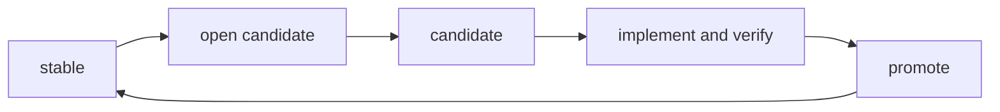
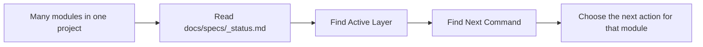
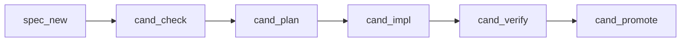
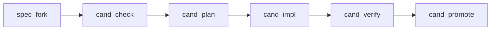
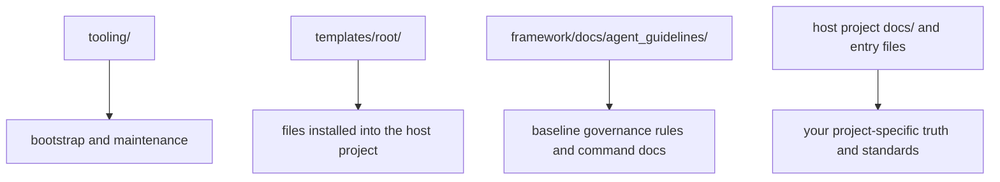

# specFlow

`specFlow` is a spec-driven development paradigm for teams that build with both humans and AI.

Short version:

Write the behavior down first. Change the code after. Verify before promotion.

You can understand it in one sentence:

`specFlow` helps a project write behavior into files first, then let humans and AI change code around those files in a controlled way.

This repository is not trying to force every project into one fixed shape.
It gives you a usable starting point, and expects you to change the project-side rules to fit your own domain.

## What Problem It Solves

Many AI-assisted projects eventually hit the same problems:

- the real requirement only exists in chat history
- different people understand the same feature differently
- code changed, but nobody can clearly say whether behavior is still correct
- each person or agent uses a different working style, so the process becomes hard to trust

`specFlow` solves that by making one thing explicit:

- the behavior source of truth should live in files

Then it adds a small command set around that truth, so design, planning, implementation, verification, and promotion do not drift apart.

## Start Here

If you are new, do not try to understand the whole system first.

Read in this order:

1. `Quick Start`
2. `The Core Model`
3. `The 3-Minute Flow`
4. `The First Commands`
5. `Command Order And Project State`

That is enough to start using `specFlow`.

If later you want to understand how to customize the rules or use the deeper governance features, jump to `Advanced Usage`.

## Quick Start

Put `specflow/` into your repository, then run this from the repository root:

```bash
./specflow/tooling/init.sh
```

Windows PowerShell:

```powershell
.\specflow\tooling\init.ps1
```

This installs the basic structure you need:

- `AGENTS.md`, `GEMINI.md`, `CLAUDE.md`
- `docs/specs/`
- `.githooks/pre-commit`
- supporting files used by the workflow

That is the whole initialization step.

One clarification:

- `init` will create the hook file under `.githooks/pre-commit`
- but Git will not automatically start using that folder unless `core.hooksPath` points to `.githooks`

If you want Git to actually use the installed hook, run:

```bash
git config core.hooksPath .githooks
```

After initialization, a beginner can start directly with the basic command flow below.

## The Core Model

There are only two core states a beginner needs first:

- `stable`: the behavior that the project currently treats as true
- `candidate`: the next version of behavior that is being prepared



How to read this:

- `stable` is the currently accepted version.
- `candidate` is the version you are currently working on.
- when the candidate is ready and verified, it is promoted and becomes the new stable version.

## The 3-Minute Flow

Suppose you want to add a new module called `module_search`.

The shortest beginner path looks like this:

1. run `spec_new:module_search`
2. write the candidate Spec for `module_search`
3. run `cand_check:module_search`
4. run `cand_plan:module_search`
5. run `cand_impl:module_search`
6. run `cand_verify:module_search`
7. run `cand_promote:module_search`

What this means in plain language:

- first define the behavior you want
- then make sure the definition is clear enough
- then plan the work
- then write the code
- then check whether the code matches the definition
- then promote that definition into the current accepted version

If instead `module_search` already exists and you want to change it, the path usually starts with `spec_fork:module_search` instead of `spec_new:module_search`.

## The First Commands

For a beginner, `specFlow` is easiest to understand like this:

- you write or update a Spec
- you choose a command based on what you want to do next
- the command tells the agent what kind of action you are taking

You do not need to memorize the entire governance system at the beginning.
You mainly need to know what each command is for.

## How A Command Is Named

Most `specFlow` commands look like this:

```text
prefix_action:{module}
```

Example:

```text
cand_plan:module_search
```

This command has two parts:

- `cand_plan`
  - the action name
- `module_search`
  - the module this action is targeting

You can read it as:

- run the `cand_plan` action for `module_search`

### What The Prefixes Mean

The important prefixes are:

- `spec`
  - this is about opening, creating, or switching the Spec version you want to work on
- `cand`
  - this is about working inside the `candidate` version
- `stable`
  - this is about checking or operating against the currently effective `stable` version

Shortest examples:

- `spec_new`
  - create the first candidate Spec for a new module
- `spec_fork`
  - open a new candidate from the current stable Spec
- `cand_impl`
  - implement against the current candidate Spec
- `stable_verify`
  - verify whether current code still matches stable

### What The Action Words Mean

After the prefix, the action word tells you what kind of step you are doing:

- `new`
  - create from zero
- `fork`
  - open the next version from an existing stable version
- `check`
  - decide whether the current candidate is clear enough
- `plan`
  - write the implementation plan
- `impl`
  - implement
- `verify`
  - verify
- `promote`
  - make the candidate become the new stable version

So:

- `spec_new` means "create a new Spec version from zero"
- `cand_verify` means "verify the implementation against the candidate"
- `stable_verify` means "verify the implementation against stable"

## Commands You Need First

You do not need every command on day one.
Start with these:

- `spec_init:{module}`
  - create the first `stable` Spec for an existing historical module
- `spec_new:{module}`
  - create the first `candidate` Spec for a brand-new module
- `spec_fork:{module}`
  - open a new `candidate` from an existing `stable`
- `cand_check:{module}`
  - check whether the current candidate is clear enough to drive work
- `cand_plan:{module}`
  - make the implementation plan from the candidate
- `cand_impl:{module}`
  - implement against the candidate
- `cand_verify:{module}`
  - verify whether implementation matches the candidate
- `cand_promote:{module}`
  - promote the candidate into the new `stable`
- `stable_verify:{module}`
  - verify whether current code still matches `stable`

## Should I Use `spec_new` Or `spec_fork`?

Use this quick rule:

- use `spec_new:{module}` when this module does not have a real governed version yet
- use `spec_fork:{module}` when this module already has a `stable` version and you want to change it

Shortest comparison:

| You are trying to do | Use this command |
| --- | --- |
| Start governance for a brand-new module | `spec_new:{module}` |
| Make a next version from an existing stable module | `spec_fork:{module}` |

If you only remember one sentence, remember this:

- `spec_new` starts from zero
- `spec_fork` starts from the current stable truth

## Command Order And Project State

If you only want the shortest mental model, remember these two common paths.

Important:

- this is the common order, not a rule saying every module in the whole project must always be processed in one single global sequence
- when a project has many modules, the real current state should be checked in `docs/specs/_status.md`
- `_status.md` is maintained by the `specFlow` command flow as the project state index
- in normal use, you read `_status.md` to know what is going on; you do not use it as a scratchpad for manual edits

In plain language:

- the diagrams below help you understand the normal path for one module
- `_status.md` tells you the real current position of all modules in the project



How to read this:

- if you are only thinking about one module, the command-order diagrams below are enough
- if you are dealing with many modules, `_status.md` is the first place to look
- the key fields are `Active Layer` and `Next Command`

### Path 1: A Brand-New Module



Plain explanation:

- create the new candidate
- make sure it is clear enough
- write the plan
- implement
- verify
- promote

### Path 2: An Existing Stable Module Needs Change



Plain explanation:

- copy the current stable into a new candidate
- make the candidate clear enough
- plan
- implement
- verify
- promote

### One Important Clarification

At the learning stage, you can treat these commands as a toolbox:

- first understand what each command is for
- then choose the command that matches your current job

But if you want the built-in governance to stay closed and trustworthy, the full workflow does assume command prerequisites and normal ordering.
So the beginner-friendly reading method is "learn the commands first", not "the rules do not exist".

## What specFlow Actually Is

`specFlow` is not mainly a code framework.
It is a change-governance paradigm.

That means it gives you:

- a way to store behavior truth in files
- a way to separate current truth from next truth
- a way to move work with explicit commands
- a way to verify before calling something done

## Advanced Usage

Once basic usage makes sense, this is the section that helps you understand the whole system and DIY it for your own project.

The advanced part is about four things:

- understanding the document structure
- knowing which files you should customize
- knowing which advanced flows exist beyond the standard module commands
- knowing how to call those flows directly when intent recognition is not enough

### The Project Structure

The easiest way to understand the repository is to split it into four layers:



How to read this:

- `tooling/` is how you install, check, and upgrade the paradigm
- `templates/root/` is the bootstrap material copied into the target repository
- `framework/docs/agent_guidelines/` is the baseline rule system of `specFlow` itself
- the installed project-side files under `docs/` and the entry files are where your project expresses its own truth and standards

### What Lives Where

Use this short map:

- `specflow/tooling/`
  - install, doctor, upgrade, and sync scripts
- `specflow/templates/root/`
  - template files that are copied into the host repository root
- `specflow/framework/docs/agent_guidelines/`
  - the rule system of the paradigm itself
- `docs/specs/`
  - your project's formal Specs and process-state files
- `docs/project_standards/`
  - your project's local standards that tighten or clarify the baseline
- `AGENTS.md`, `GEMINI.md`, `CLAUDE.md`
  - entry files for different executors, with a `specFlow` managed block plus your project-owned area

### How To Customize The Rules

The safe beginner rule is:

- change project-owned files first
- change framework files only when you intentionally want to evolve the paradigm itself

Most teams will mainly customize:

- `docs/specs/**`
  - the actual module truth of the project
- `docs/project_standards/**`
  - project-specific standards
- the project-owned parts of `AGENTS.md`, `GEMINI.md`, and `CLAUDE.md`
  - project-specific executor instructions

Most teams should usually not change `framework/docs/agent_guidelines/**` unless they are deliberately changing the specFlow mechanism itself.

In plain language:

- if you want to adapt `specFlow` to your project, edit the installed project-side files
- if you want to redesign how `specFlow` itself works, edit the framework rules

### What You Normally Keep

Most projects should keep these core mechanics:

- Specs as source of truth
- `stable` and `candidate` layering
- command-based progression
- verification before promotion
- `_status.md` as the state index
- clear ownership between framework-managed files and project-owned files

### Maintenance Tools

The tooling scripts below are useful, but they are not the first commands a beginner needs to learn.

- `doctor`
  - checks whether the installed `specFlow` structure is healthy
  - use it when you suspect the local setup is broken, missing files, or out of sync
- `upgrade`
  - refreshes framework-managed files and managed blocks
  - use it when you intentionally want to bring the installed project onto a newer `specFlow` baseline

Shell examples:

- `./specflow/tooling/doctor.sh`
- `./specflow/tooling/upgrade.sh`

Windows PowerShell:

- `.\specflow\tooling\doctor.ps1`
- `.\specflow\tooling\upgrade.ps1`

### Advanced Flows You Should Know Exist

Besides the standard module commands, `specFlow` also has advanced flows.

These are important because they help you inspect or evolve the system itself, not just move one module forward.

#### `spec_flow_review`

Use `spec_flow_review` when you want to review the governance system itself.

Plain meaning:

- review whether the `specFlow` rules are still self-consistent
- review whether rule changes introduced conflicts, ambiguity, or side effects

This is not for reviewing one business module.
It is for reviewing the mechanism.

#### `shared_extract_review`

Use `shared_extract_review` when you think some content may need to become shared truth across modules.

Plain meaning:

- decide whether something should stay inside one module
- or be extracted into a shared appendix because multiple modules now depend on the same formal truth

This is not a normal `{command}:{module}` command.
It is a boundary-review flow.

### Internal Flows That Exist But Are Not Normal User Entry Points

There are also internal or non-primary flows such as:

- `shared_flow_reconcile`
- `project_standard_create`

You should know they exist, because they are part of the full mechanism.
But they are not the normal first things users should call directly.

In plain language:

- `spec_flow_review` and `shared_extract_review` are advanced user-facing flows
- some other flows exist mainly to keep the mechanism closed behind the scenes

### How To Invoke Advanced Flows

There are two normal ways to invoke an advanced flow.

1. express the intent in plain language
2. say the exact flow name directly

Examples of plain-language intent:

- "Review whether the framework rules are still consistent."
- "Should this module content be extracted into shared?"

Examples of direct invocation:

- `spec_flow_review`
- `shared_extract_review`

This matters because intent recognition is convenient, but it is not magic.
If the agent does not recognize your intent correctly, saying the exact flow name is the clean fallback.

### What To Read When You Want To DIY The Whole System

If you want to deeply understand or redesign the system, read in this order:

1. `framework/docs/agent_guidelines/spec_policy.md`
2. `framework/docs/agent_guidelines/command_policy.md`
3. `framework/docs/agent_guidelines/git_policy.md`
4. `framework/docs/agent_guidelines/spec_flow_review.md`
5. `framework/docs/agent_guidelines/shared_extract_review.md`
6. the command docs under `framework/docs/agent_guidelines/commands/`
7. the installed project-side files under `docs/`

## File Ownership

`specFlow` has two ownership modes:

- `framework`
  - `specFlow` owns the file shape
  - `upgrade` may refresh it
- `project`
  - your repository owns it after bootstrap
  - `upgrade` must not overwrite an existing project-owned file

This matters because `specFlow` is meant to be adapted, not to control the entire repository forever.

Files like `AGENTS.md`, `GEMINI.md`, and `CLAUDE.md` use a managed block model, so the host project can keep its own instructions outside the `specFlow` block.

## Repository Layout

- `framework/`
  - baseline governance rules
- `templates/root/`
  - bootstrap files installed into the host repository
- `tooling/`
  - install, doctor, upgrade, and sync scripts

## When Not To Use It

`specFlow` is probably too heavy if:

- your project is very small
- your team does not want formal behavior truth in files
- you do not need `stable` and `candidate`
- you do not need humans and AI to follow one shared operating model

## Final Positioning

The right way to think about `specFlow` is:

- not "a rigid framework that must be obeyed"
- but "a paradigm that can be downloaded, understood quickly, and then adapted"

The goal is simple:

- make truth explicit
- make change explicit
- make verification explicit
- make customization explicit
