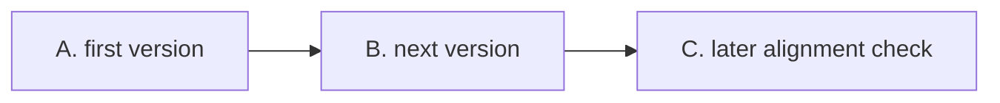
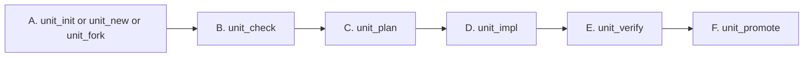
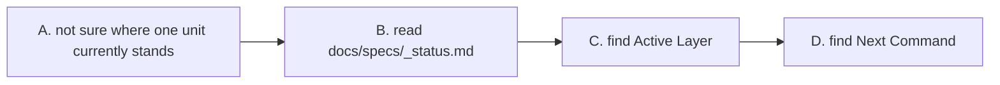
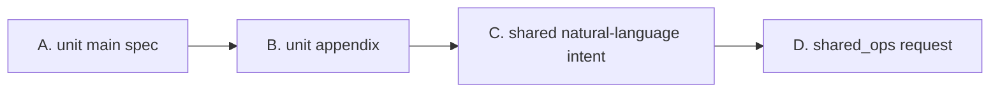
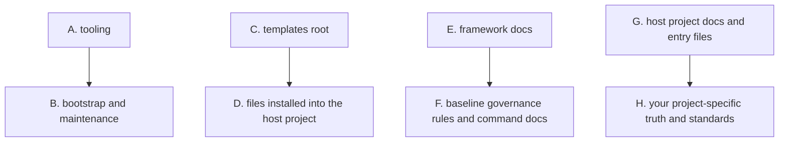

<p>
  
  
  
  
</p>

**English** · [简体中文](./README.zh-CN.md)

[Add To Your Repository](#add-to-your-repository) · [Quick Start](#quick-start) · [How To Use It](#how-you-actually-use-it) · [Shared Truth](#when-work-stops-being-unit-local) · [Advanced Usage](#advanced-usage)

---

`specFlow` makes AI-assisted development feel like engineering again: instead of letting requirements dissolve into chat logs, code diffs, and personal memory, it gives every governed unit a current truth, a next truth, and a clear path from idea to verified change. Humans and agents can move fast together while the repository still knows what is true, what is changing, and what is ready to ship. It is not a rigid template, but a strong working skeleton you can adapt and sharpen for your own domain.

## What Problem It Solves

> When the code moves fast, truth has to move slower.

Many AI-assisted projects eventually hit the same problems:

- the real requirement only exists in chat history
- different people understand the same feature differently
- code changed, but nobody can clearly say whether behavior is still correct
- each person or agent uses a different working style, so the process becomes hard to trust

`specFlow` solves that by making one thing explicit:

- the behavior source of truth should live in files

Then it adds a small command set around that truth, so design, planning, implementation, verification, and promotion do not drift apart.

## How specFlow Is Used

> Runtime-driven. Unit-governed. Spec-first.

`specFlow` is not a standalone runtime.

It is a governance layer that works together with an agentic runtime, such as:

- `Codex`
- `Gemini CLI`
- `Claude Code`

In plain language:

- `specFlow` provides the working rules
- the runtime reads those rules and executes the work

`specFlow` is also unit-governed.

That means:

- the basic working target is a formal `unit`
- Specs, planning, implementation, verification, and promotion are normally organized per unit

## Start Here

> Learn the shortest path first. Expand later.

If you are new, do not try to understand the whole system first.

Read in this order:

1. `Add To Your Repository`
2. `Quick Start`
3. `How You Actually Use It`
4. `The Core Model`
5. `The 3-Minute Flow`
6. `When You Need Manual Control`, only when you actually need it

That is enough to start using `specFlow`.

If later you want to understand how to customize the rules or use the deeper governance features, jump to `Advanced Usage`.

## Add To Your Repository

> First place `specflow/` in your repository. Then run `init`.

For most teams, the default setup is enough:

1. clone this repository somewhere else
2. copy only the `specflow/` directory into your project root
3. run `init`

Shell example:

```bash
git clone https://github.com/Bingordinary/SpecFlow.git /tmp/SpecFlow
cp -R /tmp/SpecFlow/specflow ./specflow
```

Windows PowerShell example:

```powershell
git clone https://github.com/Bingordinary/SpecFlow.git $env:TEMP\SpecFlow
Copy-Item -Recurse -Force $env:TEMP\SpecFlow\specflow .\specflow
```

If you need a long-term upstream sync workflow, treat that as advanced maintenance and see [tooling/README.md](./tooling/README.md) plus the repository history strategy you prefer.

## Quick Start

> Bootstrap the files, then let the runtime follow the flow.

After the `specflow/` directory is in your repository, run this from the repository root:

```bash
<specflow-binary> init
```

For all command examples below, `<specflow-binary>` means the compiled executable that matches your platform under `specflow/tooling/bin/`.
See [tooling/README.md](./tooling/README.md) for the exact filenames.

This installs the basic structure you need:

- `AGENTS.md`, `GEMINI.md`, `CLAUDE.md`
- `docs/specs/`
  - including unit Specs, appendix files, and process-state files
- `.githooks/pre-commit`
- supporting files used by the workflow

One clarification:

- `init` creates the hook file under `.githooks/pre-commit`
- Git will not automatically use that folder unless `core.hooksPath` points to `.githooks`

If you want Git to actually use the installed hook, run:

```bash
git config core.hooksPath .githooks
```

From this point on, a beginner usually does not need to start by memorizing commands.

If your runtime reads the installed instruction files, the normal day-one experience can be natural language:

- "Add rate limiting to the auth module."
- "This checkout behavior changed. Update the truth first, then implement it."
- "Check whether current code still matches the accepted truth."

The runtime should route that intent into the correct internal `specFlow` flow.

## How You Actually Use It

After `init`, you normally use `specFlow` in one of two ways:

1. say what you want in natural language
2. let the runtime route it into the right `specFlow` step
3. when you want exact control, use the matching command yourself

What makes this spec-driven is simple:

- the current accepted truth of one unit lives in `docs/specs/units/stable/s_unit_{unit}.md`
- the next truth being prepared lives in `docs/specs/units/candidate/c_unit_{unit}.md`

The main document you write is that unit Spec file.

A formal unit Spec should cover at least:

- unit goal and boundary
- key terminology
- data structures and protocols
- state machine and main flow
- edge cases and error handling
- verifiability and acceptance criteria

If the unit depends on shared truth or global constraints, the Spec also needs to record that alignment explicitly.

Read the three cases below as one rough story about the same unit over time.
This is intentionally simplified.
The point is to show the lifecycle shape, not every exact rule.



How to read this:

- `A. first version` is when the unit is created for the first time.
- `B. next version` is when that same unit changes later.
- `C. later alignment check` is when you want confidence that current code still matches the accepted truth.

One note before the story:

- if the unit already existed before `specFlow`, use `unit_init:{unit}` once to capture its current accepted behavior as the first governed `stable`
- after that, the unit behaves like the story below

### Case 1: The First Version Of A Unit

What you say:

- "Create a new unit for search."

If you want exact control:

```text
unit_new:search
-> write docs/specs/units/candidate/c_unit_search.md
-> unit_check:search
-> unit_plan:search
-> unit_impl:search
-> unit_verify:search
-> unit_promote:search
```

What those commands are doing:

- `unit_new` creates the first `candidate` for the new unit
- then you or the runtime write the actual candidate content into `c_unit_search.md`
- `unit_check` makes sure that written candidate truth is closed enough to guide work
- `unit_plan` turns that truth into an implementation plan
- `unit_impl` writes code against that candidate
- `unit_verify` checks whether the code matches the candidate
- `unit_promote` turns the accepted candidate into the new `stable`

When you write the document content:

- right after `unit_new`, the file exists but it still needs real content
- this is where you write the first candidate design in `c_unit_search.md`
- the minimum useful content is:
  - what the unit is for
  - what inputs and outputs it owns
  - what the main flow is
  - what edge cases matter
  - how you will know the result is correct
- only after that does `unit_check` have something real to judge
- if `unit_check` says the candidate is still incomplete, you keep editing the same candidate file until it is closed enough

What `specFlow` adds here:

- the new unit does not begin as "just some new code"
- the repository gets a written first version of the unit's behavior before implementation drifts
- later agents can see what the unit was supposed to do, not just what happened to get coded first

### Case 2: The Next Version Of That Same Unit

What you say:

- "Update search so typo correction runs before ranking."

If you want exact control:

```text
unit_fork:search
-> edit docs/specs/units/candidate/c_unit_search.md
-> unit_check:search
-> unit_plan:search
-> unit_impl:search
-> unit_verify:search
-> unit_promote:search
```

What those commands are doing:

- `unit_fork` opens a new `candidate` from the current `stable`
- then you or the runtime edit `c_unit_search.md` to describe the next version
- `unit_check` confirms that edited next truth is clear enough
- `unit_plan`, `unit_impl`, and `unit_verify` move that next truth into code and verify it
- `unit_promote` makes the next truth become the new accepted `stable`

When you write the document content:

- `unit_fork` gives you a starting point by deriving the candidate from the current stable truth
- then you edit the candidate file to describe what changes in this round
- this is where you update things such as:
  - changed protocol or field meaning
  - changed main flow
  - new validation or error behavior
  - new acceptance criteria
- `unit_check` is the point where the system asks "is this updated candidate written clearly enough to drive the implementation round"
- if the answer is no, you go back to the same candidate file and keep refining it

What `specFlow` adds here:

- it separates current accepted behavior from next behavior being prepared
- the repository does not have to guess after the fact whether the code change was a bug fix, a behavior change, or an unfinished idea
- another agent can read the current truth and the next truth directly instead of reconstructing intent from diffs and chat logs

### Case 3: Later You Recheck Whether It Is Still Aligned

What you say:

- "Check whether the search unit still matches the accepted truth."

If you want exact control:

```text
read docs/specs/units/stable/s_unit_search.md
-> unit_stable_verify:search
```

If drift exists and you want to start the next change round:

```text
unit_fork:search
-> edit docs/specs/units/candidate/c_unit_search.md
-> unit_check:search
```

What that command is doing:

- it checks the current implementation against the current accepted `stable`
- it does not start a new candidate round just because you asked for verification
- if drift exists, that drift must be handled before anyone claims stable alignment

What `specFlow` adds here:

- verification becomes an explicit repository action, not only a conversational judgment
- the project gets a clear answer to "still aligned" versus "drift exists"
- that makes it easier to trust the result later, especially when a different person or a different agent revisits the unit

The beginner takeaway is simple:

- first version of a new unit: `unit_new` + candidate chain
- next version of an existing governed unit: `unit_fork` + candidate chain
- later alignment check: `unit_stable_verify`
- historical unit entering governance for the first time: `unit_init`

You can still start in natural language.
These command names are the exact handles behind that lifecycle.

## The Core Model

> One accepted truth. One next truth.

There are only two core states a beginner needs first:

- `stable`: the behavior that the project currently treats as true
- `candidate`: the next version of behavior that is being prepared


How to read this:

- `A. stable` is the currently accepted version.
- `C. candidate` is the next version being shaped.
- `D. implement and verify` happens around the candidate.
- `E. promote` turns the accepted candidate into the new stable.

## The 3-Minute Flow

> Learn the work pattern first. Learn the command names later.

If you only want the shortest useful model, remember this sequence:

1. write or update the behavior truth
2. make sure that truth is clear enough to guide work
3. implement against that truth
4. verify the code against that truth
5. promote the verified next truth into the accepted version


How to read this:

- `A. write truth` means the behavior should become explicit in files first.
- `B. close the truth enough to work` means the repository should not rely on chat memory for key decisions.
- `C. implement` and `D. verify` happen against that written truth.
- `E. promote` makes the accepted next version become the current baseline.

This is what `specFlow` is trying to protect.

The command system exists to make this sequence explicit and reviewable.
But for a beginner, the sequence matters more than the exact command names.

## When You Need Manual Control

Manual control matters only when:

- you want to drive the exact step yourself
- the runtime did not route your request the way you expected
- you are debugging governance state for a unit

Most manual control starts from just three entry decisions:

| Situation | Use this command |
| --- | --- |
| bring an existing historical unit into governance for the first time | `unit_init:{unit}` |
| start a brand-new unit | `unit_new:{unit}` |
| change a unit that already has governed `stable` truth | `unit_fork:{unit}` |

After that, the normal candidate chain is:

```text
unit_check -> unit_plan -> unit_impl -> unit_verify -> unit_promote
```

There is also one stable-side maintenance step:

```text
unit_stable_verify
```

Use `unit_stable_verify:{unit}` only when the unit is currently on `stable`, but you need to check whether the code still matches that accepted truth.

If you want one compact picture:



This is the explicit control surface.
You only need it when natural-language routing is not enough.

## When To Read `_status.md`

`docs/specs/_status.md` is the project state index.

You normally look at it only when one of these is true:

- the project has many units
- you are not sure which layer one unit is currently on
- you want to know the default next step for that unit



How to read this:

- `B. read docs/specs/_status.md` tells you the current recorded state.
- `C. find Active Layer` tells you whether the unit is currently on `stable` or `candidate`.
- `D. find Next Command` tells you the default next legal step.

In normal use, `_status.md` is for reading state, not for manual scratch edits.

## When Work Stops Being Unit-Local

Most work should stay unit-local for as long as possible.

There are three different places truth can live:

- the unit main spec
- the unit appendix
- cross-unit shared truth



How to read this:

- `A. unit main spec` is the main home for one unit's behavior.
- `B. unit appendix` is still one unit's truth, just expanded out of the main file.
- `D. shared_ops request` is where you enter when the truth is no longer only about one unit.

Use this rule:

- first appearance stays in the current unit
- do not extract something into shared just because it may be reused later
- move into shared only when multiple units really depend on the same truth

### How To Use `shared_ops`

`shared_ops:{natural-language request}` is the only user-facing entry for shared governance.

Use it when you want to:

- design shared truth from the start
- extract already-written unit truth into a shared contract
- bind a unit to an existing shared contract
- change shared topology such as split, merge, rename, or retire
- check which units are affected after a shared-contract change

The important idea is simple:

- you describe the shared intent
- the runtime chooses the internal shared flow
- if the route is unsafe or ambiguous, it must stop at a checkpoint instead of guessing

## Advanced Usage

Once basic usage makes sense, this is the section that helps you understand the whole system and adapt it to your own project.

The advanced part is mainly about four things:

- understanding the document structure
- knowing which files you should customize
- adding project-local standards
- knowing which governance flows exist beyond the standard unit commands

### The Project Structure

At a high level, the repository splits into four layers:



How to read this:

- `A. tooling` installs, checks, and upgrades the paradigm.
- `C. templates root` is the material copied into the target repository.
- `E. framework docs` is the baseline rule system of `specFlow` itself.
- `G. host project docs and entry files` is where your project expresses its own truth and standards.

### What You Normally Customize

The safe beginner rule is:

- change project-owned files first
- change framework files only when you intentionally want to evolve the paradigm itself

Most teams mainly customize:

- `docs/specs/**`
- `docs/project_standards/**`
- the project-owned parts of `AGENTS.md`, `GEMINI.md`, and `CLAUDE.md`

### Project-Specific Standards

`specFlow` allows a project to add its own local standards on top of the framework baseline.

These standards live in:

- `docs/project_standards/`
- `docs/project_standards/_registry.md`

One important rule:

- a standard file is not active just because it exists
- it becomes active only after it is registered in `_registry.md`

In normal use, you usually do not need to build these files by hand.
The simplest path is to ask the agent in plain language.

### Maintenance Tools

The tooling surface is useful, but it is not the first thing a beginner needs to learn.

The most common maintenance commands are:

- `init`
- `doctor`
- `upgrade`

See [tooling/README.md](./tooling/README.md) for the full tooling surface.

### Advanced Flows

Besides the standard unit commands, `specFlow` also has advanced flows.

Two you should know exist are:

- `spec_flow_review`
- `shared_ops:{natural-language request}`

Use `spec_flow_review` when you want to review the governance system itself rather than move one business unit forward.
Its default scope now covers both the governance baseline documents and the governance tooling implementation under `specflow/tooling/`.

### What To Read If You Want The Full Baseline

If you want to deeply understand or redesign the system, read in this order:

1. `framework/docs/agent_guidelines/spec_policy.md`
2. `framework/docs/agent_guidelines/command_policy.md`
3. `framework/docs/agent_guidelines/git_policy.md`
4. `framework/docs/agent_guidelines/shared_ops.md`
5. `framework/docs/agent_guidelines/spec_flow_review.md`
6. the command docs under `framework/docs/agent_guidelines/commands/`
7. the installed project-side files under `docs/`

## File Ownership

`specFlow` has two ownership modes:

- `framework`
  - `specFlow` owns the file shape
  - `upgrade` may refresh it
- `project`
  - your repository owns it after bootstrap
  - `upgrade` must not overwrite an existing project-owned file

This matters because `specFlow` is meant to be adapted, not to control the entire repository forever.

Files like `AGENTS.md`, `GEMINI.md`, and `CLAUDE.md` use a managed block model, so the host project can keep its own instructions outside the `specFlow` block.

## When Not To Use It

`specFlow` is probably too heavy if:

- your project is very small
- your team does not want formal behavior truth in files
- you do not need `stable` and `candidate`
- you do not need humans and AI to follow one shared operating model
