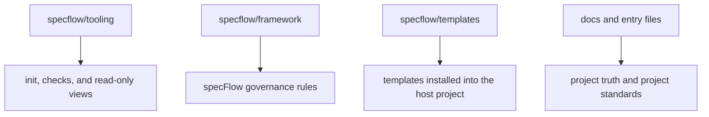

<p>
  
  
  
  
</p>

**English** · [简体中文](./README.zh-CN.md)

[Add To Your Repository](#add-to-your-repository) · [Quick Start](#quick-start) · [Adoption Modes](#adoption-modes) · [Core Concepts](#core-concepts) · [Standard Commands](#standard-commands) · [Development Workflow](#development-workflow) · [Reader](#reader) · [Advanced](#advanced-usage)

---

`specFlow` makes AI-assisted development feel like engineering again: instead of letting requirements dissolve into chat logs, code diffs, and personal memory, it gives every governed unit a current truth, a next truth, and a clear path from idea to verified change. Humans and agents can move fast together while the repository still knows what is true, what is changing, and what is ready to ship.

It is not a fixed business template, and it does not force every team to write the same documents.
It is an engineering collaboration skeleton: requirements enter repository truth first, then planning, implementation, verification, and promotion follow that truth.

## What Problem It Solves

> When code moves fast, truth must not drift.

Many AI-assisted projects eventually hit the same problems:

- the real requirement only exists in chat history
- different people or agents understand the same feature differently
- code changed, but nobody can clearly state the official behavior now
- work moves quickly in the moment, but later it is hard to know whether the change actually closed

`specFlow` handles that directly:

- put behavior truth in repository files
- make the agent read current truth before moving work forward
- keep design, planning, implementation, verification, and promotion aligned to the same truth

The point is not to add documentation burden.
The point is to stop the project from depending only on chat memory and reverse-engineering intent from code.

## How specFlow Is Used

> Runtime-driven. Spec-first. Humans own goal judgment.

`specFlow` is not a standalone runtime.

It is a governance layer that works together with an agentic runtime, such as:

- `Claude Code`
- `Codex`
- `Gemini CLI`

In plain language:

- `specFlow` defines how work should move inside the repository
- the runtime reads those rules and performs file edits, code changes, and verification
- humans state the goal, confirm important boundaries, and accept or redirect the result

The active model is progressive disclosure plus independent evaluation: each step reads only its Context Card, and advancing gates require an independent reviewer receipt in process evidence.

You will need to learn a few core concepts and the basic development workflow.
Once those are clear, you can drive most work with standard commands.
Natural language is the safety net: when you are unsure which step to take, describe your goal in plain language and the agent will route it.

## Add To Your Repository

For most teams, the simplest first-time setup is to run the installer from your project root.
It uses the default local-framework setup, where `specflow/` is ignored by your project repository:

```bash
curl -fsSL https://raw.githubusercontent.com/Bingordinary/SpecFlow/main/tooling/scripts/install.sh | bash
```

Windows PowerShell:

```powershell
irm https://raw.githubusercontent.com/Bingordinary/SpecFlow/main/tooling/scripts/install.ps1 | iex
```

The installer does exactly this:

1. clone this repository into `./specflow`
2. add `specflow/` to `.gitignore`
3. install the current platform's `specflowctl`, `specflow-reader`, and `SHA256SUMS`
4. run `specflowctl init`

The installer is only for first-time setup.
If `./specflow` already exists, it stops and tells you to use the existing pull helper instead.

Running the script directly from a GitHub link works because `raw.githubusercontent.com` serves the script as plain text.
Treat that command as remote code execution: inspect the script before running it, or pin the URL to a trusted tag or commit instead of `main` when your environment needs a fixed source.

Manual setup is still available when you want to control each step yourself, or when you want to commit `specflow/` into your project instead of ignoring it:

1. from your project root, clone this repository into a directory named `specflow`
2. make sure the final path is `./specflow`
3. add `specflow/` to `.gitignore` if your project should not commit the framework files
4. run `init` from your project root (see [Quick Start](#quick-start))

The lowercase directory name matters.
The published repository is named `SpecFlow`, so a plain `git clone https://github.com/Bingordinary/SpecFlow.git` creates `./SpecFlow`.
The installed framework directory must instead be `./specflow`, because the documents and tools use paths such as `specflow/tooling/bin/` and `specflow/framework/`.

You can either clone directly into the correct directory name, or clone first and then rename `SpecFlow` to `specflow`.

After setup, your project should contain paths such as:

- `specflow/framework/`
- `specflow/templates/`
- `specflow/tooling/`

Shell example:

```bash
git clone https://github.com/Bingordinary/SpecFlow.git specflow
printf "\nspecflow/\n" >> .gitignore
```

If you already cloned without a target directory:

```bash
mv SpecFlow specflow
printf "\nspecflow/\n" >> .gitignore
```

Windows PowerShell example:

```powershell
git clone https://github.com/Bingordinary/SpecFlow.git specflow
Add-Content .gitignore "specflow/"
```

If you already cloned without a target directory:

```powershell
Rename-Item .\SpecFlow specflow
Add-Content .gitignore "specflow/"
```

If you ignore `specflow/`, each workspace must prepare it locally before using `specFlow`.
If you want every clone of your project to include the exact same `specFlow` framework files, commit `specflow/` instead of ignoring it.

If you need a long-term upstream sync workflow, treat that as a separate maintenance concern.
See [tooling/README.md](./tooling/README.md) for tooling details.

## Prepare Local Binaries

`specflow/tooling/bin/` is not committed to git.
If you used the installer above, this step is already complete.
After manual setup, or when refreshing an existing local `specflow/` checkout, run the pull helper from your project root:

```bash
specflow/tooling/scripts/pull_with_release.sh
```

Windows PowerShell:

```powershell
.\specflow\tooling\scripts\pull_with_release.ps1
```

The script runs a fast-forward pull for `specflow/`, computes the current tooling fingerprint, and installs the current platform's `specflowctl`, `specflow-reader`, and `SHA256SUMS` only when the local binaries are missing, stale, or missing checksums.
The Release is tied to the tooling input fingerprint, not to every `specflow` source commit.

## Quick Start

If you used the installer, `init` has already run.
After manual setup, once the binaries are in place and `specflow/` is in your repository, run from the project root:

```bash
<specflow-binary> init
```

`<specflow-binary>` means the platform-matching `specflowctl` executable under `specflow/tooling/bin/`.
See [tooling/README.md](./tooling/README.md) for exact filenames.

`init` installs the basic structure:

- `AGENTS.md`, `GEMINI.md`, and `CLAUDE.md`
- `docs/specs/`
- other workflow support files

After this step, choose an [Adoption Mode](#adoption-modes).
`init` prepares the shared skeleton; it does not require you to run the whole lifecycle immediately.

For daily work, use standard commands with the module name you want to work on:

```text
unit_new:{module_name}
unit_check:{module_name}
unit_fork:{module_name}
unit_verify:{module_name}
```

When unsure, fall back to natural language:

```text
I want to add rate limiting to auth, but I am not sure what should move first. Read current project truth and tell me the next step.
```

The agent reads the installed entry files and current repository truth, then decides which command to enter, whether to write Spec truth, check a boundary, or ask a required clarification.

## Adoption Modes

You can start small. Installing specFlow does not commit a project to promotion, stable verification, governance review, or full lifecycle use.

| Mode | Use When | What It Allows |
|---|---|---|
| `reader-only` | You want visibility before changing process | Start `specflow-reader`, inspect state and truth, make no lifecycle writes |
| `implementation-only` | The request fits already-written formal truth | Use natural language for a code or test change; stop if truth, boundary, acceptance, rule, or ownership must change |
| `single-unit-trial` | You want to try specFlow on one unit | Govern one named unit through the needed steps while leaving the rest of the repo outside specFlow |
| `unit-check-only` | You only want to test whether a Spec is a good requirement | Run `unit_check:{unit}` and stop after pass, blocked, or fix-required evidence |

The formal contract is `specflow/framework/core/adoption_modes.md`.
These modes are entry choices, not new lifecycle states, process schema, or CLI mode switches.
Promotion, stable verification, and governance review remain explicit later choices, not default requirements for these starts.

Example reader-only start:

```bash
<specflow-reader-binary> --repo-root . --addr 127.0.0.1:17863
```

Example implementation-only request:

```text
Make the existing retry test less flaky without changing the documented behavior. If this needs truth changes, stop and tell me the smallest specFlow step.
```

Example single-unit trial:

```text
Use specFlow only for the payment_retry unit for now. Do not promote or enter governance review unless I ask.
```

Example unit-check-only request:

```text
Run unit_check:payment_retry and stop after the check result. Do not plan or implement yet.
```

## Core Concepts

specFlow has only two formal concepts. Everything else is built from these.

### The Two Concepts

**unit** — one independently governable engineering responsibility. A unit owns its own behavior truth (Spec), implementation plan, implementation work, and verification. It is the only object with a formal lifecycle. A unit can describe a local capability or a complete user-result chain. It does not automatically equal a directory, package, or service.

**rule** — formally reusable truth shared across objects. A global rule (`g_`) applies repository-wide. A bound rule (`b_`) applies only to the units that explicitly reference it through `rule_refs`. Rule work is entered through natural language; the agent routes to the correct internal governance flow.

### Lifecycle

Every governed object moves through the same pattern:

```
stable ⟶ candidate ⟶ verify ⟶ promote ⟶ new stable
```

The command chain for a unit:

```
unit_new / unit_fork → unit_check → unit_impl → unit_verify → unit_promote
```

- **stable** is the currently accepted behavior truth on disk
- **candidate** is the next truth being prepared (new requirements, behavior changes)
- **check** validates candidate truth clarity and acceptance item format compliance before verification
- **verify** checks the implementation against the candidate
- **promote** makes the accepted candidate the new stable

`unit_plan` is not a SpecFlow-governed command; agent frameworks handle planning internally.
`unit_impl` is a lifecycle state set by `unit_check pass` close, not a user command. Agents handle implementation internally.

For a brand-new unit, start at `unit_new`. For an existing unit with stable truth, start at `unit_fork`.

### Free Composition

Units and rules compose freely:

- A unit references any number of rules through `rule_refs` in its frontmatter
- The lifecycle applies independently to each object
- `repository_mapping.md` records which objects exist, which paths belong to them, and how ownership boundaries are decided — it describes the composition result, not a third concept

This means the same two concepts and one lifecycle pattern can govern a single feature, an entire service, or a whole repository.

## Standard Commands

| Situation | Command |
|---|---|
| Existing capability entering governance for the first time | `unit_init:{unit}` |
| Brand-new capability entering governance | `unit_new:{unit}` |
| Accepted capability opening a new change round | `unit_fork:{unit}` |
| Validate candidate truth clarity and acceptance item format (required) | `unit_check:{unit}` |
| Verify implementation against truth | `unit_verify:{unit}` |
| Promote candidate to new stable | `unit_promote:{unit}` |
| Check whether implementation still matches stable truth | `unit_stable_verify:{unit}` |

The command form is `{command}:{unit}`, for example `unit_check:payment`.

`unit_check` is a required quality gate that validates candidate truth clarity and acceptance item format compliance. `unit_plan` is handled by the agent internally and is not a SpecFlow-governed command. `unit_impl` is a lifecycle state set by `unit_check pass` close, not a user command. SpecFlow's core gate is `unit_verify`, which verifies implementation directly against candidate truth.

## Development Workflow

### Your Role

1. **Maintain spec documents** — write and update behavior truth in `docs/specs/units/`. These are the source of truth that commands consume.
2. **Drive the lifecycle** — issue the right command at each stage. Use `docs/specs/_status.md` and Reader to know the current stage and next legal command.
3. **Judge acceptance** — confirm candidate truth is correct before promotion, and that verification results match your expectations.

The agent handles the mechanical work of each command: reading truth, validating gates, producing plans, writing code, and running verification.

### When to Use Natural Language

Natural language is the fallback. Use it when you are unsure which command is next, the request spans multiple objects and order matters, you are dealing with cross-unit rules, or you want the agent to read current truth and report the next legal step.

Describe your goal in plain language. The agent reads repository truth, decides the smallest legal next action, performs it, or asks for clarification if boundaries are unclear.

## Reader

`specflow-reader` is a read-only local view for inspecting project state. Start it from the repo root:

```bash
<specflow-reader-binary> --repo-root . --addr 127.0.0.1:17863
```

Reader answers: which unit and rule objects exist, which have accepted truth, what each object's next step is, and how Specs, rules, and implementation paths connect. The four common views are Spec View, Status, Project Structure, and SpecFlow.

Reader does not edit files or advance lifecycle state. See [tooling/README.md](./tooling/README.md) for details.

## When It May Be Too Heavy

specFlow may not be the right fit if: the project is very small, the team does not want formal behavior truth in files, you do not need stable and candidate layers, or you do not need humans and AI agents to follow the same long-term collaboration model.

If you only want an agent to make a few temporary code edits, specFlow is not the shortest path. If you want a project maintained by multiple people and multiple agents over time, it pays off.

## Advanced Usage

### Project Structure

At a high level, a repository with specFlow has four kinds of content:



### Maintenance

Tooling commands: `init`, `doctor`, `build-release`. Reader is also in the tooling layer but is read-only.

After updating `specflow/`, check the tooling fingerprint to see whether local binaries need refreshing, then ask the agent to run `spec_flow_migrate` to update project-side files to match the current framework contracts.

For routine framework changes and plain `spec_flow_review`, governance review uses scoped review by default: changed files, direct owners, boundary refs, and minimal convergence refs.
The only full-scope mechanism review entry is exact `spec_flow_review:full`; use that exact entry when you want the governance slice/run-state path.
`spec_flow_design_review` always runs the default full-scope design-baseline review.

For advanced governance flows — `spec_flow_review`, `spec_flow_design_review`, and rule governance — enter them through natural language.
