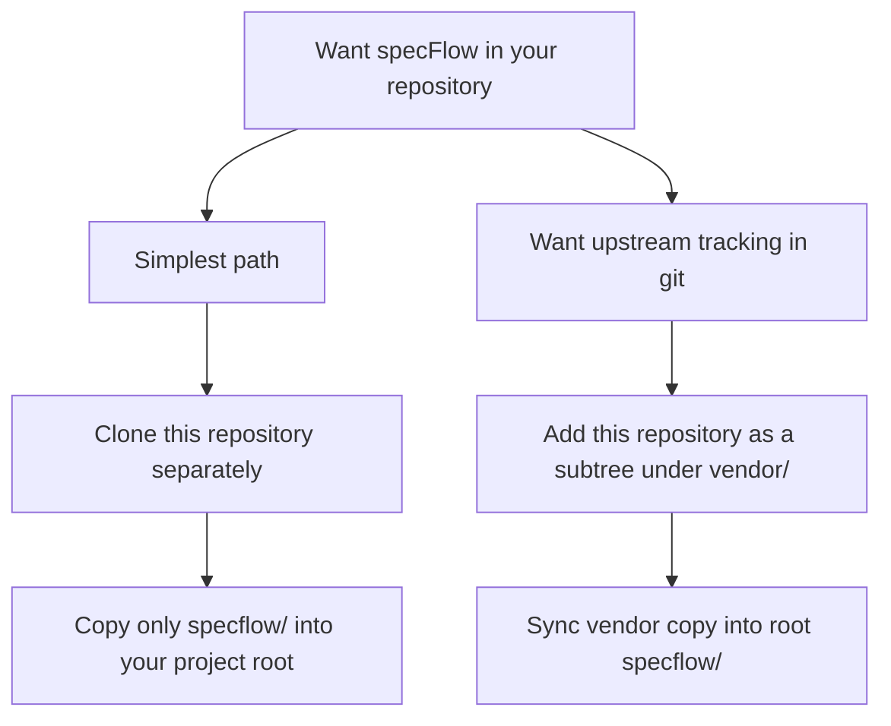
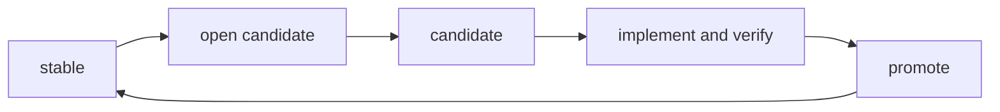
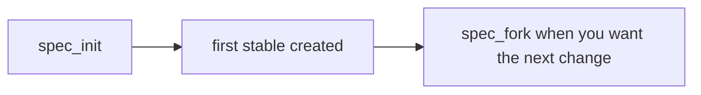
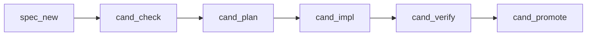
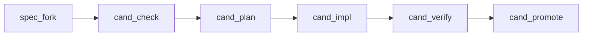
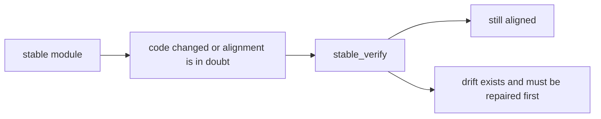
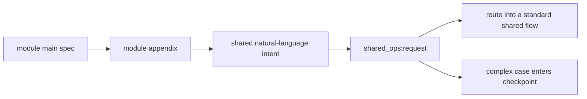
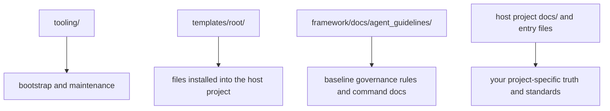

<p>
  
  
  
  
</p>


**English** · [简体中文](./README.zh-CN.md)


[Add To Your Repository](#add-specflow-to-your-repository) · [Quick Start](#quick-start) · [3-Minute Flow](#the-3-minute-flow) · [Shared Truth](#appendix-and-cross-module-sharing) · [Project Standards](#project-specific-standards) · [Advanced Usage](#advanced-usage)

---

`specFlow` is a module-oriented, spec-driven development paradigm for teams that build with both humans and AI through agentic runtimes.

You can understand it in one sentence:

`specFlow` helps a project write behavior into files first, then let humans and AI change code around those files in a controlled way.

This repository is not trying to force every project into one fixed shape.
It gives you a usable starting point, and expects you to change the project-side rules to fit your own domain.

For all command examples below, `<specflow-binary>` means the compiled executable that matches your current platform under `specflow/tooling/bin/`.

Examples:

- Linux x86_64: `./specflow/tooling/bin/specflowctl-linux-amd64`
- Linux arm64: `./specflow/tooling/bin/specflowctl-linux-arm64`
- macOS Intel: `./specflow/tooling/bin/specflowctl-darwin-amd64`
- macOS Apple Silicon: `./specflow/tooling/bin/specflowctl-darwin-arm64`
- Windows x86_64: `.\specflow\tooling\bin\specflowctl-windows-amd64.exe`
- Windows arm64: `.\specflow\tooling\bin\specflowctl-windows-arm64.exe`

## What Problem It Solves

> When the code moves fast, truth has to move slower.

Many AI-assisted projects eventually hit the same problems:

- the real requirement only exists in chat history
- different people understand the same feature differently
- code changed, but nobody can clearly say whether behavior is still correct
- each person or agent uses a different working style, so the process becomes hard to trust

`specFlow` solves that by making one thing explicit:

- the behavior source of truth should live in files

Then it adds a small command set around that truth, so design, planning, implementation, verification, and promotion do not drift apart.

## How specFlow Is Used

> Runtime-driven. Module-shaped. Spec-first.

`specFlow` is not a standalone runtime.

It is a governance layer that works together with an agentic runtime, such as:

- `Codex`
- `Gemini CLI`
- `Claude Code`

In plain language:

- `specFlow` provides the working rules
- the runtime reads those rules and executes the work

`specFlow` is also module-oriented.

That means:

- the basic working target is a formal `module`
- commands are written in forms such as `{command}:{module}`
- Specs, planning, implementation, verification, and promotion are normally organized per module

So when you use `specFlow`, you are usually doing two things together:

1. running your work through an agentic runtime
2. letting that runtime follow a module-based governance flow

## Start Here

> Learn the shortest path first. Expand later.

If you are new, do not try to understand the whole system first.

Read in this order:

1. `Add specFlow To Your Repository`
2. `Quick Start`
3. `The Core Model`
4. `The 3-Minute Flow`
5. `The First Commands`
6. `Command Order And Project State`

That is enough to start using `specFlow`.

If later you want to understand how to customize the rules or use the deeper governance features, jump to `Advanced Usage`.

## Add specFlow To Your Repository

> First place `specflow/` in your repository. Then run `init`.

There are two practical ways to adopt `specFlow`.



How to read this:

- if you want the shortest setup, clone this repository somewhere else and copy only the `specflow/` directory into your project root
- if you want to keep an explicit upstream source in your git history, keep this repository as a subtree under a vendor directory, then sync its `specflow/` directory into your root `specflow/`

### Option 1: Clone Separately And Copy `specflow/`

This is the recommended path for most teams.

Why this is the default recommendation:

- it keeps the host repository shape simple
- it matches how the tooling is documented, because the installed path is `./specflow/...`
- it does not require users to learn `git subtree` before they can get started

Shell example:

```bash
git clone https://github.com/Bingordinary/SpecFlow.git /tmp/SpecFlow
cp -R /tmp/SpecFlow/specflow ./specflow
```

Windows PowerShell example:

```powershell
git clone https://github.com/Bingordinary/SpecFlow.git $env:TEMP\SpecFlow
Copy-Item -Recurse -Force $env:TEMP\SpecFlow\specflow .\specflow
```

After that, go to `Quick Start` below and run:

```bash
<specflow-binary> init
```

### Option 2: Track The Upstream With `git subtree`

Use this when you want the upstream repository to stay visible in your git history and you want a repeatable update path.

Important:

- in this repository, the installable payload lives under the `specflow/` subdirectory
- because of that, adding this repository directly as `--prefix=specflow` would create `specflow/specflow/...`
- the safe subtree workflow is to keep the upstream repository under a vendor directory, then sync its `specflow/` folder into your root `specflow/`

Initial setup:

```bash
git remote add specflow-upstream https://github.com/Bingordinary/SpecFlow.git
git subtree add --prefix=vendor/specflow-upstream specflow-upstream main --squash
rsync -a vendor/specflow-upstream/specflow/ ./specflow/
```

Windows PowerShell equivalent:

```powershell
git remote add specflow-upstream https://github.com/Bingordinary/SpecFlow.git
git subtree add --prefix=vendor/specflow-upstream specflow-upstream main --squash
Copy-Item -Recurse -Force .\vendor\specflow-upstream\specflow\* .\specflow\
```

Then run:

```bash
<specflow-binary> init
```

Later, when you want to update:

```bash
git fetch specflow-upstream
git subtree pull --prefix=vendor/specflow-upstream specflow-upstream main --squash
rsync -a --delete vendor/specflow-upstream/specflow/ ./specflow/
<specflow-binary> upgrade
```

What each step is doing:

1. `git subtree add` stores the upstream repository under `vendor/specflow-upstream`
2. `rsync` copies the installable `specflow/` payload into the location your project will actually use
3. `git subtree pull` refreshes the vendor copy later
4. `upgrade` reapplies newer framework-managed files and managed blocks after you sync a newer upstream version

## Quick Start

> Bootstrap the files, then let the runtime follow the flow.

After the `specflow/` directory is in your repository, run this from the repository root:

```bash
<specflow-binary> init
```

This installs the basic structure you need:

- `AGENTS.md`, `GEMINI.md`, `CLAUDE.md`
- `docs/specs/`
  - including module Specs, appendix files, and process-state files
- `.githooks/pre-commit`
- supporting files used by the workflow

That is the whole initialization step.

One clarification:

- `init` will create the hook file under `.githooks/pre-commit`
- but Git will not automatically start using that folder unless `core.hooksPath` points to `.githooks`

If you want Git to actually use the installed hook, run:

```bash
git config core.hooksPath .githooks
```

After initialization, a beginner can start directly with the basic command flow below.

## The Core Model

> One accepted truth. One next truth.

There are only two core states a beginner needs first:

- `stable`: the behavior that the project currently treats as true
- `candidate`: the next version of behavior that is being prepared



How to read this:

- `stable` is the currently accepted version.
- `candidate` is the version you are currently working on.
- when the candidate is ready and verified, it is promoted and becomes the new stable version.

## The 3-Minute Flow

> This is the shortest path from idea to governed change.

Suppose you want to add a new module called `module_search`.

The shortest beginner path looks like this:

1. run `spec_new:module_search`
2. write the candidate Spec for `module_search`
3. run `cand_check:module_search`
4. run `cand_plan:module_search`
5. run `cand_impl:module_search`
6. run `cand_verify:module_search`
7. run `cand_promote:module_search`

What this means in plain language:

- first define the behavior you want
- then make sure the definition is clear enough
- then plan the work
- then write the code
- then check whether the code matches the definition
- then promote that definition into the current accepted version

If instead `module_search` already exists and you want to change it, the path usually starts with `spec_fork:module_search` instead of `spec_new:module_search`.

## The First Commands

For a beginner, `specFlow` is easiest to understand like this:

- you write or update a Spec
- you choose a command based on what you want to do next
- the command tells the agent what kind of action you are taking

You do not need to memorize the entire governance system at the beginning.
You mainly need to know what each command is for.

## How A Command Is Named

Most `specFlow` commands look like this:

```text
prefix_action:{module}
```

Example:

```text
cand_plan:module_search
```

This command has two parts:

- `cand_plan`
  - the action name
- `module_search`
  - the module this action is targeting

You can read it as:

- run the `cand_plan` action for `module_search`

### What The Prefixes Mean

The important prefixes are:

- `spec`
  - this is about opening, creating, or switching the Spec version you want to work on
- `cand`
  - this is about working inside the `candidate` version
- `stable`
  - this is about checking or operating against the currently effective `stable` version

Shortest examples:

- `spec_new`
  - create the first candidate Spec for a new module
- `spec_fork`
  - open a new candidate from the current stable Spec
- `cand_impl`
  - implement against the current candidate Spec
- `stable_verify`
  - verify whether current code still matches stable

### What The Action Words Mean

After the prefix, the action word tells you what kind of step you are doing.

A beginner-friendly way to read them is:

- `new`
  - create a new Spec from zero
- `fork`
  - open the next Spec version from an existing stable version
- `check`
  - decide whether the current candidate Spec is clear enough to guide work
- `plan`
  - turn the candidate Spec into an implementation plan
- `impl`
  - implement the code according to the candidate Spec and plan
- `verify`
  - check whether the implemented code really matches the Spec
- `promote`
  - make the verified candidate become the new stable version

One important clarification:

- before `cand_impl`, you are mainly shaping and checking the Spec
- at `cand_impl`, the work moves from Spec files into code changes
- at `cand_verify`, the code is checked against the Spec again before promotion

So:

- `spec_new` means "create a new Spec version from zero"
- `cand_verify` means "verify the implementation against the candidate"
- `stable_verify` means "verify the implementation against stable"

## Commands You Need First

You do not need every command on day one.
Start with these:

- `spec_init:{module}`
  - create the first `stable` Spec for an existing historical module
- `spec_new:{module}`
  - create the first `candidate` Spec for a brand-new module
- `spec_fork:{module}`
  - open a new `candidate` from an existing `stable`
- `cand_check:{module}`
  - check whether the current candidate is clear enough to drive work
- `cand_plan:{module}`
  - make the implementation plan from the candidate
- `cand_impl:{module}`
  - implement against the candidate
- `cand_verify:{module}`
  - verify whether implementation matches the candidate
- `cand_promote:{module}`
  - promote the candidate into the new `stable`
- `stable_verify:{module}`
  - verify whether current code still matches `stable`

## Should I Use `spec_init`, `spec_new`, Or `spec_fork`?

Use this quick rule:

- use `spec_init:{module}` when the module already exists in the project, but has never entered formal `specFlow` governance before
- use `spec_new:{module}` when this is a brand-new module and you want to create its first governed version as `candidate`
- use `spec_fork:{module}` when this module already has a `stable` version and you want to change it

Shortest comparison:

| You are trying to do | Use this command |
| --- | --- |
| Bring an existing historical module into governance for the first time | `spec_init:{module}` |
| Start governance for a brand-new module | `spec_new:{module}` |
| Make a next version from an existing stable module | `spec_fork:{module}` |

If you only remember one sentence, remember this:

- `spec_init` gives an already-existing module its first governed `stable`
- `spec_new` starts a brand-new module from zero
- `spec_fork` starts the next change from the current stable truth

## Command Order And Project State

If you only want the shortest mental model, remember these three common paths.

Important:

- this is the common order, not a rule saying every module in the whole project must always be processed in one single global sequence
- when a project has many modules, the real current state should be checked in `docs/specs/_status.md`
- `_status.md` is maintained by the `specFlow` command flow as the project state index
- in normal use, you read `_status.md` to know what is going on; you do not use it as a scratchpad for manual edits

In plain language:

- the diagrams below help you understand the normal path for one module
- `_status.md` tells you the real current position of all modules in the project


How to read this:

- if you are only thinking about one module, the command-order diagrams below are enough
- if you are dealing with many modules, `_status.md` is the first place to look
- the key fields are `Active Layer` and `Next Command`

### Path 1: A Historical Module Enters Governance For The First Time



Plain explanation:

- the module already exists in the project
- you first capture its already-effective behavior as the first `stable`
- this is governance onboarding, not future design work
- when you later want to change that module, you open a `candidate` with `spec_fork`

### Path 2: A Brand-New Module



Plain explanation:

- create the new candidate
- make sure it is clear enough
- write the plan
- implement
- verify
- promote

### Path 3: An Existing Stable Module Needs Change



Plain explanation:

- copy the current stable into a new candidate
- make the candidate clear enough
- plan
- implement
- verify
- promote

### Stable-Side Maintenance

There is also one important stable-side maintenance path:



Plain explanation:

- `stable_verify` is not the normal way to start a new design round
- it is used when a module is currently on `stable`, but you need to check whether the code still matches that `stable`
- only after stable alignment is clear should the module move on to the next controlled upgrade round

### One Important Clarification

At the learning stage, you can treat these commands as a toolbox:

- first understand what each command is for
- then choose the command that matches your current job

But if you want the built-in governance to stay closed and trustworthy, the full workflow does assume command prerequisites and normal ordering.
So the beginner-friendly reading method is "learn the commands first", not "the rules do not exist".

## What specFlow Actually Is

`specFlow` is not mainly a code framework.
It is a change-governance paradigm.

That means it gives you:

- a way to store behavior truth in files
- a way to separate current truth from next truth
- a way to move work with explicit commands
- a way to verify before calling something done

## Appendix And Cross-Module Sharing

The basic command flow above is enough for normal module work.

But there is one extra mechanism you should know exists:

- module appendix
- cross-module shared truth

You do not need to learn the internal governance details on day one.
You mainly need one simple picture of how these pieces relate.



How to read this:

- keep the module main Spec focused on the module's core behavior
- if some formal details are too long or too specific for the main file, keep them in that module's appendix
- if that truth still belongs to only one module, it stays in the module main file or module appendix
- once you need to work on cross-module shared truth, enter through `shared_ops:{natural-language request}`

Use this simple rule:

- first appearance stays in the current module
- do not extract something into shared just because it may be reused later
- when shared work begins, describe the intent directly instead of picking an internal shared flow name

In plain language:

- `appendix` is still module-owned truth
- `shared contract` is truth that multiple formal modules depend on
- shared exists to prevent dual source of truth, not to collect vaguely similar ideas

### How To Use `shared_ops`

`shared_ops:{natural-language request}` is the only user-facing entry for shared governance.

Use it when you want to do things such as:

- design shared truth from the start
- extract already-written module truth into a shared contract
- bind a module to an existing shared contract
- change shared topology such as split / merge / rename / retire
- check which modules are affected after a shared-contract change

The key rule is:

- you do not need to choose `shared_new`, `shared_extract`, `shared_bind`, `shared_topology`, or `shared_sync` yourself
- you describe the intent
- the agent routes it according to the shared-governance rules
- if the request cannot be safely routed, the agent must stop at a checkpoint rather than guess

Examples:

- `shared_ops:I want to design a shared structured-output fallback contract for both agent and assistant from the start`
- `shared_ops:Extract the app config topology currently duplicated in module_ai and module_memory into a shared contract`
- `shared_ops:module_skill needs to reuse shared_app_config_topology`
- `shared_ops:Split shared_runtime_model and decide whether the old shared should be retired`
- `shared_ops:I changed structured_output_fallback; tell me which modules need fallback`

What happens next:

- the agent first classifies the request into a shared-governance intent
- if the route is stable, it enters the matching internal shared flow
- if one request mixes multiple actions and the order would change formal truth, it must stop at a checkpoint
- that checkpoint should explain the complex intent, why automatic continuation is unsafe, and the recommended action sequence

One important boundary:

- `shared_ops` handles only cross-module shared-truth governance
- it should not replace module lifecycle commands for single-module closure
- it should not replace module-side `system_constraints_change_proposal` when the real task becomes global-default-rule promotion

## Advanced Usage

Once basic usage makes sense, this is the section that helps you understand the whole system and DIY it for your own project.

The advanced part is about four things:

- understanding the document structure
- knowing which files you should customize
- knowing which governance flows exist beyond the standard module commands
- knowing when the system should stop at a checkpoint instead of guessing

### The Project Structure

The easiest way to understand the repository is to split it into four layers:



How to read this:

- `tooling/` is how you install, check, and upgrade the paradigm
- `templates/root/` is the bootstrap material copied into the target repository
- `framework/docs/agent_guidelines/` is the baseline rule system of `specFlow` itself
- the installed project-side files under `docs/` and the entry files are where your project expresses its own truth and standards

### What Lives Where

Use this short map:

- `specflow/tooling/`
  - install, doctor, upgrade, and sync scripts
- `specflow/templates/root/`
  - template files that are copied into the host repository root
- `specflow/framework/docs/agent_guidelines/`
  - the rule system of the paradigm itself
- `docs/specs/`
  - your project's formal Specs and process-state files
- `docs/project_standards/`
  - your project's local standards that tighten or clarify the baseline
- `AGENTS.md`, `GEMINI.md`, `CLAUDE.md`
  - entry files for different executors, with a `specFlow` managed block plus your project-owned area

### How To Customize The Rules

The safe beginner rule is:

- change project-owned files first
- change framework files only when you intentionally want to evolve the paradigm itself

Most teams will mainly customize:

- `docs/specs/**`
  - the actual module truth of the project
- `docs/project_standards/**`
  - project-specific standards
- the project-owned parts of `AGENTS.md`, `GEMINI.md`, and `CLAUDE.md`
  - project-specific executor instructions

Most teams should usually not change `framework/docs/agent_guidelines/**` unless they are deliberately changing the specFlow mechanism itself.

In plain language:

- if you want to adapt `specFlow` to your project, edit the installed project-side files
- if you want to redesign how `specFlow` itself works, edit the framework rules

### Project-Specific Standards

`specFlow` allows a project to add its own local standards on top of the framework baseline.

These standards live in:

- `docs/project_standards/`
- `docs/project_standards/_registry.md`

One important rule:

- a standard file is not active just because it exists
- it becomes active only after it is registered in `_registry.md`

In normal use, you usually do not need to build these files by hand.
The simplest path is to ask the agent in plain language, for example:

- "Create a project-specific review standard for Prompt quality and let `cand_check` use it."
- "Add a project-local output standard for this project."
- "Create a local decision rule for escalation in this repository."

What the agent should do next:

1. create one standard file under `docs/project_standards/`
2. add one registry entry to `docs/project_standards/_registry.md`
3. make sure the target command or flow already supports the chosen consumption surface

In mechanism terms, this is handled by an internal flow named `project_standard_create`.
You do not need to invoke that internal name directly.
The normal user-facing way is to express the rule you want in plain language.

A project standard normally has two parts:

- the rule file
- the registry entry that activates it

Example registry entry:

| standard_id | type | surface | file | consumed_by | applies_to | effect | conflict_rule |
| --- | --- | --- | --- | --- | --- | --- | --- |
| `project_prompt_guidelines` | `review_standard` | `candidate_closure_review` | `docs/project_standards/prompt_guidelines.md` | `cand_check` | `all_targets_on_surface` | `tighten` | `framework_wins` |

How to read this:

- `type` says what kind of project standard this is
- `surface` says which command-defined extension point it plugs into
- `file` points to the actual rule document
- `consumed_by` says which command or internal flow must read it
- `effect` can tighten or clarify the framework baseline, but must not weaken it

One important boundary:

- project-specific standards may tighten or clarify the framework
- they must not weaken, bypass, or replace the framework baseline

### What You Normally Keep

Most projects should keep these core mechanics:

- Specs as source of truth
- `stable` and `candidate` layering
- command-based progression
- verification before promotion
- `_status.md` as the state index
- clear ownership between framework-managed files and project-owned files

### Maintenance Tools

The tooling scripts below are useful, but they are not the first commands a beginner needs to learn.

- `doctor`
  - checks whether the installed `specFlow` structure is healthy
  - use it when you suspect the local setup is broken, missing files, or out of sync
- `upgrade`
  - refreshes framework-managed files and managed blocks
  - use it when you intentionally want to bring the installed project onto a newer `specFlow` baseline

Examples:

- `<specflow-binary> doctor`
- `<specflow-binary> upgrade`

### Advanced Flows You Should Know Exist

Besides the standard module commands, `specFlow` also has advanced flows.

These are important because they help you inspect or evolve the system itself, not just move one module forward.

#### `spec_flow_review`

Use `spec_flow_review` when you want to review the governance system itself.

Plain meaning:

- review whether the `specFlow` rules are still self-consistent
- review whether rule changes introduced conflicts, ambiguity, or side effects

This is not for reviewing one business module.
It is for reviewing the mechanism.
By default it also reviews the shared-governance rule files inside the governance baseline, not only the main command chain.
But it reviews whether those shared rules stay coherent; it does not replace `shared_ops` for handling a concrete shared request instance.
Its output should also explicitly report whether shared-governance coverage happened, which required shared rule files were covered, and whether that review result is pass, blocked, or has findings.

### Internal Flows That Exist But Are Not Normal User Entry Points

There are also internal or non-primary flows such as:

- `shared_topology`
- `shared_sync`
- `project_standard_create`

You should know they exist, because they are part of the full mechanism.
But they are not the normal first things users should call directly.

In plain language:

- `spec_flow_review` is an advanced user-facing review flow
- the default review covers shared-governance rules, not only the main command chain
- `shared_ops:{natural-language request}` is the only user-facing entry for cross-module shared governance
- flows such as `shared_topology` and `shared_sync` exist mainly to keep the mechanism closed behind the scenes

### How To Invoke Advanced Flows

There are two normal ways to invoke an advanced flow.

1. express the intent in plain language
2. say the exact flow name directly

Examples of plain-language intent:

- "Review whether the framework rules are still consistent."

Examples of direct invocation:

- `spec_flow_review`

This matters because intent recognition is convenient, but it is not magic.
If the agent does not recognize your intent correctly, saying the exact flow name is the clean fallback.

### What To Read When You Want To DIY The Whole System

If you want to deeply understand or redesign the system, read in this order:

1. `framework/docs/agent_guidelines/spec_policy.md`
2. `framework/docs/agent_guidelines/command_policy.md`
3. `framework/docs/agent_guidelines/git_policy.md`
4. `framework/docs/agent_guidelines/spec_flow_review.md`
5. `framework/docs/agent_guidelines/shared_ops.md`
6. `framework/docs/agent_guidelines/shared_topology.md`
7. `framework/docs/agent_guidelines/shared_sync.md`
8. the command docs under `framework/docs/agent_guidelines/commands/`
9. the installed project-side files under `docs/`

## File Ownership

`specFlow` has two ownership modes:

- `framework`
  - `specFlow` owns the file shape
  - `upgrade` may refresh it
- `project`
  - your repository owns it after bootstrap
  - `upgrade` must not overwrite an existing project-owned file

This matters because `specFlow` is meant to be adapted, not to control the entire repository forever.

Files like `AGENTS.md`, `GEMINI.md`, and `CLAUDE.md` use a managed block model, so the host project can keep its own instructions outside the `specFlow` block.

## When Not To Use It

`specFlow` is probably too heavy if:

- your project is very small
- your team does not want formal behavior truth in files
- you do not need `stable` and `candidate`
- you do not need humans and AI to follow one shared operating model

## Final Positioning

The right way to think about `specFlow` is:

- not "a rigid framework that must be obeyed"
- but "a paradigm that can be downloaded, understood quickly, and then adapted"

The goal is simple:

- make truth explicit
- make change explicit
- make verification explicit
- make customization explicit
