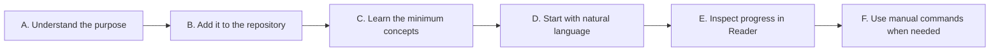
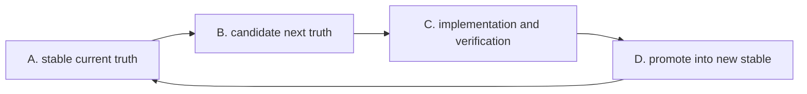
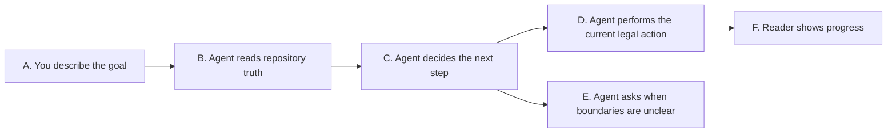
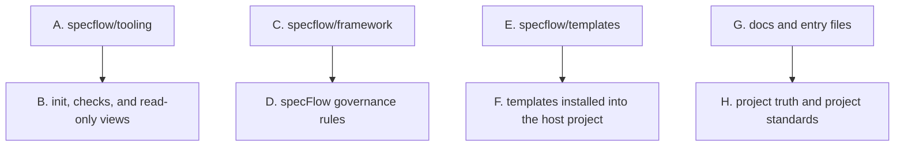

<p>
  
  
  
  
</p>

**English** · [简体中文](./README.zh-CN.md)

[Add To Your Repository](#add-to-your-repository) · [Quick Start](#quick-start) · [Core Concepts](#core-concepts) · [Natural-Language Guidance](#natural-language-guidance) · [Reader Progress View](#reader-progress-view) · [Manual Commands](#when-you-need-manual-commands) · [Advanced Usage](#advanced-usage)

---

`specFlow` makes AI-assisted development feel like engineering again: instead of letting requirements dissolve into chat logs, code diffs, and personal memory, it gives every governed unit a current truth, a next truth, and a clear path from idea to verified change. Humans and agents can move fast together while the repository still knows what is true, what is changing, and what is ready to ship.

It is not a fixed business template, and it does not force every team to write the same documents.
It is an engineering collaboration skeleton: requirements enter repository truth first, then planning, implementation, verification, and promotion follow that truth.

## What Problem It Solves

> When code moves fast, truth must not drift.

Many AI-assisted projects eventually hit the same problems:

- the real requirement only exists in chat history
- different people or agents understand the same feature differently
- code changed, but nobody can clearly state the official behavior now
- work moves quickly in the moment, but later it is hard to know whether the change actually closed

`specFlow` handles that directly:

- put behavior truth in repository files
- make the agent read current truth before moving work forward
- keep design, planning, implementation, verification, and promotion aligned to the same truth

The point is not to add documentation burden.
The point is to stop the project from depending only on chat memory and reverse-engineering intent from code.

## How specFlow Is Used

> Runtime-driven. Spec-first. Humans own goal judgment.

`specFlow` is not a standalone runtime.

It is a governance layer that works together with an agentic runtime, such as:

- `Codex`
- `Gemini CLI`
- `Claude Code`

In plain language:

- `specFlow` defines how work should move inside the repository
- the runtime reads those rules and performs file edits, code changes, and verification
- humans state the goal, confirm important boundaries, and accept or redirect the result

You do not need to memorize every command on day one.
The recommended entry is now natural language: say what you want to accomplish, and the agent should guide the request to the right next step from current repository truth.

## Start Here

If you are new to `specFlow`, understand it in this order:

1. first understand why it exists: requirements and behavior truth should live in the repository
2. then complete the smallest installation path: copy `specflow/` into your project and run `init`
3. learn only the core concepts: `Spec`, `stable`, `candidate`, `unit`, `scenario`, and `shared`
4. use natural language for daily work
5. use Reader to inspect progress and object relationships
6. learn manual commands only when you need exact control

The goal is to start using it correctly before learning every internal mechanism.



How to read this:

- `A. Understand the purpose` means knowing why repository truth matters
- `D. Start with natural language` is the normal daily entry
- `E. Inspect progress in Reader` shows where the project currently stands
- `F. Use manual commands when needed` is for exact control

## Add To Your Repository

For most teams, the default setup is enough:

1. clone this repository somewhere else
2. copy only the `specflow/` directory into your project root
3. run `init` from your project root

Shell example:

```bash
git clone https://github.com/Bingordinary/SpecFlow.git /tmp/SpecFlow
cp -R /tmp/SpecFlow/specflow ./specflow
```

Windows PowerShell example:

```powershell
git clone https://github.com/Bingordinary/SpecFlow.git $env:TEMP\SpecFlow
Copy-Item -Recurse -Force $env:TEMP\SpecFlow\specflow .\specflow
```

If you need a long-term upstream sync workflow, treat that as a maintenance concern.
See [tooling/README.md](./tooling/README.md) for tooling details.

## Quick Start

After `specflow/` is in your repository, run this from the repository root:

```bash
<specflow-binary> init
```

In this document, `<specflow-binary>` means the platform-matching `specflowctl` executable under `specflow/tooling/bin/`.
See [tooling/README.md](./tooling/README.md) for exact filenames.

`init` installs the basic structure:

- `AGENTS.md`, `GEMINI.md`, and `CLAUDE.md`
- `docs/specs/`
- `.githooks/pre-commit`
- other workflow support files

If you want Git to use the installed hook, run:

```bash
git config core.hooksPath .githooks
```

After this step, beginners usually do not need to memorize commands first.
You can tell the agent:

```text
Add rate limiting to auth.
The checkout refund behavior changed. Update truth first, then implement it.
Check whether search still matches the accepted truth.
This rule will be reused by multiple modules. Help me decide where it belongs.
```

The agent should read the installed entry files and current repository truth, then decide whether the next step is writing Spec truth, checking a boundary, creating a plan, implementing code, verifying behavior, or asking one required clarification.

## Core Concepts

These are enough to start.

`Spec` is behavior truth written in the repository.
It is not ordinary explanatory text; implementation and verification should follow it.

`stable` is the current accepted truth.
If the project officially accepts a behavior, the matching `stable` file should say so.

`candidate` is the next truth currently being prepared.
New requirements, behavior changes, and boundary changes usually enter `candidate` first, then become `stable` after acceptance.

`unit` is one engineering responsibility that can be described, implemented, and verified independently.
It does not automatically equal a directory, package, or service.

`scenario` is an end-to-end result path.
When the question is whether a user-visible chain works from trigger to outcome, rather than whether one local capability works, a `scenario` may be needed.

`shared` is truth reused by more than one object.
If the same formal rule is used by multiple `unit` or `scenario` objects, it should not be copied everywhere; it should become shared truth.

`repository_mapping.md` is repository structure truth.
It explains how paths, objects, and responsibility boundaries connect, so the agent does not guess ownership from directory names alone.

`_status.md` is the state index.
It records each object's current layer and next step, but it does not contain behavior rules.

The smallest model looks like this:



The key points:

- `A. stable current truth` is the behavior already accepted now
- `B. candidate next truth` is the behavior being changed in this round
- `C. implementation and verification` must follow the candidate
- `D. promote into new stable` means the round has been accepted

## Natural-Language Guidance

Natural-language guidance is the recommended daily entry.

You do not need to decide which command to use first.
You state the result you want, and the agent routes the request from current repository truth.

Here, "route" simply means deciding the next step that is legal now.
For example: write Spec truth, check the current design, create a plan, implement, verify, or ask you because a boundary is unclear.



How to read this:

- `A. You describe the goal` is your ordinary-language request
- `B. Agent reads repository truth` means the agent checks current Specs, state, and repository structure
- `C. Agent decides the next step` selects the smallest legal current action
- `E. Agent asks when boundaries are unclear` prevents the agent from guessing business ownership
- `F. Reader shows progress` lets you inspect the project state visually

### How To Ask Clearly

Natural language does not mean every short sentence is enough.
The request is easier to route when it says three things:

- what result you want
- what this round includes and excludes
- what would prove the work is complete

You can say:

```text
I want to add refund status tracking to checkout.
This round only covers refund state transitions. Do not change payment gateway integration.
Completion means users can see refund pending, refund succeeded, and refund failed.
If the boundary is unclear, ask me first instead of guessing.
```

Or shorter:

```text
Change search ranking so relevance comes before updated time. Update truth first, then implement.
```

If you do not know where to start, say that directly:

```text
I want to change the login security policy, but I am not sure what should move first. Read current project truth and tell me the next step.
```

### Common Entry Examples

New capability:

```text
Add a search capability. Write the first behavior truth before implementation.
```

Evolve existing capability:

```text
Update search so typo correction runs before ranking.
```

Check whether implementation still aligns:

```text
Check whether search still matches the accepted truth.
```

Reuse one rule across multiple objects:

```text
This error-code rule will be used by auth and checkout. Decide whether it should stay in one unit or become shared truth.
```

Review the governance mechanism itself:

```text
Check whether the current specFlow rules leave the agent unclear about the next step anywhere.
```

## Reader Progress View

`specflow-reader` is a read-only local view.
It helps you inspect current project state; it does not edit files and does not advance lifecycle state.

Start it with:

```bash
<specflow-reader-binary> serve --repo-root . --addr 127.0.0.1:17863
```

`<specflow-reader-binary>` means the platform-matching `specflow-reader` executable under `specflow/tooling/bin/`.

Reader answers questions like:

- which `unit`, `scenario`, and `shared` objects exist now
- which objects already have accepted truth and which are preparing next truth
- what each object's next step is
- how Spec documents, shared rules, and implementation paths connect
- which source file produced a displayed state or relationship

The three common views are:

- `Status`: object layer and next step
- `Project Structure`: path ownership and implementation locations
- `SpecFlow`: relationships among Specs, shared rules, system constraints, and support files

Important boundaries:

- Reader only reads repository truth
- Reader does not decide which governance flow a request should enter
- Reader does not write page conclusions back into project files
- if files are missing or malformed, Reader should report diagnostics instead of repairing them silently

The usual workflow is:

1. ask the agent to move work forward in natural language
2. the agent reads or updates repository truth
3. open Reader to inspect object state, next step, and related files
4. if the state is unexpected, ask the agent to explain or correct it

## When You Need Manual Commands

Most of the time, start with natural language.
Use explicit commands only when:

- you want to choose the exact current step
- the agent's route does not match your expectation
- you are debugging one object's governance state
- you are writing automation or a fixed process

Common entries:

| Situation | Common action |
| --- | --- |
| New, unfamiliar, or structurally changed repository | update `docs/specs/repository_mapping.md` |
| Existing capability entering governance for the first time | `unit_init:{unit}` |
| Brand-new capability entering governance | `unit_new:{unit}` |
| Accepted capability opening a new change round | `unit_fork:{unit}` |
| Check whether implementation still matches accepted truth | `unit_stable_verify:{unit}` |

Once an object enters the candidate chain, the common order is:

```text
unit_check -> unit_plan -> unit_impl -> unit_verify -> unit_promote
```

Meaning:

- `unit_check`: check whether next truth is clear enough
- `unit_plan`: turn truth into an implementation plan
- `unit_impl`: implement according to the plan
- `unit_verify`: verify implementation against truth
- `unit_promote`: promote the accepted next truth into stable truth

Manual commands are an exact control surface.
They are not the first thing a new user must memorize.

## When Work Stops Being Unit-Local

Most truth should start inside the current `unit`.
Do not extract shared truth only because something might be reused later.

Use this rough judgment:

- one capability's own behavior: put it in that `unit` Spec
- detailed evidence, protocol expansion, or history for one capability: put it in that `unit` appendix
- formally reused by multiple objects: consider shared truth
- repository-wide defaults, prohibitions, or global exceptions: consider system constraints

If you are unsure, ask naturally:

```text
This rule may be reused by multiple modules. Decide whether it should stay in the current unit or become shared truth.
```

The agent should read current repository truth before deciding.
If the boundary is unclear, it should ask instead of guessing.

## Advanced Usage

Read this section after the basics are clear.
It explains how the system is maintained and extended.

### Project Structure

At a high level, a repository with `specFlow` has four kinds of content:



How to read this:

- `A. specflow/tooling` owns `init`, `doctor`, `upgrade`, and Reader
- `C. specflow/framework` is the specFlow rule baseline
- `E. specflow/templates` contains files installed into the host project
- `G. docs and entry files` is where your project expresses truth, standards, and collaboration entry instructions

### What You Usually Edit

Most teams usually edit:

- `docs/specs/**`
- `docs/project_standards/**`
- the project-owned parts of `AGENTS.md`, `GEMINI.md`, and `CLAUDE.md`

Only edit these when you are intentionally changing `specFlow` itself:

- `specflow/framework/**`
- `specflow/templates/**`
- `specflow/tooling/**`
- `specflow/README*.md`

### Project Standards

`specFlow` allows a project to add its own standards on top of the framework baseline.

Those standards usually live in:

- `docs/project_standards/`
- `docs/project_standards/_registry.md`

The important rule:

- a standard file does not become active just because it exists
- it becomes active only after it is registered in `_registry.md`

In normal use, you do not need to build these files manually from nothing.
You can ask the agent to create or update them from your project rules.

### Maintenance Tooling

The tooling layer performs deterministic maintenance actions.
Common commands are:

- `init`
- `doctor`
- `upgrade`

Reader also lives in the tooling layer, but it is read-only.
See [tooling/README.md](./tooling/README.md) for the full tooling surface.

### Advanced Flows

Beyond unit commands, `specFlow` has governance-oriented flows.

The most common ones are:

- `spec_flow_review`
- `spec_flow_design_review`
- natural-language shared governance

Use these when reviewing the governance system itself, not when simply moving one business capability forward.

### Reading The Full Baseline

If you want to deeply understand or redesign the system, read in this order:

1. `framework/natural_language_routing.md`
2. `framework/spec_policy.md`
3. `framework/command_policy.md`
4. `framework/git_policy.md`
5. `framework/shared_*.md`
6. `framework/spec_flow_review.md`
7. `framework/commands/`
8. the installed project-side `docs/` files

## File Ownership

`specFlow` has two ownership modes:

- `framework`
  - `specFlow` manages the file structure
  - `upgrade` may refresh it
- `project`
  - after initialization, this belongs to your project
  - `upgrade` should not overwrite existing project files directly

Entry files such as `AGENTS.md`, `GEMINI.md`, and `CLAUDE.md` use a managed block model.
That means `specFlow` owns its block, while your project can keep long-term instructions outside that block.

## When It May Be Too Heavy

`specFlow` may be too much if:

- the project is very small
- the team does not want formal behavior truth in files
- you do not need `stable` and `candidate` layers
- you do not need humans and AI agents to follow the same long-term collaboration model

If you only want an agent to make a few temporary code edits, `specFlow` may not be the shortest path.
If you want a project to be maintained by multiple people and multiple agents over time, it starts to pay off.
