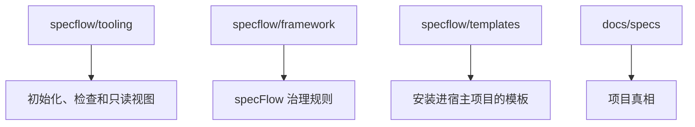

<p>
  
  
  
  
</p>

[English](./README.md) · **简体中文**

[接入仓库](#接入仓库) · [快速开始](#快速开始) · [核心概念](#核心概念) · [命令](#命令) · [工作流程](#工作流程) · [Reader](#reader-看进度)

---

`specFlow` 想做的，是让 AI 辅助开发重新像工程——而不是一连串聪明但会蒸发的对话：每个治理单元都有它的当前真相，以及从想法到验证落地的清晰路径。人和 agent 可以一起高速推进，仓库本身仍然清楚什么是真的、什么在变、什么已经可以交付。

## 它解决什么问题

> 代码可以快，真相不能乱。

很多 AI 辅助开发项目最后都会卡在同一类问题上：

- 真正的需求只存在于聊天记录里
- 不同的人、不同的 agent，对同一个功能理解不一致
- 代码已经改了，但没人能明确说现在的正式行为到底是什么
- 临时推进很快，回头看时却很难判断这轮改动是否真正收口

`specFlow` 的做法很直接：

- 把行为真相落到仓库文件里
- 让 agent 每次推进前先读当前真相
- 让设计、实现、验证和升级围绕同一份真相前进

这样做不是为了增加文档负担，而是为了避免项目只靠聊天记忆和从代码反推需求。

## specFlow 怎么用

`specFlow` 是一层治理规则，需要和 agentic runtime 一起工作，例如 Claude Code 或 OpenCode。

- `specFlow` 负责定义工作在仓库里应该怎么推进
- runtime 通过自动 hook 注入读取这些规则，执行文件读写、代码修改和验证
- 人负责说清目标、确认关键边界，以及接受或调整结果

你的项目 `specflow/framework/concepts.md` 在每次 agent session 启动时通过平台 hooks（Claude Code、OpenCode）自动注入到 agent 上下文中。agent 不需要主动读入口文件。

你需要理解几个核心概念和基本工作流程。掌握后，大部分工作可以通过 `spec_validate`、`spec_verify`、`spec_promote` 三个触发词驱动。自然语言作为兜底机制。

## 接入仓库

对大多数团队来说，最简单的首次接入方式是在项目根目录直接运行安装脚本：

```bash
curl -fsSL https://raw.githubusercontent.com/Bingordinary/SpecFlow/main/tooling/scripts/install.sh | bash
```

Windows PowerShell：

```powershell
irm https://raw.githubusercontent.com/Bingordinary/SpecFlow/main/tooling/scripts/install.ps1 | iex
```

安装脚本只做这些事：

1. 把这个仓库 clone 到 `./specflow`
2. 把 `specflow/` 写入 `.gitignore`
3. 安装当前平台需要的 `specflowctl`、`specflow-reader` 和 `SHA256SUMS`
4. 执行 `specflowctl init`（安装框架文件和平台 hooks）

之后平台 hooks 会在每次 agent session 启动时自动注入 specFlow 规则。不再需要手动维护入口文件。让 agent 对口令可验证 hooks 是否生效。

手动接入：

```bash
git clone https://github.com/Bingordinary/SpecFlow.git specflow
printf "\nspecflow/\n" >> .gitignore
specflowctl init
```

接入完成后，你的项目里应该能看到这些路径：

- `specflow/framework/`
- `specflow/templates/`
- `specflow/tooling/`

## 准备本地二进制文件

`specflow/tooling/bin/` 不提交到 git。
如果你使用了安装脚本，这一步已经完成。
如果使用手动接入，或要刷新已有的本地 `specflow/` 目录：

```bash
specflow/tooling/scripts/pull_with_release.sh
```

Windows PowerShell：

```powershell
.\specflow\tooling\scripts\pull_with_release.ps1
```

## 快速开始

`init` 完成后框架已就绪。在项目根目录启动 agent——平台 hooks 会自动加载 specFlow 规则。

工作流程：

```
specflowctl next --unit <name>      →  发现 unit 文件
编辑 candidate spec + 代码           →  没有门控
spec_validate {unit}                →  只读 subagent 检查 spec 质量
spec_verify {unit}                  →  只读 subagent 检查实现
spec_promote {unit}                 →  先 validate 再 verify，通过后 promote 到 stable
```

示例对话：

```
你：给 auth 加一个 rate limiter。
Agent：没有找到 candidate spec，先了解一下设计...
  [创建 docs/specs/units/candidate/c_unit_auth_rate_limit.md]
  [实现代码]
  要 promote 到 stable 吗？
你：先跑一下 validate。
Agent：[运行只读 subagent，按 validate checklist 检查]
  Validate 通过。
  要跑 verify 吗？
你：好。
Agent：[运行只读 subagent，按 verify checklist 检查]
  Verify 通过。
  要 promote 吗？
你：发吧。
Agent：[运行 specflowctl promote...]
  已 promote 到 stable。
```

## 核心概念

**文件存在即状态。** 没有状态机、没有状态表、没有生命周期阶段。candidate spec 存在 = 在编辑。不存在 = 没在改。

| 目录 | 含义 |
|------|------|
| `docs/specs/units/stable/` | 已经通过的稳定设计真相 |
| `docs/specs/units/candidate/` | 当前正在编辑的设计 |
| `docs/specs/rules/stable/` | 已经稳定的共享规则 |
| `docs/specs/rules/candidate/` | 正在编辑的规则 |

`promote` 是唯一的门控，负责把 candidate 文件复制到 stable。其他所有操作由 agent 直接完成。

**unit** —— 一块独立可治理的工程责任。一个 unit 拥有自己的行为真相（Spec）、实现和验证。

**rule** —— 跨对象复用的正式共享约束。全局规则（`g_`）作用于整个仓库。绑定规则（`b_`）只作用于通过 `rule_refs` 引用它的 unit。

## 命令

### 工具命令（specflowctl）

| 命令 | 作用 |
|------|------|
| `specflowctl next --unit <name>` | 发现 unit 文件、spec、规则和依赖 |
| `specflowctl promote --unit <name>` | 格式校验 + candidate→stable（唯一门控） |
| `specflowctl init` | 安装框架文件和平台 hooks |
| `specflowctl doctor` | 诊断项目配置 |
| `specflowctl migrate` | 更新 hook 文件 + 检查工具版本 |
| `specflowctl rule *` | 规则治理 |
| `specflowctl validate` | 校验文件写入权限 |

### Agent 触发词（对 agent 说）

| 触发词 | agent 做什么 |
|--------|-------------|
| `spec_validate {unit}` | 开只读 subagent 按 validate 清单检查 spec 质量 |
| `spec_verify {unit}` | 开只读 subagent 按 verify 清单检查实现 |
| `spec_promote {unit}` | 先 validate 再 verify，都通过后调 `specflowctl promote` |
| `spec_flow_migrate` | 跑迁移工具 + 检查项目文档格式 |

Agent 也会在合适时机主动建议："需要跑 validate 吗？"、"需要跑 verify 吗？"、"要 promote 吗？"

## 工作流程

### 你的职责

1. **维护 spec 文档** —— 编写和更新 `docs/specs/units/` 中的行为真相文件
2. **确认操作** —— agent 问 "需要跑 validate/verify/promote" 时回答好或不用
3. **判断验收** —— 确认 candidate 真相在 promote 前是正确的

### Agent 的职责

1. **发现** —— `specflowctl next --unit <name>` 发现 unit 文件
2. **编辑和实现** —— 更新 candidate spec 和代码，没有门控
3. **Validate** —— 开只读 subagent，按清单检查 frontmatter、acceptance items、引用完整性、跨 unit 一致性
4. **Verify** —— 开只读 subagent，逐项检查 acceptance item 的实现、scope 和代码质量
5. **Promote** —— 先 validate 再 verify，通过后调 `specflowctl promote`

### 什么时候退回自然语言

自然语言是兜底。当你不确定该用哪个触发词、工作跨越多个 unit、或想让 agent 先探索再做决定时使用。

## Reader 看进度

`specflow-reader` 是一个只读的本地视图，用来查看项目当前状态。在项目根目录启动：

```bash
<specflow-reader-binary> --repo-root . --addr 127.0.0.1:17863
```

Reader 能回答当前有哪些 unit 和 rule 对象、哪些已有正式真相、Spec 怎么连接。详见 [tooling/README.md](./tooling/README.md)。

## 什么情况下不适合

specFlow 可能偏重如果：项目非常小、团队不想把行为真相正式写进文件、或不需要人和 AI 长期遵守同一套协作模型。

## 维护

更新 `specflow/` 后，需要更新 hooks 并检查项目文档格式：

- 如果 hooks 正常：告诉 agent `spec_flow_migrate`
- 如果 hooks 尚未安装：告诉 agent "Read `framework/operations/migration.md` and follow the procedure"

迁移过程会更新 hook 文件、检查工具版本、校验项目文档格式。

框架治理方面：`spec_flow_review`（默认 scoped）、`spec_flow_review:full`（深度审计）、`spec_flow_design_review`（设计质量审查）。通过自然语言进入。

### 项目结构


