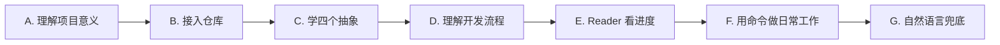
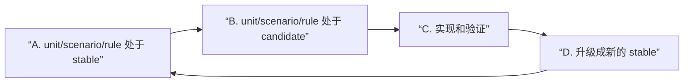
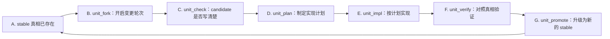
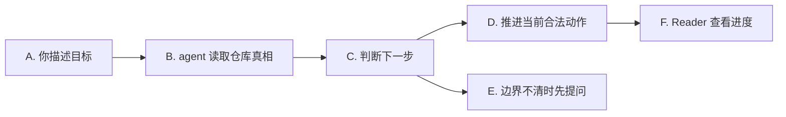
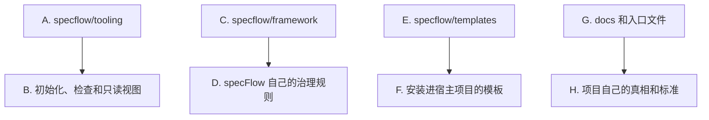

<p>
  
  
  
  
</p>

[English](./README.md) · **简体中文**

[接入仓库](#接入仓库) · [快速开始](#快速开始) · [核心概念](#核心概念) · [开发流程](#开发流程) · [Reader 看进度](#reader-看进度) · [标准命令](#标准命令) · [自然语言引导](#自然语言引导) · [进阶用法](#进阶用法)

---

`specFlow` 想做的，是让 AI 辅助开发重新像工程，而不是一连串聪明但会蒸发的对话：它把每个治理单元的当前真相、下一版真相，以及从想法到验证落地的推进路径，真正留在仓库里。这样一来，人和 agent 可以一起高速推进，但项目本身仍然清楚知道什么是真的、什么正在变化、什么已经可以交付。

它不是一个固定业务模板，也不是让所有团队写同一种文档。
它更像一套工程协作骨架：需求先进入仓库真相，再进入计划、实现、验证和沉淀。

## 它解决什么问题

> 代码可以快，真相不能乱。

很多 AI 辅助开发项目，最后都会卡在同一类问题上：

- 真正的需求只存在于聊天记录里
- 不同的人、不同的 agent，对同一个功能理解不一致
- 代码已经改了，但没人能明确说现在的正式行为到底是什么
- 临时推进很快，回头看时却很难判断这轮改动是否真正收口

`specFlow` 的做法很直接：

- 把行为真相落到仓库文件里
- 让 agent 每次推进前先读当前真相
- 让设计、计划、实现、验证和升级围绕同一份真相前进

这样做不是为了增加文档负担，而是为了避免项目只靠聊天记忆和代码结果反推需求。

## specFlow 怎么用

> Runtime 驱动，Spec 优先，人负责目标判断。

`specFlow` 不是一个单独运行的 runtime。

它是一层治理规则，需要和 agentic runtime 一起工作，例如：

- `Codex`
- `Gemini CLI`
- `Claude Code`

可以把它理解成：

- `specFlow` 负责定义这件事在仓库里应该怎么推进
- runtime 负责按照这些规则真正去读文件、改文件、改代码、做验证
- 人负责说清目标、确认关键边界，以及接受或调整结果

你需要先理解几个核心抽象概念和基本的开发流程。
把这些搞清楚之后，大部分日常工作可以用标准命令驱动。
自然语言是兜底机制：当你不确定下一步该走哪个命令时，用普通语言描述你的目标，agent 会帮你路由。

## 从这里开始

如果你是第一次接触 `specFlow`，建议按这个顺序理解：

1. 先知道它为什么存在：让需求和行为真相留在仓库里
2. 再完成最小安装：把 `specflow/` 接入你的项目并执行 `init`
3. 理解四个核心抽象：`unit`、`scenario`、`rule`、`repository_mapping`
4. 理解开发流程：`stable` → `candidate` → 验证 → 升级的循环，以及标准命令链
5. 用 Reader 看当前进度和对象关系
6. 日常用标准命令推进工作
7. 不确定下一步时，退回自然语言兜底

前四步是开始使用前必须理解的。后面的靠实践自然就会熟练。



怎么理解这张图：

- `A. 理解项目意义` 是先知道为什么要把真相写进仓库
- `C. 学四个抽象` 是最小的概念词汇量
- `D. 理解开发流程` 是知道生命周期和标准命令链怎么走
- `F. 用命令做日常工作` 是日常主入口
- `G. 自然语言兜底` 是不确定时的安全网

## 接入仓库

对大多数团队来说，最简单的接入方式是：

1. 在你的项目根目录里，把这个仓库 clone 到名为 `specflow` 的目录
2. 确认最终路径是 `./specflow`
3. 如果你的项目不想提交 framework 文件，把 `specflow/` 加到 `.gitignore`
4. 回到你的项目里执行 `init`

小写目录名是必要的。
公开仓库名是 `SpecFlow`，所以直接执行 `git clone https://github.com/Bingordinary/SpecFlow.git` 会得到 `./SpecFlow`。
但接入到项目里的 framework 目录必须是 `./specflow`，因为文档和工具都按 `specflow/tooling/bin/`、`specflow/framework/` 这类路径工作。

你可以直接 clone 到正确目录名，也可以先 clone，再把 `SpecFlow` 改名成 `specflow`。

接入完成后，你的项目里应该能看到这些路径：

- `specflow/framework/`
- `specflow/templates/`
- `specflow/tooling/`

Shell 示例：

```bash
git clone https://github.com/Bingordinary/SpecFlow.git specflow
printf "\nspecflow/\n" >> .gitignore
```

如果你已经用默认目录名 clone 过：

```bash
mv SpecFlow specflow
printf "\nspecflow/\n" >> .gitignore
```

Windows PowerShell 示例：

```powershell
git clone https://github.com/Bingordinary/SpecFlow.git specflow
Add-Content .gitignore "specflow/"
```

如果你已经用默认目录名 clone 过：

```powershell
Rename-Item .\SpecFlow specflow
Add-Content .gitignore "specflow/"
```

如果你忽略 `specflow/`，每个工作区在使用 `specFlow` 前都要自己准备这份目录。
如果你希望别人 clone 你的项目后天然带着同一套 `specFlow` framework 文件，就不要忽略它，而是把 `specflow/` 提交进项目仓库。

如果你需要长期跟上游同步，把它当成单独的维护问题处理即可。
具体工具细节见 [tooling/README.md](./tooling/README.md)。

## 准备本地二进制文件

`specflow/tooling/bin/` 不提交到 git。
执行 `init` 前，先从与你当前 tooling 源码 fingerprint 匹配的 Release 下载当前平台需要的 binary。
Release 绑定的是 tooling 输入 fingerprint，不是每一次 `specflow` 源码提交。

Linux amd64 示例：

```bash
mkdir -p specflow/tooling/bin
tag="specflow-tooling-$(specflow/tooling/scripts/tooling_fingerprint.sh --short)"
base="https://github.com/Bingordinary/SpecFlow/releases/download/${tag}"
curl -fL -o specflow/tooling/bin/specflowctl-linux-amd64 "${base}/specflowctl-linux-amd64"
curl -fL -o specflow/tooling/bin/specflow-reader-linux-amd64 "${base}/specflow-reader-linux-amd64"
curl -fL -o specflow/tooling/bin/SHA256SUMS "${base}/SHA256SUMS"
chmod +x specflow/tooling/bin/specflowctl-linux-amd64 specflow/tooling/bin/specflow-reader-linux-amd64
(cd specflow/tooling/bin && sha256sum -c SHA256SUMS --ignore-missing)
```

这些命令会替换 `specflow/tooling/bin/` 下已经存在的同名文件。
这个目录只是本地缓存，所以替换这些文件就是正常的更新方式。

Windows amd64 PowerShell 示例：

```powershell
$tag = "specflow-tooling-" + (& .\specflow\tooling\scripts\tooling_fingerprint.ps1 -Short)
$base = "https://github.com/Bingordinary/SpecFlow/releases/download/$tag"
New-Item -ItemType Directory -Force specflow/tooling/bin | Out-Null
Invoke-WebRequest "$base/specflowctl-windows-amd64.exe" -OutFile "specflow/tooling/bin/specflowctl-windows-amd64.exe"
Invoke-WebRequest "$base/specflow-reader-windows-amd64.exe" -OutFile "specflow/tooling/bin/specflow-reader-windows-amd64.exe"
Invoke-WebRequest "$base/SHA256SUMS" -OutFile "specflow/tooling/bin/SHA256SUMS"
```

其他平台后缀包括 `darwin-amd64`、`darwin-arm64`、`linux-amd64`、`linux-arm64`、`windows-amd64.exe` 和 `windows-arm64.exe`。

## 快速开始

当 `specflow/` 已经进入你的仓库后，在仓库根目录执行：

```bash
<specflow-binary> init
```

下文里的 `<specflow-binary>`，表示 `specflow/tooling/bin/` 下与你当前平台匹配的 `specflowctl` 可执行文件。
这个目录是本地缓存。
请从当前 tooling fingerprint 对应的 GitHub Release 下载匹配平台的 binary，或者在开发 tooling 时从源码本地构建。
具体文件名可以直接看 [tooling/README.md](./tooling/README.md)。

`init` 会安装最基本的骨架，包括：

- `AGENTS.md`、`GEMINI.md`、`CLAUDE.md`
- `docs/specs/`
- 其他 workflow 支撑文件

完成这一步后，建议先读完[核心概念](#核心概念)和[开发流程](#开发流程)，再开始日常工作。

日常用标准命令推进：

```text
unit_new:search
unit_check:auth
unit_fork:payment
unit_verify:checkout
```

不确定下一步时，退回自然语言兜底：

```text
给 auth 加 rate limit，但我不确定应该先动哪块。请先读当前项目真相，然后告诉我下一步。
checkout 的退款规则变了，先更新真相再实现。
这个规则以后要给多个模块共用，帮我判断应该放在哪里。
```

agent 会读取安装后的入口文件和当前仓库真相，再决定下一步该走哪个命令、写 Spec、检查边界，还是停下来问你一个必须确认的问题。

## 核心概念

`specFlow` 只有四个正式抽象。其它概念都是从这四个派生出来的。

### 四个抽象

`unit` 是一块可独立描述、实现和验证的工程责任。
它是最小的治理对象。一个 unit 拥有自己的行为真相、实现计划和实现工作。
它不一定等于一个目录、package 或 service。

`scenario` 是一条端到端触发-结果链路。
当你关心的是”用户从触发到最终结果是否成立”——跨越多个 unit 时——就需要 scenario。
scenario 拥有链路真相和端到端验证，但不拥有实现计划。

`rule` 是一个被多个对象正式复用的规则。
它有两种作用域：全局规则（`g_`）作用于整个仓库；绑定规则（`b_`）只作用于显式引用了它的 unit 或 scenario。
rule 不是命令对象——用户通过自然语言进入 rule 工作，agent 负责路由到正确的内部 rule 治理流。

`repository_mapping` 是项目结构真相文件（`docs/specs/repository_mapping.md`）。
它记录当前有哪些正式对象、哪些路径归属于哪些对象、以及归属边界怎么判定。
它不是命令对象，也不使用 `stable`/`candidate` 分层。

### stable 与 candidate 分层

`stable` 和 `candidate` 不是独立概念，而是 `unit`、`scenario`、`rule` 可以处于的两种层。

`stable` 是当前正式接受的真相。如果项目已经承认某个行为，对应的 `stable` 文件就记录了这个事实。

`candidate` 是正在准备的下一版真相。新需求、行为调整、边界变化，先进入 `candidate`，确认后再变成新的 `stable`。

### 状态索引

`_status.md` 是状态索引文件（`docs/specs/_status.md`）。
它记录每个 `unit` 和 `scenario` 对象当前处于哪一层、下一步合法命令是什么。它不承载行为规则正文。

### 最小模型



这张图的关键点是：

- `A. stable` 是现在已经承认的行为
- `B. candidate` 是这一轮准备改变的行为
- `C. 实现和验证` 必须围绕 candidate 发生
- `D. 升级成新的 stable` 表示这一轮结果被正式接受

## 开发流程

这是你日常工作的主循环。在开始使用前必须理解。

### 生命周期

一个治理对象沿着固定的阶段序列推进。每个阶段有一个标准命令。

对 `unit` 来说，完整命令链是：

```text
unit_init → unit_stable_verify → unit_fork → unit_new → unit_check → unit_plan → unit_impl → unit_verify → unit_promote
```

实际工作中，最常用的循环是：



怎么理解这张图：

- `A. stable 真相已存在` 表示 unit 磁盘上已有正式接受的行为真相
- `B. unit_fork` 从当前 stable 开启新一轮 candidate
- `C. unit_check` 确认 candidate 真相已经写得足够清楚，可以进入计划阶段
- `D. unit_plan` 把真相整理成可执行的实现计划
- `E. unit_impl` 按计划实现
- `F. unit_verify` 对照 candidate 真相验证实现
- `G. unit_promote` 把确认后的 candidate 升级为新的 stable 真相

对于从未有过 stable 真相的全新 unit，起点是 `unit_new` 而非 `unit_fork`。

对 `scenario` 来说，命令链类似但不包含实现计划：

```text
scenario_new → scenario_stable_verify → scenario_fork → scenario_check → scenario_verify → scenario_promote
```

### 标准命令速查

| 场景 | 命令 |
| --- | --- |
| 历史能力第一次纳入治理 | `unit_init:{unit}` |
| 全新能力第一次进入治理 | `unit_new:{unit}` |
| 已有正式真相的能力开启新一轮演进 | `unit_fork:{unit}` |
| 检查 candidate 真相是否写清楚 | `unit_check:{unit}` |
| 从真相生成实现计划 | `unit_plan:{unit}` |
| 按计划实现 | `unit_impl:{unit}` |
| 对照真相验证实现 | `unit_verify:{unit}` |
| 将 candidate 升级为新的 stable | `unit_promote:{unit}` |
| 检查当前实现是否仍符合 stable 真相 | `unit_stable_verify:{unit}` |

scenario 对应命令形状相同：`scenario_new`、`scenario_fork`、`scenario_check`、`scenario_verify`、`scenario_promote`、`scenario_stable_verify`。

### 你的职责

作为用户，你的主要职责是：

1. **维护 spec 文档** —— 编写和更新行为真相文件。unit 的真相在 `docs/specs/units/`，scenario 的真相在 `docs/specs/scenarios/`。这些是命令消费的真相源头。
2. **驱动生命周期** —— 在正确的阶段发出正确的命令。通过 `_status.md` 和 Reader 了解当前阶段和下一步合法命令。
3. **判断验收** —— 确认 candidate 真相在升级前是正确的，确认验证结果符合你的预期。

agent 负责每个命令的机械执行：读取真相、校验 gate、生成计划、编写代码、运行验证。

### 什么时候退回自然语言

自然语言是兜底机制。以下情况用它：

- 你不确定下一步该走哪个命令
- 工作跨越多个对象，操作顺序很关键
- 涉及跨单元规则，归属不清楚
- 你想让 agent 先读当前真相，再告诉你下一步

## 自然语言引导

自然语言引导是安全网——不是日常主入口。

当你知道该用哪个命令时，直接用命令。自然语言是留给”下一步不确定”的时刻：你用普通语言描述目标，agent 读取当前仓库真相后，判断最小的合法下一步。

路由的意思是：agent 判断现在应该先走哪一步——先写 Spec、先检查当前设计、先制定计划、先实现、先验证，或者因为边界不清而先问你。



怎么理解这张图：

- `A. 你描述目标` 是你用普通语言说需求
- `B. agent 读取仓库真相` 是 agent 去看当前 Spec、状态和项目结构
- `C. 判断下一步` 是选择当前最小且合法的动作
- `E. 边界不清时先提问` 是避免 agent 直接猜业务边界
- `F. Reader 查看进度` 是你用可视化方式确认项目状态

### 怎么说更容易被正确引导

自然语言不等于随便一句话就一定足够。
越能说清这三点，agent 越不容易走偏：

- 你想完成什么结果
- 这次范围包括什么，不包括什么
- 什么现象能证明这件事已经完成

可以直接这样说：

```text
我要做：给 checkout 增加退款状态追踪。
这次范围：只覆盖退款状态流转，不改支付网关接入。
完成标准：用户能看到退款处理中、退款成功、退款失败三种状态。
如果发现边界不清，先问我，不要直接猜。
```

也可以更短：

```text
search 的排序规则要改成先按相关性，再按更新时间。先更新真相，再实现。
```

如果你不知道该从哪里开始，也可以直接说：

```text
我想改登录安全策略，但不确定应该先动哪块。请先读当前项目真相，然后告诉我下一步。
```

### 常见入口示例

新能力：

```text
帮我新增一个 search 能力，先写清第一版行为，再实现。
```

已有能力继续演进：

```text
把 search 改成先做 typo correction，再做 ranking。
```

检查当前实现是否对齐：

```text
帮我检查 search 现在是不是还符合正式真相。
```

跨多个对象复用同一规则：

```text
这个错误码规则后面 auth 和 checkout 都要用，帮我判断应该放在单元里还是做成规则。
```

治理机制本身需要检查：

```text
帮我检查当前 specFlow 规则有没有让 agent 卡在不清楚下一步的地方。
```

## Reader 看进度

`specflow-reader` 是一个只读本地视图。
它用来帮你看当前项目状态，不负责改文件，也不负责推进流程。

启动方式：

```bash
<specflow-reader-binary> --repo-root . --addr 127.0.0.1:17863
```

`<specflow-reader-binary>` 表示 `specflow/tooling/bin/` 下与你当前平台匹配的 `specflow-reader` 可执行文件。
这个 binary 来自当前 tooling fingerprint 对应的 GitHub Release，也可以在开发 tooling 时本地构建。
它会直接启动本地服务，不需要 `serve` 子命令。

如果你当前所在目录是项目根目录，请保留 `--repo-root .`。
如果你先进入 `specflow/tooling/bin`，再从这个目录里执行 reader binary，就可以省略 `--repo-root`，因为默认项目根目录是相对于当前工作目录的 `../../..`：

```bash
cd specflow/tooling/bin
./specflow-reader-linux-amd64 --addr 127.0.0.1:17863
```

Reader 主要回答这些问题：

- 当前有哪些 `unit`、`scenario` 和 `rule`
- 哪些对象已经有正式真相，哪些还在准备下一版
- 当前对象的下一步是什么
- Spec 文档、规则和实现路径之间怎么连接
- 哪些内容来自 `_status.md`、`repository_mapping.md` 或具体 Spec 文件

Reader 的刷新按钮会立刻从磁盘重新读取一次快照。
已打开的页面也会按固定间隔轮询本地 reader 服务。
Reader 不依赖文件监听事件。

Reader 里通常先看四个视图：

- `Spec 查看`：看仍在确认的 candidate Spec，以及已经确认的 stable Spec
- `状态`：看对象当前层和下一步
- `项目结构`：看路径归属和实现位置
- `SpecFlow`：看 Spec、规则、全局规则和支撑文件之间的关系

需要注意：

- Reader 只读仓库真相
- Reader 不会替你判断一个需求应该走哪个治理 flow
- Reader 不会把页面上的结论写回项目文件
- 如果文件缺失或格式不对，Reader 应该报告问题，而不是偷偷修复

最常见的配合方式是：

1. 你用自然语言让 agent 推进
2. agent 更新或读取仓库真相
3. 你打开 Reader 看对象状态、下一步和关联文件
4. 如果状态不符合预期，再让 agent 解释或修正

## 标准命令

日常工作中，你最常用的是[开发流程](#开发流程)中列出的标准 `unit` 命令。

命令格式为 `{命令}:{unit}` 或 `{命令}:{scenario}`。例如：`unit_check:payment`、`scenario_verify:checkout_flow`。

### 选择合适的入口

| 你的情况 | 动作 |
| --- | --- |
| 新仓库、陌生仓库，或者仓库结构刚变过 | 更新 `docs/specs/repository_mapping.md` |
| 历史能力第一次纳入治理 | `unit_init:{unit}` |
| 全新能力第一次进入治理 | `unit_new:{unit}` |
| 已有正式真相的能力要开新一轮演进 | `unit_fork:{unit}` |
| 检查当前实现是否仍符合正式真相 | `unit_stable_verify:{unit}` |
| 现有项目文件需要适配新版 `specFlow` framework 规则 | `spec_flow_migrate` |

一旦 unit 进入 candidate 链，按标准顺序推进：

```text
unit_check → unit_plan → unit_impl → unit_verify → unit_promote
```

### 什么时候用自然语言更合适

以下情况用自然语言而不是直接发命令：

- 你不确定下一步该走哪个命令
- agent 上一条命令的路由结果和你预期不一致
- 你正在排查某个对象的治理状态
- 工作跨越多个对象，操作顺序很关键
- 涉及跨单元规则处理

## 什么时候不再是单元内问题

大部分真相应该先在当前 `unit` 内解决。
不要因为”以后可能复用”就过早抽成 `rule`。

通常可以按这个判断：

- 只描述一个能力自己的行为：放在这个 `unit` 的 Spec 里
- 只是这个能力的详细证据、协议展开或历史说明：放在这个 `unit` 的 appendix 里
- 已经被多个正式对象共同复用：提取成 `rule`（全局 `g_` 或绑定 `b_`）
- 是全仓库默认规则、禁止事项或全局例外：考虑全局 `g_` rule

如果你不确定，退回自然语言：

```text
这个规则可能会被多个模块共用。请先判断它应该留在当前单元，还是做成 rule。
```

agent 应该读取当前仓库真相后再判断。
如果边界不清，它应该停下来问你，而不是硬猜。

## 进阶用法

基础用法看明白以后，再看这一节。
这里主要帮助你理解这套系统怎样被维护和扩展。

### 项目结构

从高层看，`specFlow` 接入后的仓库通常有四类内容：



怎么理解：

- `A. specflow/tooling` 负责 `init`、`doctor`、`upgrade` 和 Reader
- `C. specflow/framework` 是 specFlow 的规则基线
- `E. specflow/templates` 是安装到宿主项目的文件模板
- `G. docs 和入口文件` 是你的项目表达真相、标准和协作入口的地方

### 通常改哪些地方

大多数团队日常真正会改的是：

- `docs/specs/**`
- `docs/project_standards/**`
- `AGENTS.md`、`GEMINI.md`、`CLAUDE.md` 里属于项目自己的部分

只有当你明确在改 `specFlow` 本身时，才应该改：

- `specflow/framework/**`
- `specflow/templates/**`
- `specflow/tooling/**`
- `specflow/README*.md`

### 项目级标准

`specFlow` 允许项目在 framework 基线之上增加自己的标准。

这些标准主要放在：

- `docs/project_standards/`
- `docs/project_standards/_registry.md`

关键规则是：

- 不是标准文件存在，它就自动生效
- 只有注册进 `_registry.md` 后，它才会进入流程

正常使用时，你不必手工从零搭这些文件。
可以直接让 agent 根据你的项目规则创建或更新。

### 维护工具

tooling 层主要做确定性的维护动作。
常见命令是：

- `init`
- `doctor`
- `upgrade`

Reader 也在 tooling 层，但它是只读视图。
完整工具说明见 [tooling/README.md](./tooling/README.md)。

### 更新须知

当你 pull 或用其他方式更新 `specflow/` 后，只在当前 tooling 源码 fingerprint 需要另一份 Release binary 时，才需要刷新本地 binary。

fingerprint 是直接从源码里的 tooling 输入算出来的，所以这个检查不依赖已有的 `specflowctl` binary：

```bash
specflow/tooling/scripts/tooling_fingerprint.sh --short
```

如果 `specflow/tooling/bin/` 不存在，或者已有 binary 报 stale，就重新执行[准备本地二进制文件](#准备本地二进制文件)里的下载命令。
下载命令会覆盖本地缓存文件。
每次 pull 后都跑一遍是安全的，但只有 tooling fingerprint 变化或本地 binary 缺失时才有必要。

本地 binary 确认是当前版本后，再让 agent 执行：

```bash
spec_flow_migrate
```

`spec_flow_migrate` 的作用，是让当前项目实例适配新版 `specFlow` framework 契约。
它会扫描项目侧真相文件、状态文件、过程文件和入口文件 managed block；只做结果明确的机械文件形状更新；如果旧过程状态在新规则下已经不能信任，就让这些状态失效。

它是 agent 入口，不是 `specflowctl migrate` 这种二进制子命令。
它不能改变业务真相，也不能改实现代码。

### 进阶 flow

除了单元命令，`specFlow` 还有一些更偏治理本身的 flow。

最常见的是：

- `spec_flow_review`
- `spec_flow_design_review`
- `spec_flow_migrate`
- rule 治理（通过自然语言进入）

当你想检查治理系统本身，而不是推进某个业务能力时，才会进入 `spec_flow_review` 或 `spec_flow_design_review`。
更新 `specflow/` 后使用 `spec_flow_migrate`，详见[更新须知](#更新须知)。
对于 rule 工作——提取、绑定、重构或检查跨单元规则的影响——用自然语言描述意图，agent 会通过 rule 治理分支路由。

### 想吃透整套 baseline 时怎么读

如果你准备深入理解或改造这套机制，建议按这个顺序读：

1. `framework/natural_language_routing.md`
2. `framework/spec_policy.md`
3. `framework/command_policy.md`
4. `framework/rule_new.md`、`framework/rule_extract.md`、`framework/rule_bind.md`、`framework/rule_topology.md`、`framework/rule_sync.md`、`framework/rule_escape.md`
5. `framework/spec_flow_review.md`
6. `framework/spec_flow_migrate.md`
7. `framework/commands/`
8. 安装到项目侧的 `docs/` 文件

## 文件所有权

`specFlow` 里有两种所有权模式：

- `framework`
  - `specFlow` 管理文件结构
  - `upgrade` 可能会刷新它
- `project`
  - 初始化之后，这部分属于你的项目
  - `upgrade` 不应该直接覆盖已有项目文件

像 `AGENTS.md`、`GEMINI.md`、`CLAUDE.md` 这类入口文件，采用 managed block 模式。
也就是说，`specFlow` 管自己的 block，你的项目可以在 block 外保留自己的长期说明。

## 什么情况下不适合用它

如果你的情况是下面这样，`specFlow` 可能偏重：

- 项目非常小
- 团队并不想把行为真相正式写进文件
- 你不需要 `stable` 和 `candidate` 这种分层
- 你不需要让人和 AI 长期遵守同一套协作模型

如果你只是想让 agent 临时改几行代码，`specFlow` 可能不是最短路径。
如果你希望一个项目长期被多人和多个 agent 共同维护，它才会开始体现价值。
