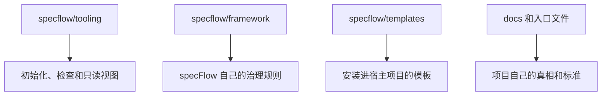

<p>
  
  
  
  
</p>

[English](./README.md) · **简体中文**

[接入仓库](#接入仓库) · [快速开始](#快速开始) · [核心概念](#核心概念) · [标准命令](#标准命令) · [开发流程](#开发流程) · [Reader](#reader-看进度) · [进阶用法](#进阶用法)

---

`specFlow` 想做的，是让 AI 辅助开发重新像工程——而不是一连串聪明但会蒸发的对话：每个治理单元都有它的当前真相、下一版真相，以及从想法到验证落地的清晰路径。人和 agent 可以一起高速推进，仓库本身仍然清楚什么是真的、什么在变、什么已经可以交付。

它不是固定的业务模板，也不是让所有团队写同一种文档。
它是一套工程协作骨架：需求先进入仓库真相，再进入计划、实现、验证和沉淀。

## 它解决什么问题

> 代码可以快，真相不能乱。

很多 AI 辅助开发项目最后都会卡在同一类问题上：

- 真正的需求只存在于聊天记录里
- 不同的人、不同的 agent，对同一个功能理解不一致
- 代码已经改了，但没人能明确说现在的正式行为到底是什么
- 临时推进很快，回头看时却很难判断这轮改动是否真正收口

`specFlow` 的做法很直接：

- 把行为真相落到仓库文件里
- 让 agent 每次推进前先读当前真相
- 让设计、计划、实现、验证和升级围绕同一份真相前进

这样做不是为了增加文档负担，而是为了避免项目只靠聊天记忆和从代码反推需求。

## specFlow 怎么用

> Runtime 驱动，Spec 优先，人负责目标判断。

`specFlow` 不是一个单独运行的 runtime。

它是一层治理规则，需要和 agentic runtime 一起工作，例如：

- `Claude Code`
- `Codex`
- `Gemini CLI`

可以把它理解成：

- `specFlow` 负责定义这件事在仓库里应该怎么推进
- runtime 负责按照这些规则真正去读文件、改文件、改代码、做验证
- 人负责说清目标、确认关键边界，以及接受或调整结果

你需要先理解几个核心概念和基本的开发流程。
把这些搞清楚之后，大部分日常工作可以用标准命令驱动。
自然语言是兜底机制：当你不确定下一步该走哪个命令时，用普通语言描述你的目标，agent 会帮你路由。

## 接入仓库

对大多数团队来说，最简单的首次接入方式是在项目根目录直接运行安装脚本。
它采用默认的本地 framework 方式，也就是把 `specflow/` 加进你的项目 `.gitignore`：

```bash
curl -fsSL https://raw.githubusercontent.com/Bingordinary/SpecFlow/main/tooling/scripts/install.sh | bash
```

Windows PowerShell：

```powershell
irm https://raw.githubusercontent.com/Bingordinary/SpecFlow/main/tooling/scripts/install.ps1 | iex
```

安装脚本只做这些事：

1. 把这个仓库 clone 到 `./specflow`
2. 把 `specflow/` 写入 `.gitignore`
3. 安装当前平台需要的 `specflowctl`、`specflow-reader` 和 `SHA256SUMS`
4. 执行 `specflowctl init`

安装脚本只用于首次接入。
如果 `./specflow` 已经存在，它会停下来，并提示你继续使用已有的 pull helper。

从 GitHub 链接直接运行脚本是可行的，因为 `raw.githubusercontent.com` 返回的是脚本文本。
但这本质上是在执行远程代码：运行前应该先检查脚本内容；如果你的环境需要固定来源，就不要用 `main`，而是把 URL 固定到可信的 tag 或 commit。

如果你想自己控制每一步，或者想把 `specflow/` 提交进项目仓库，而不是忽略它，可以继续使用手动接入方式：

1. 在你的项目根目录里，把这个仓库 clone 到名为 `specflow` 的目录
2. 确认最终路径是 `./specflow`
3. 如果你的项目不想提交 framework 文件，把 `specflow/` 加到 `.gitignore`
4. 回到你的项目里执行 `init`（见[快速开始](#快速开始)）

小写目录名是必要的。
公开仓库名是 `SpecFlow`，所以直接执行 `git clone https://github.com/Bingordinary/SpecFlow.git` 会得到 `./SpecFlow`。
但接入到项目里的 framework 目录必须是 `./specflow`，因为文档和工具都按 `specflow/tooling/bin/`、`specflow/framework/` 这类路径工作。

你可以直接 clone 到正确目录名，也可以先 clone，再把 `SpecFlow` 改名成 `specflow`。

接入完成后，你的项目里应该能看到这些路径：

- `specflow/framework/`
- `specflow/templates/`
- `specflow/tooling/`

Shell 示例：

```bash
git clone https://github.com/Bingordinary/SpecFlow.git specflow
printf "\nspecflow/\n" >> .gitignore
```

如果你已经用默认目录名 clone 过：

```bash
mv SpecFlow specflow
printf "\nspecflow/\n" >> .gitignore
```

Windows PowerShell 示例：

```powershell
git clone https://github.com/Bingordinary/SpecFlow.git specflow
Add-Content .gitignore "specflow/"
```

如果你已经用默认目录名 clone 过：

```powershell
Rename-Item .\SpecFlow specflow
Add-Content .gitignore "specflow/"
```

如果你忽略 `specflow/`，每个工作区在使用 `specFlow` 前都要自己准备这份目录。
如果你希望别人 clone 你的项目后天然带着同一套 `specFlow` framework 文件，就不要忽略它，而是把 `specflow/` 提交进项目仓库。

如果你需要长期跟上游同步，把它当成单独的维护问题处理即可。
具体工具细节见 [tooling/README.md](./tooling/README.md)。

## 准备本地二进制文件

`specflow/tooling/bin/` 不提交到 git。
如果你使用了上面的安装脚本，这一步已经完成。
如果你使用手动接入，或者要刷新已有的本地 `specflow/` 目录，在项目根目录运行 pull 脚本：

```bash
specflow/tooling/scripts/pull_with_release.sh
```

Windows PowerShell：

```powershell
.\specflow\tooling\scripts\pull_with_release.ps1
```

这个脚本会对 `specflow/` 执行 fast-forward pull，计算当前 tooling fingerprint，并且只在本地 binary 缺失、过期或缺少校验文件时，安装当前平台需要的 `specflowctl`、`specflow-reader` 和 `SHA256SUMS`。
Release 绑定的是 tooling 输入 fingerprint，不是每一次 `specflow` 源码提交。

## 快速开始

如果你使用了安装脚本，`init` 已经执行过。
如果你使用手动接入，当 `specflow/` 已经进入你的仓库、本地二进制文件也已就位后，在仓库根目录执行：

```bash
<specflow-binary> init
```

`<specflow-binary>` 表示 `specflow/tooling/bin/` 下与你当前平台匹配的 `specflowctl` 可执行文件。
具体文件名见 [tooling/README.md](./tooling/README.md)。

`init` 会安装最基本的骨架，包括：

- `AGENTS.md`、`GEMINI.md`、`CLAUDE.md`
- `docs/specs/`
- 其他 workflow 支撑文件

完成这一步后，建议先读完[核心概念](#核心概念)和[开发流程](#开发流程)，再开始日常工作。

日常用标准命令推进，把 `{module_name}` 替换为你要工作的模块名：

```text
unit_new:{module_name}
unit_check:{module_name}
unit_fork:{module_name}
unit_verify:{module_name}
```

不确定下一步时，退回自然语言兜底：

```text
给 auth 加 rate limit，但我不确定应该先动哪块。请先读当前项目真相，然后告诉我下一步。
```

agent 会读取安装后的入口文件和当前仓库真相，再决定下一步该走哪个命令、写 Spec、检查边界，还是停下来问你一个必须确认的问题。

## 核心概念

specFlow 只有两个正式概念。其它一切都是从这两个组合出来的。

### 两个概念

**unit** —— 一块独立可治理的工程责任。一个 unit 拥有自己的行为真相（Spec）、实现计划、实现工作和验证。它是唯一有正式生命周期的对象。unit 可以描述一个局部能力，也可以描述一条完整的用户结果链。它不一定等于一个目录、package 或 service。

**rule** —— 跨对象复用的正式真相。全局规则（`g_`）作用于整个仓库；绑定规则（`b_`）只作用于通过 `rule_refs` 显式引用它的 unit。rule 工作通过自然语言进入，agent 负责路由到正确的内部治理流。

### 生命周期

每个治理对象都沿着同一个模式推进：

```
stable ⟶ candidate ⟶ verify ⟶ promote ⟶ 新的 stable
```

对应到 unit 的命令链：

```
unit_new / unit_fork → unit_check → unit_plan → unit_impl → unit_verify → unit_promote
```

- **stable** 是当前正式接受的行为真相
- **candidate** 是正在准备的下一版真相（新需求、行为调整）
- **verify** 对照 candidate 验证实现
- **promote** 把通过验收的 candidate 升级为新的 stable

全新 unit 从 `unit_new` 开始。已有 stable 真相的 unit 从 `unit_fork` 开始。

### 自由组合

Unit 和 rule 可以自由组合：

- 一个 unit 通过 frontmatter 里的 `rule_refs` 引用任意数量的 rule
- 生命周期对每个对象独立作用
- `repository_mapping.md` 记录当前有哪些对象、哪些路径归属于谁、边界怎么判——它描述组合的结果，不是第三个概念

这意味着，不管是一个功能、一个服务、还是整个仓库，都只需要两个概念加一个生命周期模式就能治理。

## 标准命令

| 场景 | 命令 |
|---|---|
| 历史能力第一次纳入治理 | `unit_init:{unit}` |
| 全新能力第一次进入治理 | `unit_new:{unit}` |
| 已有正式真相的能力开启新一轮演进 | `unit_fork:{unit}` |
| 检查 candidate 真相是否写清楚 | `unit_check:{unit}` |
| 从真相生成实现计划 | `unit_plan:{unit}` |
| 按计划实现 | `unit_impl:{unit}` |
| 对照真相验证实现 | `unit_verify:{unit}` |
| 将 candidate 升级为新的 stable | `unit_promote:{unit}` |
| 检查当前实现是否仍符合 stable 真相 | `unit_stable_verify:{unit}` |

命令格式为 `{命令}:{unit}`，例如 `unit_check:payment`。

## 开发流程

### 你的职责

1. **维护 spec 文档** —— 编写和更新 `docs/specs/units/` 中的行为真相文件。这些是命令消费的真相源头。
2. **驱动生命周期** —— 在正确的阶段发出正确的命令。通过 `docs/specs/_status.md` 和 Reader 了解当前阶段和下一步合法命令。
3. **判断验收** —— 确认 candidate 真相在升级前是正确的，确认验证结果符合你的预期。

agent 负责每个命令的机械执行：读取真相、校验 gate、生成计划、编写代码、运行验证。

### 什么时候退回自然语言

自然语言是兜底机制。当你：不确定下一步该走哪个命令、工作跨越多个对象且顺序关键、涉及跨单元规则、或想让 agent 先读当前真相再告诉你怎么走，就用自然语言。

用普通语言描述目标。agent 会读取仓库真相，判断当前最小的合法动作，然后执行——如果边界不清就先问你。

## Reader 看进度

`specflow-reader` 是一个只读的本地视图，用来查看项目当前状态。在项目根目录启动：

```bash
<specflow-reader-binary> --repo-root . --addr 127.0.0.1:17863
```

Reader 能回答：当前有哪些 unit 和 rule 对象、哪些已有正式真相、每个对象下一步是什么、Spec 文档和规则及实现路径之间怎么连接。四个常用视图是 Spec 查看、状态、项目结构和 SpecFlow。

Reader 不负责改文件，也不负责推进流程。详见 [tooling/README.md](./tooling/README.md)。

## 什么情况下不适合

specFlow 可能偏重如果：项目非常小、团队不想把行为真相正式写进文件、不需要 stable/candidate 分层、或不需要人和 AI 长期遵守同一套协作模型。

如果只是让 agent 临时改几行代码，specFlow 不是最短路径。如果希望项目被多人和多 agent 长期维护，它才会开始体现价值。

## 进阶用法

### 项目结构

specFlow 接入后的仓库有四类内容：



### 维护工具

tooling 命令：`init`、`doctor`、`upgrade`。Reader 也在 tooling 层，但它是只读视图。

更新 `specflow/` 后，先检查 tooling fingerprint 确认是否需要刷新本地二进制文件，然后让 agent 执行 `spec_flow_migrate`，使项目侧文件适配当前 framework 契约。

进阶治理 flow（`spec_flow_review`、`spec_flow_design_review`、rule 治理）通过自然语言进入。
