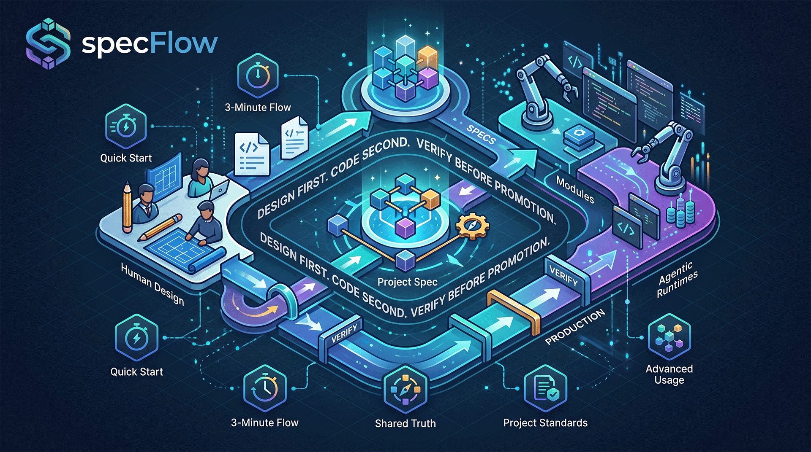
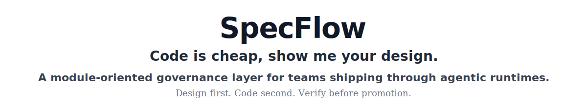
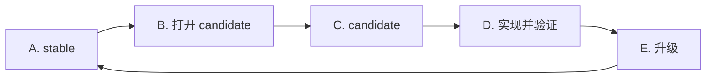
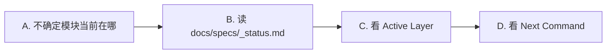
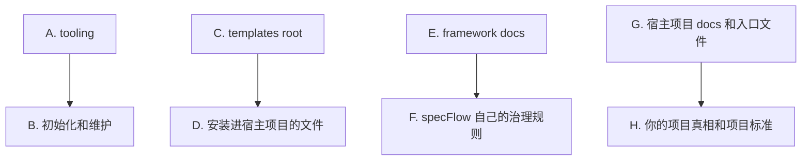

<p>
  
  
  
  
</p>

[English](./README.md) · **简体中文**

[接入仓库](#接入仓库) · [快速开始](#快速开始) · [实际怎么用](#实际怎么用) · [共享真相](#什么时候不再是单模块问题) · [进阶用法](#进阶用法)

---

`specFlow` 想做的，是让 AI 辅助开发重新像工程，而不是一连串聪明但会蒸发的对话：它把每个模块的当前真相、下一版真相，以及从想法到验证落地的推进路径，真正留在仓库里。这样一来，人和 agent 可以一起高速推进，但项目本身仍然清楚知道什么是真的、什么正在变化、什么已经可以交付。它不是死模板，而是一套很强的治理骨架，你可以继续按自己的业务把它改得更锋利。

## 它解决什么问题

> 代码可以快，真相不能乱。

很多 AI 辅助开发项目，最后都会卡在同一类问题上：

- 真正的需求只存在于聊天记录里
- 不同的人、不同的 agent，对同一个功能理解不一致
- 代码已经改了，但没人能明确说现在的正式行为到底是什么
- 临时推进很快，回头看时却很难判断这轮改动是否真正收口

`specFlow` 的做法很简单：

- 把行为真相落到仓库文件里

然后再围绕这份真相加上一套明确的推进步骤，让设计、计划、实现、验证、升级不会一路漂移下去。

## specFlow 怎么用

> Runtime 驱动，模块组织，Spec 优先。

`specFlow` 不是一个单独运行的 runtime。

它是一层治理规则，需要和 agentic runtime 一起工作，例如：

- `Codex`
- `Gemini CLI`
- `Claude Code`

可以把它理解成：

- `specFlow` 负责定义这件事在仓库里应该怎么推进
- runtime 负责按照这些规则真正去读文件、改文件、改代码、做验证

它还是模块导向的。
也就是说，大部分正式工作都会围绕一个明确的 `module` 展开，Spec、计划、实现、验证和升级，通常也按模块收口。

## 从这里开始

> 先抓住最短路径，后面再扩展。

如果你是第一次接触 `specFlow`，不要一上来试图吃透所有规则。

建议按这个顺序读：

1. `接入仓库`
2. `快速开始`
3. `实际怎么用`
4. `核心模型`
5. `三分钟理解流程`
6. `什么时候需要手动控命令`，只有你真的需要精确控制时再看

读完这些，你就已经知道它大致怎么用了。

如果后面你想理解更深的治理机制、自定义方式或者完整基线，再进入 `进阶用法`。

## 接入仓库

> 先把 `specflow/` 放进项目，再执行 `init`。

对大多数团队来说，默认接入方式就够了：

1. 把这个仓库 clone 到别的目录
2. 只把其中的 `specflow/` 目录复制到你项目根目录
3. 回到你的项目里执行 `init`

Shell 示例：

```bash
git clone https://github.com/Bingordinary/SpecFlow.git /tmp/SpecFlow
cp -R /tmp/SpecFlow/specflow ./specflow
```

Windows PowerShell 示例：

```powershell
git clone https://github.com/Bingordinary/SpecFlow.git $env:TEMP\SpecFlow
Copy-Item -Recurse -Force $env:TEMP\SpecFlow\specflow .\specflow
```

如果你真的需要长期跟上游同步，把它当成维护层问题处理即可，再去看 [tooling/README.md](./tooling/README.md) 和你偏好的仓库同步策略。

## 快速开始

> 先把结构装好，再开始用。

当 `specflow/` 已经进入你的仓库后，在仓库根目录执行：

```bash
<specflow-binary> init
```

下文里的 `<specflow-binary>`，都表示 `specflow/tooling/bin/` 下与你当前平台匹配的可执行文件。
具体文件名可以直接看 [tooling/README.md](./tooling/README.md)。

这一条命令会把最基本的骨架装进来，包括：

- `AGENTS.md`、`GEMINI.md`、`CLAUDE.md`
- `docs/specs/`
  - 这里面会放模块 Spec、appendix 文件、流程状态文件
- `.githooks/pre-commit`
- 其他这套工作流需要的支持文件

有一个细节要注意：

- `init` 会创建 `.githooks/pre-commit`
- 但 Git 不会自动使用这个目录，除非 `core.hooksPath` 指向 `.githooks`

如果你想让 Git 真的启用这里的 hook，请执行：

```bash
git config core.hooksPath .githooks
```

从这一步开始，新手通常不需要先去背命令。

如果你的 runtime 会读取这些入口文件，日常交互通常可以直接从自然语言开始，例如：

- “给 auth 模块加上 rate limit。”
- “checkout 这里的行为改了，先更新真相，再实现。”
- “帮我检查当前代码是不是还符合已接受的真相。”

正常情况下，runtime 应该把这些意图路由到正确的 `specFlow` 流程里。

## 实际怎么用

执行完 `init` 后，日常使用通常有两种方式：

1. 直接用自然语言描述你要做什么
2. 让 runtime 把这个意图路由到合适的 `specFlow` 步骤
3. 如果你想精确控制，再自己显式写命令

这套东西之所以叫“文档驱动”，核心就在这里：

- 当前已经正式接受的模块真相，放在 `docs/specs/modules/stable/s_{module}.md`
- 正在准备中的下一版真相，放在 `docs/specs/modules/candidate/c_{module}.md`

你真正要写的主文档，就是这个模块 Spec 文件。

一份正式的模块 Spec，至少应该能回答这些问题：

- 这个模块是干什么的，边界在哪里
- 关键术语是什么意思
- 输入输出、数据结构、协议长什么样
- 主流程和状态流转是什么
- 边界情况和错误处理怎么定
- 怎样验证它算是正确完成

如果这个模块还依赖共享真相或全局约束，那么这些对齐关系也要在 Spec 里写明。

下面三个 case，不要把它看成三个零散 FAQ。
更合适的读法是：这是同一个模块从第一次出现，到后续演进，再到后来回头做对齐检查的一条简化生命周期。

这个描述故意做了简化。
它的目标是帮你建立感觉，不是把所有精确规则都塞在这里。


怎么理解这张图：

- `A. 第一版` 是这个模块第一次被正式建立起来
- `B. 下一版` 是同一个模块后面继续演进
- `C. 后续对齐检查` 是过了一段时间后，你回来确认当前代码是不是还符合正式真相

在进入案例前先补一个前提：

- 如果这个模块在 `specFlow` 接入前就已经存在，那么第一次纳管时先用 `spec_init:{module}`
- 它的作用不是设计下一版，而是先把“当前已经生效的真实行为”落成第一份 governed `stable`
- 从那以后，这个模块就会按下面这条故事线继续走

### 场景 1：给模块做第一版

你会怎么说：

- “帮我创建一个 search 模块。”

如果你想精确控制：

```text
spec_new:module_search
-> write docs/specs/modules/candidate/c_module_search.md
-> cand_check:module_search
-> cand_plan:module_search
-> cand_impl:module_search
-> cand_verify:module_search
-> cand_promote:module_search
```

这些命令分别在干什么：

- `spec_new` 先给这个新模块创建第一份 `candidate`
- 接着你或 runtime 把真正的 candidate 内容写进 `c_module_search.md`
- `cand_check` 判断这份 candidate 是否已经闭合到足以支撑后续工作
- `cand_plan` 把这份真相转成实现计划
- `cand_impl` 按 candidate 去改代码
- `cand_verify` 检查代码是否真的符合 candidate
- `cand_promote` 把被接受的 candidate 变成新的 `stable`

文档内容是在什么时候写进去的：

- `spec_new` 之后，文件虽然存在了，但内容还没有自然完整到能直接推进
- 这时你要在 `c_module_search.md` 里把第一版 candidate 真正写出来
- 最少应该写到让人能看懂：
  - 这个模块到底负责什么
  - 它接什么输入，产什么输出
  - 主要流程怎么走
  - 关键边界情况是什么
  - 你准备拿什么标准判断它算正确
- 只有写到这个程度，`cand_check` 才有东西可判断
- 如果 `cand_check` 认为还不够闭合，就继续回到同一个 candidate 文件里补内容

这里 `specFlow` 额外提供的价值是：

- 新模块不会从“先写一坨代码”开始
- 仓库里会先留下第一版行为真相，再进入实现
- 后面别的 agent 接手时，能直接看到这个模块本来要做什么，而不是只能从代码结果反推

### 场景 2：给同一个模块继续做下一版

你会怎么说：

- “把 search 改成先做 typo correction，再做 ranking。”

如果你想精确控制：

```text
spec_fork:module_search
-> edit docs/specs/modules/candidate/c_module_search.md
-> cand_check:module_search
-> cand_plan:module_search
-> cand_impl:module_search
-> cand_verify:module_search
-> cand_promote:module_search
```

这些命令分别在干什么：

- `spec_fork` 从当前 `stable` 打开一个新的 `candidate`
- 接着你或 runtime 修改 `c_module_search.md`，描述这一轮的下一版行为
- `cand_check` 确认这份更新后的 candidate 是否已经写清楚
- `cand_plan`、`cand_impl`、`cand_verify` 负责把这一轮真相真正推进成代码并验证
- `cand_promote` 则把这一轮的下一版变成新的正式 `stable`

文档内容是在什么时候写进去的：

- `spec_fork` 不是直接把下一版写完，它只是给你一个从当前 stable 派生出来的起点
- 真正的变化内容，还是要你写进 `c_module_search.md`
- 这一轮通常会改到这些东西：
  - 协议或字段含义变了什么
  - 主流程哪里变了
  - 验证规则或错误行为哪里变了
  - 这轮新增了什么验收标准
- `cand_check` 的作用就是问一句：这份“下一版真相”现在是不是已经写清楚到足够驱动实现
- 如果答案是否，那就继续回到 candidate 文档里补，不是硬往后推

这里 `specFlow` 额外提供的价值是：

- 当前已接受行为和下一版行为被明确分开
- 仓库不需要事后再猜，这次改动到底是修 bug、改行为，还是只改到一半
- 后来的 agent 可以直接读“当前真相”和“下一版真相”，而不是重新从 diff 和聊天记录里拼意图

### 场景 3：过一段时间回来，检查它还对不对

你会怎么说：

- “帮我检查 search 模块现在是不是还符合已接受的真相。”

如果你想精确控制：

```text
read docs/specs/modules/stable/s_module_search.md
-> stable_verify:module_search
```

如果发现 drift，而且你想顺势开始下一轮改动：

```text
spec_fork:module_search
-> edit docs/specs/modules/candidate/c_module_search.md
-> cand_check:module_search
```

这个命令在做什么：

- `stable_verify` 检查的是：当前实现是否还符合当前正式接受的 `stable`
- 它不是因为你提了“检查”就自动开启一个新的 candidate 轮次
- 如果发现 drift，就先把“已经漂移”这个事实说清楚，再决定后续怎么处理

这里 `specFlow` 额外提供的价值是：

- 验证变成仓库里的正式动作，而不只是聊天里一句“看起来没问题”
- 项目能得到一个明确结论：`still aligned` 还是 `drift exists`
- 后面不管换成另一个人还是另一个 agent 再回来，都更容易信任这次检查结果

给新手的最短总结：

- 新模块第一版：`spec_new` + candidate 链
- 已经纳管的模块继续做下一版：`spec_fork` + candidate 链
- 后来做对齐检查：`stable_verify`
- 历史模块第一次纳管：`spec_init`

你依然可以从自然语言开始。
这些命令只是把这条生命周期背后的精确抓手显式写出来。

## 核心模型

> 一份当前真相，一份下一版真相。

新手一开始只需要抓住两个状态：

- `stable`：项目当前正式承认的行为真相
- `candidate`：正在准备中的下一版行为真相



怎么理解：

- `A. stable` 是当前正式版本
- `C. candidate` 是下一版正在成形的真相
- `D. 实现并验证` 是围绕 candidate 发生的
- `E. 升级` 是把被接受的 candidate 变成新的 stable

## 三分钟理解流程

> 先理解工作顺序，再去记命令名。

如果你只想抓住最短可用模型，就记住这条顺序：

1. 先写或更新行为真相
2. 把这份真相写到足够能指导工作
3. 按这份真相实现
4. 按这份真相验证
5. 把被验证通过的下一版升成正式版本


这张图最重要的意思是：

- 真相应该先进文件，而不是只活在聊天里
- 实现和验证都应该围绕已经写下来的真相进行
- `specFlow` 想保护的就是这条顺序

命令系统存在的意义，是把这条顺序显式化、可审阅化。
但对新手来说，先理解这条顺序，通常比先背命令更重要。

## 什么时候需要手动控命令

只有这些时候，你才真的需要自己显式控制命令：

- 你想精确指定当前该走哪一步
- runtime 路由出来的结果和你预期不一致
- 你正在排查某个模块的治理状态

大多数手动控制，先从三个入口判断开始：

| 你的情况 | 对应命令 |
| --- | --- |
| 历史模块第一次纳入治理 | `spec_init:{module}` |
| 全新模块第一次进入治理 | `spec_new:{module}` |
| 已有 stable 的模块要开新一轮演进 | `spec_fork:{module}` |

一旦模块已经进入 candidate 链，后面的正常顺序通常是：

```text
cand_check -> cand_plan -> cand_impl -> cand_verify -> cand_promote
```

另外还有一个 stable 侧的维护动作：

```text
stable_verify
```

只有在模块当前停留在 `stable`，而你又想确认代码是不是还和这份 stable 对得上时，才会用到它。

如果你只想要一张最小流程图：


这就是显式控制面。
只有当自然语言入口不够稳，或者你想精确掌控时，才需要它。

## 什么时候看 `_status.md`

`docs/specs/_status.md` 是整个项目的模块状态索引。

一般只有这些情况下，你才需要先去看它：

- 项目里模块很多
- 你不确定某个模块现在停在哪一层
- 你想知道这个模块默认下一步该做什么



怎么理解：

- `B. 读 docs/specs/_status.md` 是为了确认当前仓库记录的事实状态
- `C. 看 Active Layer` 是确认这个模块现在处于 `stable` 还是 `candidate`
- `D. 看 Next Command` 是确认它默认下一步应该走哪条命令

正常使用里，`_status.md` 是用来读状态的，不是让你手写草稿的地方。

## 什么时候不再是单模块问题

大部分真相应该尽量在单模块内部解决。

通常真相会落在三个地方之一：

- 模块主 Spec
- 模块 appendix
- 跨模块共享真相


怎么理解：

- `A. 模块主 Spec` 是一个模块主行为的正式落点
- `B. 模块 appendix` 还是单模块真相，只是把细节从主文件里展开
- `D. shared_ops 请求` 是当这份真相不再只属于一个模块时，你应该进入的用户入口

可以先记住一条简单规则：

- 第一版内容先留在当前模块里
- 不要因为“以后可能复用”就过早抽 shared
- 只有当多个模块真的依赖同一份正式真相时，才把它变成 shared

### 如何使用 `shared_ops`

`shared_ops:{natural-language request}` 是 shared 治理唯一正式的用户入口。

你会在这些场景里用到它：

- 一开始就要设计成共享真相
- 把已经写在模块里的内容抽成 shared contract
- 让一个模块绑定到已有 shared contract
- 调整 shared 拓扑，比如拆分、合并、重命名、退场
- 改了 shared 之后，检查会影响哪些模块

这块最重要的理解是：

- 你描述 shared 相关的意图
- runtime 决定该进哪个内部 shared flow
- 如果路由不稳或边界不清，系统必须停下来做 checkpoint，而不是硬猜

## 进阶用法

当基础用法已经看明白以后，这一节才是帮助你理解整套系统、并把它改造成适合自己项目的地方。

进阶部分主要关心四件事：

- 仓库结构怎么分层
- 通常改哪些文件
- 怎么加项目级标准
- 除了标准模块命令之外，还有哪些治理 flow

### 项目结构

从高层看，这个仓库可以分成四层：



怎么理解：

- `A. tooling` 负责安装、检查、升级这套范式
- `C. templates root` 是会复制到目标项目里的模板骨架
- `E. framework docs` 是 `specFlow` 自己的基线规则
- `G. 宿主项目 docs 和入口文件` 才是你自己项目表达真相和项目标准的地方

### 通常改哪些地方

新手最安全的规则是：

- 先改项目侧文件
- 只有当你明确在改 `specFlow` 本身时，才去改 framework 规则

大多数团队真正会改的，主要是这些地方：

- `docs/specs/**`
- `docs/project_standards/**`
- `AGENTS.md`、`GEMINI.md`、`CLAUDE.md` 里属于项目自己的部分

### 项目级标准

`specFlow` 允许项目在 framework 基线之上再加项目级标准。

这些标准主要放在：

- `docs/project_standards/`
- `docs/project_standards/_registry.md`

最关键的一条规则是：

- 不是说标准文件存在，它就自动生效
- 只有注册进 `_registry.md` 以后，它才会真正进入流程

正常使用时，你通常不必手工从零搭这些文件。
最简单的方式，还是直接用自然语言让 agent 帮你创建。

### 维护工具

tooling 层很有用，但它不是新手第一天最该学的东西。

最常见的维护命令通常是：

- `init`
- `doctor`
- `upgrade`

完整的 tooling 面，直接看 [tooling/README.md](./tooling/README.md)。

### 进阶 flow

除了标准模块命令，`specFlow` 还有一些更偏治理本身的 flow。

最值得先知道存在的是两个：

- `spec_flow_review`
- `shared_ops:{natural-language request}`

当你想审的是治理系统本身，而不是推进某个业务模块时，才会进入 `spec_flow_review`。
它的默认范围现在同时覆盖治理基线文档，以及 `specflow/tooling/` 下的治理工具实现。

### 想吃透整套 baseline 时怎么读

如果你想真的把整套系统吃透，或者准备自己重构这套机制，建议按这个顺序读：

1. `framework/docs/agent_guidelines/spec_policy.md`
2. `framework/docs/agent_guidelines/command_policy.md`
3. `framework/docs/agent_guidelines/git_policy.md`
4. `framework/docs/agent_guidelines/shared_ops.md`
5. `framework/docs/agent_guidelines/spec_flow_review.md`
6. `framework/docs/agent_guidelines/commands/` 下的命令文档
7. 安装到项目侧的 `docs/` 文件

## 文件所有权

`specFlow` 里有两种所有权模式：

- `framework`
  - `specFlow` 管理文件结构
  - `upgrade` 可能会刷新它
- `project`
  - 初始化之后，这部分属于你的项目
  - `upgrade` 不应该直接覆盖已有项目文件

这件事为什么重要：

- 因为 `specFlow` 的目标不是永远接管你的仓库
- 它是为了给你一个可持续调整的治理骨架

像 `AGENTS.md`、`GEMINI.md`、`CLAUDE.md` 这类入口文件，采用的是 managed block 模式。
也就是说，`specFlow` 管自己的 block，你的项目也能在 block 外保留自己的长期说明。

## 什么情况下不适合用它

如果你的情况是下面这样，`specFlow` 可能就偏重了：

- 项目非常小
- 团队并不想把行为真相正式写进文件
- 你并不需要 `stable` 和 `candidate` 这种分层
- 你也不需要让人和 AI 长期遵守同一套协作模型
