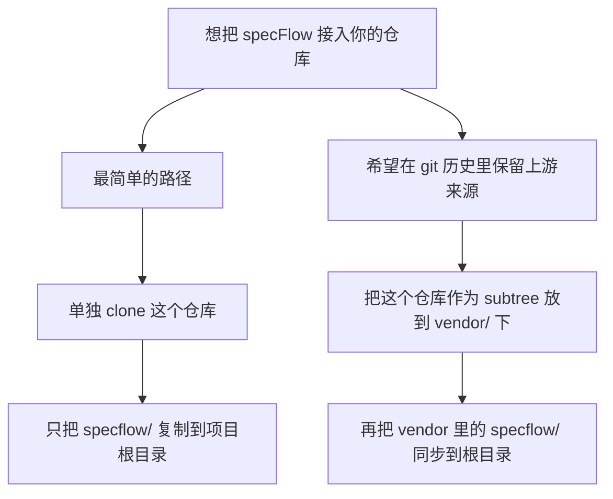
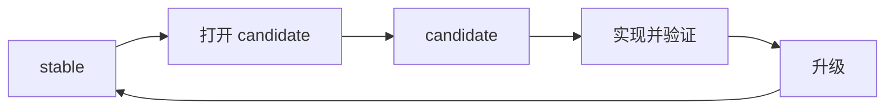
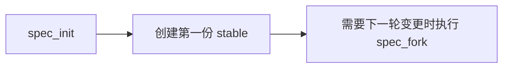
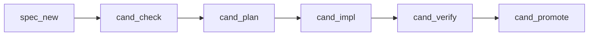
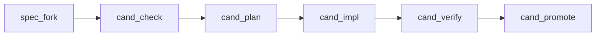
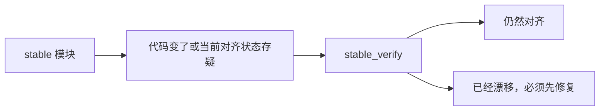
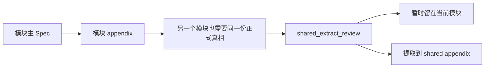
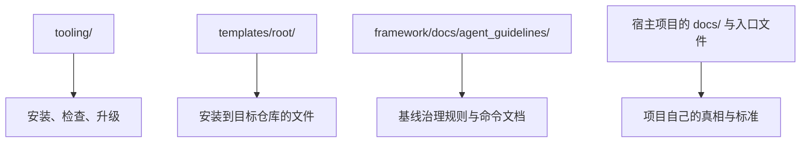

<p>
  
  
  
  
</p>


[English](./README.md) · **简体中文**


[接入仓库](#怎样把-specflow-放进你的仓库) · [快速开始](#快速开始) · [三分钟流程](#三分钟流程) · [共享机制](#附录与跨模块共享) · [项目标准](#项目级标准) · [进阶用法](#进阶用法)

---

`specFlow` 是一套面向 agentic runtime 的、以模块为基本组织单位的 Spec 驱动开发范式。

你可以把它理解成一句话：

`specFlow` 先把行为写进文件里，再让人和 AI 围绕这些文件去改代码，而且整个过程是受控的。

这个仓库并不是要把所有项目都强行变成同一种形状。
它提供一个可用的起点，并且默认你会按自己的业务去调整项目侧规则。

## 它解决什么问题

> 当代码跑得很快时，真相必须慢下来。

很多 AI 辅助开发项目最后都会碰到同样的问题：

- 真正的需求只存在于聊天记录里
- 不同的人对同一个功能理解不一样
- 代码改了，但没人能明确说现在行为到底对不对
- 每个人或每个 agent 的工作方式不同，流程越来越难信任

`specFlow` 解决问题的核心做法只有一个：

- 把行为真相显式地写进文件

然后再围绕这份真相加上一组小而明确的命令，让设计、计划、实现、验证、升级不会彼此漂移。

## specFlow 是怎么使用的

> Runtime 驱动，模块组织，Spec 优先。

`specFlow` 不是一个可以单独运行的 runtime。

它是一层治理规则，需要和 agentic runtime 一起使用，例如：

- `Codex`
- `Gemini CLI`
- `Claude Code`

用大白话说：

- `specFlow` 负责提供工作规则
- runtime 负责读取规则并真正执行工作

`specFlow` 同时也是模块导向的。

这意味着：

- 基本工作对象是正式的 `module`
- 命令采用 `{command}:{module}` 这样的形式
- Spec、计划、实现、验证、升级，通常都围绕单个模块展开

所以你在使用 `specFlow` 时，通常是在同时做两件事：

1. 用一个 agentic runtime 执行工作
2. 让这个 runtime 按模块化治理流程推进

## 从这里开始

> 先掌握最短路径，后面再扩展。

如果你是第一次接触，不要一上来就试图理解整套系统。

建议按这个顺序读：

1. `怎样把 specFlow 放进你的仓库`
2. `快速开始`
3. `核心模型`
4. `三分钟流程`
5. `第一批要认识的命令`
6. `命令顺序与项目状态`

读完这些，你就已经可以开始用 `specFlow`。

如果后面你想理解如何自定义规则，或者想进入更深的治理机制，再去看 `进阶用法`。

## 怎样把 specFlow 放进你的仓库

> 先把 `specflow/` 放进项目，再执行 `init`。

把 `specFlow` 接入你自己的仓库，实际有两种可用方式。



这张图怎么理解：

- 如果你想最快接入，就把这个仓库 clone 到独立目录，然后只复制 `specflow/` 到你项目根目录
- 如果你想在 git 历史里显式保留上游来源，就把这个仓库作为 subtree 放到 `vendor/` 下，再把其中的 `specflow/` 同步到项目根目录

### 方式 1：单独 clone，然后复制 `specflow/`

这是最推荐的大多数团队起步方式。

为什么默认推荐这个：

- 它让宿主项目的目录形状最简单
- 它和文档里的工具路径完全一致，因为安装后就是 `./specflow/...`
- 它不要求用户在开始前先学会 `git subtree`

Shell 示例：

```bash
git clone https://github.com/Bingordinary/SpecFlow.git /tmp/SpecFlow
cp -R /tmp/SpecFlow/specflow ./specflow
```

Windows PowerShell 示例：

```powershell
git clone https://github.com/Bingordinary/SpecFlow.git $env:TEMP\SpecFlow
Copy-Item -Recurse -Force $env:TEMP\SpecFlow\specflow .\specflow
```

完成后，直接进入下面的 `快速开始`，执行：

```bash
./specflow/tooling/init.sh
```

### 方式 2：用 `git subtree` 跟踪上游

当你希望上游仓库在你自己的 git 历史里保持可追踪，并且想要一条可重复执行的升级路径时，用这个方式。

有一个前提必须讲清楚：

- 当前这个仓库里，可安装内容位于 `specflow/` 子目录下
- 所以如果你直接用 `--prefix=specflow` 接入整个仓库，会得到 `specflow/specflow/...`
- 因此当前安全的 subtree 用法是：先把整个上游仓库放到 `vendor/` 下，再把其中的 `specflow/` 同步到你项目根目录的 `specflow/`

首次接入：

```bash
git remote add specflow-upstream https://github.com/Bingordinary/SpecFlow.git
git subtree add --prefix=vendor/specflow-upstream specflow-upstream main --squash
rsync -a vendor/specflow-upstream/specflow/ ./specflow/
```

Windows PowerShell 对应写法：

```powershell
git remote add specflow-upstream https://github.com/Bingordinary/SpecFlow.git
git subtree add --prefix=vendor/specflow-upstream specflow-upstream main --squash
Copy-Item -Recurse -Force .\vendor\specflow-upstream\specflow\* .\specflow\
```

然后执行：

```bash
./specflow/tooling/init.sh
```

后续如果你要升级：

```bash
git fetch specflow-upstream
git subtree pull --prefix=vendor/specflow-upstream specflow-upstream main --squash
rsync -a --delete vendor/specflow-upstream/specflow/ ./specflow/
./specflow/tooling/upgrade.sh
```

这一串动作分别在做什么：

1. `git subtree add` 把上游仓库存放到 `vendor/specflow-upstream`
2. `rsync` 把真正可安装的 `specflow/` 同步到项目实际使用的位置
3. `git subtree pull` 在以后刷新 vendor 里的上游副本
4. `upgrade` 在你同步了新版本后，重新应用较新的 framework 管理文件和 managed block

## 快速开始

> 先把文件框架装好，再让 runtime 按流程工作。

当 `specflow/` 已经放进你的仓库后，在仓库根目录执行：

```bash
./specflow/tooling/init.sh
```

Windows PowerShell：

```powershell
.\specflow\tooling\init.ps1
```

这一步会安装最基本的结构：

- `AGENTS.md`、`GEMINI.md`、`CLAUDE.md`
- `docs/specs/`
  - 包括模块 Spec、appendix 文件和流程状态文件
- `.githooks/pre-commit`
- 其他工作流所需的辅助文件

初始化本身就这么多。

有一个细节要注意：

- `init` 会在 `.githooks/pre-commit` 下创建 hook 文件
- 但 Git 不会自动启用这个目录，除非 `core.hooksPath` 指向 `.githooks`

如果你希望 Git 真的使用这里的 hook，请执行：

```bash
git config core.hooksPath .githooks
```

初始化完成后，新手就可以直接进入下面的基础命令流。

## 核心模型

> 一份当前真相，一份下一版真相。

新手一开始只需要记住两个核心状态：

- `stable`：项目当前承认的行为真相
- `candidate`：正在准备中的下一版行为真相



怎么理解这张图：

- `stable` 是当前已经被接受的版本
- `candidate` 是你当前正在处理的下一版
- 当 `candidate` 已经完成并验证通过后，它会被提升成新的 `stable`

## 三分钟流程

> 这是从想法走到受控变更的最短路径。

假设你要新增一个模块 `module_search`。

新手最短路径通常是：

1. 执行 `spec_new:module_search`
2. 写出 `module_search` 的 candidate Spec
3. 执行 `cand_check:module_search`
4. 执行 `cand_plan:module_search`
5. 执行 `cand_impl:module_search`
6. 执行 `cand_verify:module_search`
7. 执行 `cand_promote:module_search`

用大白话说，这一串动作就是：

- 先把要做的行为定义清楚
- 然后确认定义已经足够清楚
- 再写实施计划
- 再去改代码
- 再检查代码是不是真的符合定义
- 最后把这一版升级成当前接受的版本

如果 `module_search` 已经存在，而你只是要改它，通常起点不是 `spec_new`，而是 `spec_fork`。

## 第一批要认识的命令

先用一个新手视角来理解：

- 你先写或更新 Spec
- 然后根据下一步想做什么来选命令
- 命令是在告诉 agent：你现在正在做哪一种动作

一开始不需要死记整套治理系统。
你最需要先知道的是：每个命令分别是干什么的。

## 命令名怎么读

大多数 `specFlow` 命令都是这种形式：

```text
prefix_action:{module}
```

例如：

```text
cand_plan:module_search
```

这个命令有两部分：

- `cand_plan`
  - 动作名
- `module_search`
  - 目标模块

所以它的意思就是：

- 对 `module_search` 执行 `cand_plan`

### 前缀是什么意思

最重要的前缀有三个：

- `spec`
  - 打开、创建或切换你要工作的 Spec 版本
- `cand`
  - 在 `candidate` 这一层里推进工作
- `stable`
  - 对当前生效的 `stable` 做检查或操作

最短例子：

- `spec_new`
  - 给新模块创建第一份 candidate Spec
- `spec_fork`
  - 从当前 stable 打开一份新的 candidate
- `cand_impl`
  - 按当前 candidate Spec 去实现代码
- `stable_verify`
  - 检查当前代码是否还符合 stable

### 动作词是什么意思

前缀后面的动作词，表示你现在在做哪一种步骤。

用新手最容易懂的方式来看：

- `new`
  - 从零开始创建新的 Spec
- `fork`
  - 从已有 stable 打开下一版 Spec
- `check`
  - 判断当前 candidate Spec 是否已经足够清楚，可以稳定地驱动工作
- `plan`
  - 把 candidate Spec 转成实施计划
- `impl`
  - 按 candidate Spec 和计划去修改代码
- `verify`
  - 检查已经实现出来的代码是否真的符合 Spec
- `promote`
  - 把已经验证通过的 candidate 升级成新的 stable

这里有一个关键澄清：

- 在 `cand_impl` 之前，主要是在收敛和检查 Spec
- 到了 `cand_impl`，工作才正式从 Spec 文件进入代码修改
- 到了 `cand_verify`，就是把代码再拿回去对照 Spec 做确认

所以：

- `spec_new` 的意思是“从零开始创建一份新的 Spec 版本”
- `cand_verify` 的意思是“对照 candidate 去验证实现”
- `stable_verify` 的意思是“对照 stable 去验证实现”

## 第一批需要先会用的命令

第一天不需要掌握所有命令。
先从这些开始：

- `spec_init:{module}`
  - 给一个历史模块创建第一份 `stable`
- `spec_new:{module}`
  - 给一个全新的模块创建第一份 `candidate`
- `spec_fork:{module}`
  - 从现有 `stable` 打开下一份 `candidate`
- `cand_check:{module}`
  - 检查当前 candidate 是否已经足够清楚
- `cand_plan:{module}`
  - 从 candidate 生成实施计划
- `cand_impl:{module}`
  - 按 candidate 去做实现
- `cand_verify:{module}`
  - 检查实现是否符合 candidate
- `cand_promote:{module}`
  - 把 candidate 升级成新的 `stable`
- `stable_verify:{module}`
  - 检查当前代码是否还符合 `stable`

## 我应该用 `spec_init`、`spec_new` 还是 `spec_fork`？

快速判断规则如下：

- 当模块早就存在，但还没有正式纳入 `specFlow` 治理时，用 `spec_init:{module}`
- 当这是一个全新的模块，你要创建它的第一份 candidate 时，用 `spec_new:{module}`
- 当模块已经有了 `stable`，你现在要继续做下一版变更时，用 `spec_fork:{module}`

最短对比：

| 你现在要做什么 | 用哪个命令 |
| --- | --- |
| 把一个历史模块第一次正式纳入治理 | `spec_init:{module}` |
| 给一个全新模块建立第一版治理对象 | `spec_new:{module}` |
| 基于现有 stable 开启下一轮变更 | `spec_fork:{module}` |

如果你只记一句话，就记这个：

- `spec_init` 是“旧模块第一次纳管，先落 stable”
- `spec_new` 是“新模块从零开始，先落 candidate”
- `spec_fork` 是“已有 stable，再开下一版”

## 命令顺序与项目状态

如果你只想先抓住最短心智模型，可以记住下面三条常见路径。

要注意：

- 这是常见顺序，不是说整个项目所有模块永远都必须走同一个全局顺序
- 当项目里有很多模块时，真实状态要以 `docs/specs/_status.md` 为准
- `_status.md` 由 `specFlow` 命令流维护，是项目状态索引
- 正常使用时你是“读取” `_status.md`，而不是把它当作随手编辑的草稿板


怎么理解这张图：

- 如果你只关心单个模块，下面的命令路径图通常就够了
- 如果你面对的是一个多模块项目，第一眼先看 `_status.md`
- 关键字段是 `Active Layer` 和 `Next Command`

### 路径 1：历史模块第一次纳入治理



说明：

- 模块原本就存在
- 你先把它当前已经生效的行为沉淀成第一份 `stable`
- 这一步是在做“纳管”，不是在设计下一版
- 后面如果你要继续修改它，再用 `spec_fork` 打开 candidate

### 路径 2：全新模块



说明：

- 创建新的 candidate
- 确认它已经足够清楚
- 写计划
- 实现
- 验证
- 升级

### 路径 3：已有 stable 的模块继续演进



说明：

- 从当前 stable 复制出新的 candidate
- 让 candidate 收敛到足够清楚
- 计划
- 实现
- 验证
- 升级

### stable 侧维护

还有一条很重要的 stable 侧维护路径：



说明：

- `stable_verify` 不是开启新设计轮次的常规起点
- 它是在模块当前处于 `stable` 时，用来检查代码是否仍然符合这份 `stable`
- 只有 stable 对齐重新明确之后，模块才适合进入下一轮受控升级

### 一个重要说明

在学习阶段，你可以先把这些命令当作工具箱：

- 先理解每个命令是干什么的
- 再选择与你当前工作匹配的那个命令

但如果你希望内建治理真的保持闭环、可信，那么完整流程仍然依赖前置条件和正常顺序。
所以新手友好的阅读方式是“先学会命令”，而不是“规则不存在”。

## specFlow 到底是什么

`specFlow` 并不主要是一个代码框架。
它更像是一种变更治理范式。

它提供的是：

- 一种把行为真相落到文件里的方式
- 一种把当前真相和下一版真相分开的方式
- 一种用显式命令推进工作的方式
- 一种在宣布完成之前先验证的方式

## 附录与跨模块共享

基础命令流已经足够覆盖普通模块工作。

但还有一个你应该知道存在的机制：

- 模块 appendix
- 跨模块 shared truth

第一天你不需要学内部治理细节。
你只需要先建立一个简单的关系图。



这张图怎么读：

- 模块主 Spec 只放这个模块最核心的行为定义
- 如果有些正式内容太长、太细、但仍只属于该模块，就放到这个模块自己的 appendix
- 只要这份真相还只属于一个模块，它就应该留在模块主文件或模块 appendix 中
- 只有当另一个正式模块也需要同一份正式真相时，才进入 shared 边界判断

最简单的规则是：

- 第一次出现时，先留在当前模块
- 不要因为“将来可能复用”就提前抽成 shared
- 当第二个正式模块也需要同一份正式真相时，再判断仓库里是否应该只保留一份正式定义

用大白话说：

- `appendix` 仍然是模块自己的真相
- `shared appendix` 是多个正式模块共同依赖的一份真相
- shared 的目的，是避免双份真相，不是收集“看起来有点像”的内容

### 如何使用 `shared_extract_review`

`shared_extract_review` 不是 `{command}:{module}` 这种普通命令。

你会在下面这些场景下用它来做边界判断：

- 这份内容现在写在某个模块里，但另一个模块看起来也需要同一份正式定义
- 你想判断这份内容是否应该继续留在当前模块
- 或者它是否已经到了应该提取成 shared appendix 的边界

在普通模块工作里，你通常不需要手动触发这个 flow。
如果你需要一个明确的边界判断，可以用自然语言提出来，也可以直接写 `shared_extract_review`。

为了让触发更清楚，请至少说明三件事：

1. 当前内容写在哪里
2. 哪个其他模块现在也需要这份真相
3. 你想做的是一个 shared 边界判断

例子：

- “`module_a` 里的 fallback protocol 现在 `module_b` 也要用，帮我判断要不要提取成 shared。”
- “检查 `module_search` 和 `module_recall` 之间的 output schema 是否应该共享。”
- “`shared_extract_review`：审查当前写在 `module_agent` appendix 里的 retry semantics，现在 `module_trace` 也要复用。”

执行后会发生什么：

- 这个 flow 会先判断这是不是同一份 shared formal truth
- 它会告诉你：现在应该继续留在当前模块，还是应该提取到 shared appendix
- 如果已经形成双份正式真相风险，它会告诉你应先做 shared 收敛

有一个边界必须明确：

- `shared_extract_review` 负责做边界判断
- 它不会默认自动帮你改模块文件，也不会独自完成完整提取

## 进阶用法

当你已经理解基础用法后，这一节帮助你理解整个系统，并且把它真正改造成适合你项目的样子。

进阶部分主要是四件事：

- 理解文档结构
- 知道哪些文件可以由你来自定义
- 知道标准模块命令之外还有哪些治理 flow
- 知道当意图识别不够准确时，怎样显式触发这些 flow

### 项目结构

理解这个仓库最简单的方式，是把它分成四层：



怎么理解：

- `tooling/` 负责安装、检查、升级
- `templates/root/` 是会被拷贝到目标仓库里的模板
- `framework/docs/agent_guidelines/` 是 `specFlow` 自己的基线规则系统
- 安装到项目里的 `docs/` 和入口文件，才是你的项目表达自身真相和规则的地方

### 什么东西放在哪里

用这个最短地图来看：

- `specflow/tooling/`
  - 安装、doctor、upgrade、sync 脚本
- `specflow/templates/root/`
  - 会复制到目标仓库根目录的模板文件
- `specflow/framework/docs/agent_guidelines/`
  - 这套范式自己的规则系统
- `docs/specs/`
  - 你项目里的正式 Spec 和流程状态文件
- `docs/project_standards/`
  - 你项目自己的补充标准，用来收紧或澄清基线
- `AGENTS.md`、`GEMINI.md`、`CLAUDE.md`
  - 不同执行器的入口文件，包含 `specFlow` 管理块和项目自有区域

### 如何自定义规则

新手最安全的原则是：

- 先改项目拥有的文件
- 只有当你是明确想修改 `specFlow` 机制本身时，才去改 framework 文件

大多数团队主要会改这些：

- `docs/specs/**`
  - 项目本身的模块真相
- `docs/project_standards/**`
  - 项目自己的标准
- `AGENTS.md`、`GEMINI.md`、`CLAUDE.md` 的项目自有部分
  - 项目自己的执行器说明

大多数团队通常不应该改 `framework/docs/agent_guidelines/**`，除非你是真的要重设计这套机制本身。

用大白话说：

- 如果你是想让 `specFlow` 适配你的项目，就改项目侧文件
- 如果你是想重做 `specFlow` 自己的治理机制，才去改 framework 规则

### 项目级标准

`specFlow` 允许项目在 framework baseline 之上增加自己的本地标准。

这些标准放在：

- `docs/project_standards/`
- `docs/project_standards/_registry.md`

有一个关键规则：

- 一个标准文件不是“存在就生效”
- 它只有在 `_registry.md` 里注册之后，才算正式生效

在正常使用里，你通常不需要自己手搓这些文件。
最简单的方式是直接用自然语言让 agent 帮你创建，例如：

- “给这个项目新增一个 Prompt 质量审查标准，并让 `cand_check` 使用它。”
- “给这个项目新增一个项目级输出标准。”
- “为这个仓库新增一个本地升级决策规则。”

接下来 agent 应该做的事情是：

1. 在 `docs/project_standards/` 下创建一个标准文件
2. 在 `docs/project_standards/_registry.md` 里增加一条注册项
3. 确认目标命令或 flow 已经支持这个标准要挂载的 `surface`

从机制角度讲，这件事由一个内部 flow `project_standard_create` 处理。
你不需要直接记住或手动调用这个内部名字。
对用户来说，正常入口就是用自然语言描述你想新增的项目规则。

一个项目标准通常由两部分组成：

- 规则文件本体
- 用来启用它的 registry entry

示例 registry entry：

| standard_id | type | surface | file | consumed_by | applies_to | effect | conflict_rule |
| --- | --- | --- | --- | --- | --- | --- | --- |
| `project_prompt_guidelines` | `review_standard` | `candidate_closure_review` | `docs/project_standards/prompt_guidelines.md` | `cand_check` | `all_targets_on_surface` | `tighten` | `framework_wins` |

怎么理解这几个字段：

- `type` 表示这是什么类型的项目标准
- `surface` 表示它挂在哪个命令已经定义好的扩展点上
- `file` 指向真正的规则文档
- `consumed_by` 表示哪个命令或内部 flow 会读取它
- `effect` 只能是收紧或澄清，不能削弱 baseline

最重要的边界是：

- 项目级标准可以收紧或澄清 framework
- 但不能削弱、绕过或替代 framework baseline

### 通常应该保持什么不变

大多数项目最好保留这些核心机制：

- Spec 作为真相源
- `stable` 和 `candidate` 的分层
- 用命令推进过程
- 升级前先验证
- 用 `_status.md` 作为状态索引
- 明确区分 framework 管理文件和 project 拥有文件

### 维护工具

下面这些工具脚本很有用，但它们不是新手第一天必须学的入口。

- `doctor`
  - 检查本地安装的 `specFlow` 结构是否健康
  - 当你怀疑文件缺失、结构损坏或状态不同步时使用
- `upgrade`
  - 刷新 framework 管理的文件和 managed block
  - 当你明确要把项目更新到较新的 `specFlow` 基线时使用

Shell 示例：

- `./specflow/tooling/doctor.sh`
- `./specflow/tooling/upgrade.sh`

Windows PowerShell：

- `.\specflow\tooling\doctor.ps1`
- `.\specflow\tooling\upgrade.ps1`

### 还有哪些进阶 flow

除了标准模块命令外，`specFlow` 还有一些进阶 flow。

这些 flow 的意义是帮助你检查或演化这套治理机制本身，而不只是推进某一个模块。

#### `spec_flow_review`

当你想审查治理系统本身是否仍然自洽时，使用 `spec_flow_review`。

它的含义是：

- 检查 `specFlow` 规则之间是否仍然一致
- 检查规则变更有没有引入冲突、歧义或副作用

这不是用来审查某个业务模块的。
它审的是机制本身。

### 存在但不是普通用户入口的内部 flow

还有一些内部或非主要入口 flow，例如：

- `shared_flow_reconcile`
- `project_standard_create`

你最好知道它们存在，因为它们是完整机制的一部分。
但它们不是一般用户最先直接调用的入口。

用大白话说：

- `spec_flow_review` 是一个面向用户的进阶审查 flow
- `shared_extract_review` 之所以前面单独介绍，是因为跨模块共享是日常边界问题
- 其他一些 flow 主要是为了让机制内部保持闭环

### 如何触发进阶 flow

触发进阶 flow 通常有两种方式：

1. 用自然语言表达意图
2. 直接写出 flow 名称

自然语言例子：

- “检查 framework 规则现在是否还自洽。”

直接调用例子：

- `spec_flow_review`

这件事重要的原因是：

- 意图识别很方便
- 但它不是魔法
- 如果 agent 没有准确识别你的意思，直接写正式 flow 名就是最干净的兜底方式

### 如果你想自己研究或重做整套系统，建议怎么读

如果你想深入理解，或者真的准备重设计系统，可以按下面顺序读：

1. `framework/docs/agent_guidelines/spec_policy.md`
2. `framework/docs/agent_guidelines/command_policy.md`
3. `framework/docs/agent_guidelines/git_policy.md`
4. `framework/docs/agent_guidelines/spec_flow_review.md`
5. `framework/docs/agent_guidelines/shared_extract_review.md`
6. `framework/docs/agent_guidelines/commands/` 下的命令文档
7. 项目里安装后的 `docs/` 文件

## 文件所有权

`specFlow` 里有两种文件所有权模式：

- `framework`
  - 文件结构由 `specFlow` 拥有
  - `upgrade` 可以刷新这类文件
- `project`
  - 文件在 bootstrap 完成后由你的项目拥有
  - `upgrade` 不应覆盖已经存在的 project-owned 文件

这很重要，因为 `specFlow` 的目标是“可适配”，不是“永远接管整个仓库”。

像 `AGENTS.md`、`GEMINI.md`、`CLAUDE.md` 这些入口文件采用的是 managed block 模型，所以项目可以在 `specFlow` 管理块之外保留自己的说明。

## 什么情况下不适合用它

在下面这些情况下，`specFlow` 可能太重了：

- 你的项目很小
- 你的团队不想把正式行为真相写进文件
- 你并不需要 `stable` 和 `candidate` 这套分层
- 你并不需要让人和 AI 遵守同一套工作模型

## 最后的定位

理解 `specFlow` 最合适的方式，不是：

- “一个必须死守的僵硬框架”

而是：

- “一个可以下载下来、快速理解、然后按项目改造的开发治理范式”

它的目标很简单：

- 让真相显式化
- 让变更显式化
- 让验证显式化
- 让自定义显式化
