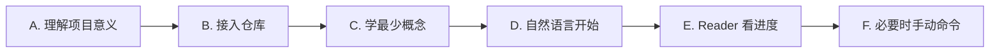
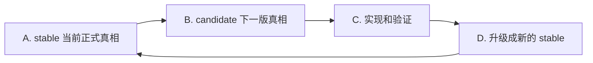
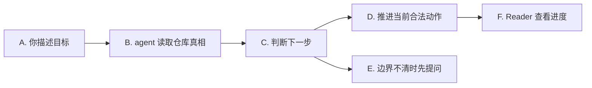
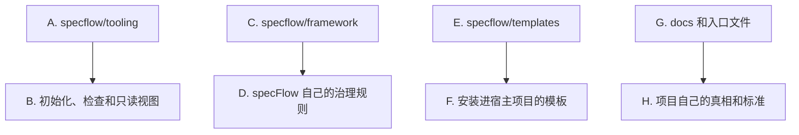

<p>
  
  
  
  
</p>

[English](./README.md) · **简体中文**

[接入仓库](#接入仓库) · [快速开始](#快速开始) · [核心概念](#核心概念) · [自然语言引导](#自然语言引导) · [Reader 看进度](#reader-看进度) · [手动命令](#什么时候需要手动命令) · [进阶用法](#进阶用法)

---

`specFlow` 想做的，是让 AI 辅助开发重新像工程，而不是一连串聪明但会蒸发的对话：它把每个治理单元的当前真相、下一版真相，以及从想法到验证落地的推进路径，真正留在仓库里。这样一来，人和 agent 可以一起高速推进，但项目本身仍然清楚知道什么是真的、什么正在变化、什么已经可以交付。

它不是一个固定业务模板，也不是让所有团队写同一种文档。
它更像一套工程协作骨架：需求先进入仓库真相，再进入计划、实现、验证和沉淀。

## 它解决什么问题

> 代码可以快，真相不能乱。

很多 AI 辅助开发项目，最后都会卡在同一类问题上：

- 真正的需求只存在于聊天记录里
- 不同的人、不同的 agent，对同一个功能理解不一致
- 代码已经改了，但没人能明确说现在的正式行为到底是什么
- 临时推进很快，回头看时却很难判断这轮改动是否真正收口

`specFlow` 的做法很直接：

- 把行为真相落到仓库文件里
- 让 agent 每次推进前先读当前真相
- 让设计、计划、实现、验证和升级围绕同一份真相前进

这样做不是为了增加文档负担，而是为了避免项目只靠聊天记忆和代码结果反推需求。

## specFlow 怎么用

> Runtime 驱动，Spec 优先，人负责目标判断。

`specFlow` 不是一个单独运行的 runtime。

它是一层治理规则，需要和 agentic runtime 一起工作，例如：

- `Codex`
- `Gemini CLI`
- `Claude Code`

可以把它理解成：

- `specFlow` 负责定义这件事在仓库里应该怎么推进
- runtime 负责按照这些规则真正去读文件、改文件、改代码、做验证
- 人负责说清目标、确认关键边界，以及接受或调整结果

你不需要从第一天就记住所有命令。
现在推荐的入口是自然语言：直接说你想完成什么，agent 会根据当前仓库真相把请求引导到合适的步骤。

## 从这里开始

如果你是第一次接触 `specFlow`，建议按这个顺序理解：

1. 先知道它为什么存在：让需求和行为真相留在仓库里
2. 再完成最小安装：把 `specflow/` 接入你的项目并执行 `init`
3. 理解几个核心概念：`Spec`、`stable`、`candidate`、`unit`、`scenario`、`shared`
4. 日常直接用自然语言提需求
5. 用 Reader 看当前进度和对象关系
6. 只有需要精确控制时，再看手动命令

这条路径的重点是：先开始正确使用，再慢慢理解完整机制。



怎么理解这张图：

- `A. 理解项目意义` 是先知道为什么要把真相写进仓库
- `D. 自然语言开始` 是日常工作的主入口
- `E. Reader 看进度` 是看项目现在走到哪一步
- `F. 必要时手动命令` 是给需要精确控制的人用的

## 接入仓库

对大多数团队来说，默认接入方式就够了：

1. 把这个仓库 clone 到别的目录
2. 只把其中的 `specflow/` 目录复制到你项目根目录
3. 回到你的项目里执行 `init`

Shell 示例：

```bash
git clone https://github.com/Bingordinary/SpecFlow.git /tmp/SpecFlow
cp -R /tmp/SpecFlow/specflow ./specflow
```

Windows PowerShell 示例：

```powershell
git clone https://github.com/Bingordinary/SpecFlow.git $env:TEMP\SpecFlow
Copy-Item -Recurse -Force $env:TEMP\SpecFlow\specflow .\specflow
```

如果你需要长期跟上游同步，把它当成维护问题处理即可。
具体工具细节见 [tooling/README.md](./tooling/README.md)。

## 快速开始

当 `specflow/` 已经进入你的仓库后，在仓库根目录执行：

```bash
<specflow-binary> init
```

下文里的 `<specflow-binary>`，表示 `specflow/tooling/bin/` 下与你当前平台匹配的 `specflowctl` 可执行文件。
具体文件名可以直接看 [tooling/README.md](./tooling/README.md)。

`init` 会安装最基本的骨架，包括：

- `AGENTS.md`、`GEMINI.md`、`CLAUDE.md`
- `docs/specs/`
- `.githooks/pre-commit`
- 其他 workflow 支撑文件

如果你想让 Git 使用安装好的 hook，请执行：

```bash
git config core.hooksPath .githooks
```

完成这一步后，新手通常不需要先背命令。
你可以直接对 agent 说：

```text
给 auth 加 rate limit。
checkout 的退款规则变了，先更新真相再实现。
帮我检查 search 现在是不是还符合正式真相。
这个规则以后要给多个模块共用，帮我判断应该放在哪里。
```

agent 应该读取安装后的入口文件和当前仓库真相，再决定下一步该写 Spec、检查边界、制定计划、实现代码，还是停下来问你一个必须确认的问题。

## 核心概念

先理解这几个词就够了。

`Spec` 是写在仓库里的行为真相。
它不是普通说明文，而是后续实现和验证要遵守的依据。

`stable` 是当前正式接受的真相。
如果一个行为已经被项目承认，就应该能在对应的 `stable` 文件里找到。

`candidate` 是正在准备的下一版真相。
新需求、行为调整、边界变化，通常先进入 `candidate`，确认后再变成新的 `stable`。

`unit` 是一块可独立说明、实现和验证的工程责任。
它不一定等于一个目录、package 或 service。

`scenario` 是一条端到端结果链路。
当你关心的是“用户从触发到最终结果是否成立”，而不是一个局部能力时，就可能需要 `scenario`。

`shared` 是多个对象共同复用的规则。
如果同一份正式规则被多个 `unit` 或 `scenario` 使用，就不应该到处复制，而应该沉淀为共享真相。

`repository_mapping.md` 是项目结构真相。
它说明路径、对象和责任边界怎么对应，agent 不能只靠目录名猜归属。

`_status.md` 是状态索引。
它记录当前对象处于哪一层、下一步是什么，但它不承载行为规则正文。

最小模型可以这样看：



这张图的关键点是：

- `A. stable 当前正式真相` 是现在已经承认的行为
- `B. candidate 下一版真相` 是这一轮准备改变的行为
- `C. 实现和验证` 必须围绕 candidate 发生
- `D. 升级成新的 stable` 表示这一轮结果被正式接受

## 自然语言引导

自然语言引导是现在推荐的日常入口。

你不需要先判断该用哪个命令。
你只需要说清楚你想要的结果，agent 会根据当前仓库真相做路由。

这里的“路由”意思很简单：agent 会判断这件事现在应该先走哪一步。
比如先写 Spec、先检查当前设计、先制定计划、先实现、先验证，或者因为边界不清而先问你。



怎么理解这张图：

- `A. 你描述目标` 是你用普通语言说需求
- `B. agent 读取仓库真相` 是 agent 去看当前 Spec、状态和项目结构
- `C. 判断下一步` 是选择当前最小且合法的动作
- `E. 边界不清时先提问` 是避免 agent 直接猜业务边界
- `F. Reader 查看进度` 是你用可视化方式确认项目状态

### 怎么说更容易被正确引导

自然语言不等于随便一句话就一定足够。
越能说清这三点，agent 越不容易走偏：

- 你想完成什么结果
- 这次范围包括什么，不包括什么
- 什么现象能证明这件事已经完成

可以直接这样说：

```text
我要做：给 checkout 增加退款状态追踪。
这次范围：只覆盖退款状态流转，不改支付网关接入。
完成标准：用户能看到退款处理中、退款成功、退款失败三种状态。
如果发现边界不清，先问我，不要直接猜。
```

也可以更短：

```text
search 的排序规则要改成先按相关性，再按更新时间。先更新真相，再实现。
```

如果你不知道该从哪里开始，也可以直接说：

```text
我想改登录安全策略，但不确定应该先动哪块。请先读当前项目真相，然后告诉我下一步。
```

### 常见入口示例

新能力：

```text
帮我新增一个 search 能力，先写清第一版行为，再实现。
```

已有能力继续演进：

```text
把 search 改成先做 typo correction，再做 ranking。
```

检查当前实现是否对齐：

```text
帮我检查 search 现在是不是还符合正式真相。
```

跨多个对象复用同一规则：

```text
这个错误码规则后面 auth 和 checkout 都要用，帮我判断应该放在单元里还是做成共享规则。
```

治理机制本身需要检查：

```text
帮我检查当前 specFlow 规则有没有让 agent 卡在不清楚下一步的地方。
```

## Reader 看进度

`specflow-reader` 是一个只读本地视图。
它用来帮你看当前项目状态，不负责改文件，也不负责推进流程。

启动方式：

```bash
<specflow-reader-binary> serve --repo-root . --addr 127.0.0.1:17863
```

`<specflow-reader-binary>` 表示 `specflow/tooling/bin/` 下与你当前平台匹配的 `specflow-reader` 可执行文件。

Reader 主要回答这些问题：

- 当前有哪些 `unit`、`scenario` 和 `shared`
- 哪些对象已经有正式真相，哪些还在准备下一版
- 当前对象的下一步是什么
- Spec 文档、共享规则和实现路径之间怎么连接
- 哪些内容来自 `_status.md`、`repository_mapping.md` 或具体 Spec 文件

Reader 里通常先看三个视图：

- `状态`：看对象当前层和下一步
- `项目结构`：看路径归属和实现位置
- `SpecFlow`：看 Spec、共享规则、系统约束和支撑文件之间的关系

需要注意：

- Reader 只读仓库真相
- Reader 不会替你判断一个需求应该走哪个治理 flow
- Reader 不会把页面上的结论写回项目文件
- 如果文件缺失或格式不对，Reader 应该报告问题，而不是偷偷修复

最常见的配合方式是：

1. 你用自然语言让 agent 推进
2. agent 更新或读取仓库真相
3. 你打开 Reader 看对象状态、下一步和关联文件
4. 如果状态不符合预期，再让 agent 解释或修正

## 什么时候需要手动命令

大多数情况下，你可以先用自然语言。
只有这些时候，才需要自己显式控制命令：

- 你想精确指定当前该走哪一步
- agent 路由出来的结果和你预期不一致
- 你正在排查某个对象的治理状态
- 你正在写自动化脚本或固定流程

常见入口如下：

| 你的情况 | 常见动作 |
| --- | --- |
| 新仓库、陌生仓库，或者仓库结构刚变过 | 更新 `docs/specs/repository_mapping.md` |
| 历史能力第一次纳入治理 | `unit_init:{unit}` |
| 全新能力第一次进入治理 | `unit_new:{unit}` |
| 已有正式真相的能力要开新一轮演进 | `unit_fork:{unit}` |
| 检查当前实现是否仍符合正式真相 | `unit_stable_verify:{unit}` |

一旦对象进入 candidate 链，常见顺序是：

```text
unit_check -> unit_plan -> unit_impl -> unit_verify -> unit_promote
```

这条链的意思是：

- `unit_check`：检查下一版真相是否写清楚
- `unit_plan`：把真相整理成实现计划
- `unit_impl`：按计划实现
- `unit_verify`：验证实现是否符合真相
- `unit_promote`：把确认后的下一版沉淀为正式真相

手动命令是精确控制面，不是新手第一天必须背的入口。

## 什么时候不再是单元内问题

大部分真相应该先在当前 `unit` 内解决。
不要因为“以后可能复用”就过早抽成 shared。

通常可以按这个判断：

- 只描述一个能力自己的行为：放在这个 `unit` 的 Spec 里
- 只是这个能力的详细证据、协议展开或历史说明：放在这个 `unit` 的 appendix 里
- 已经被多个正式对象共同复用：考虑 shared
- 是全仓库默认规则、禁止事项或全局例外：考虑系统约束

如果你不确定，直接用自然语言说：

```text
这个规则可能会被多个模块共用。请先判断它应该留在当前单元，还是做成共享规则。
```

agent 应该读取当前仓库真相后再判断。
如果边界不清，它应该停下来问你，而不是硬猜。

## 进阶用法

基础用法看明白以后，再看这一节。
这里主要帮助你理解这套系统怎样被维护和扩展。

### 项目结构

从高层看，`specFlow` 接入后的仓库通常有四类内容：



怎么理解：

- `A. specflow/tooling` 负责 `init`、`doctor`、`upgrade` 和 Reader
- `C. specflow/framework` 是 specFlow 的规则基线
- `E. specflow/templates` 是安装到宿主项目的文件模板
- `G. docs 和入口文件` 是你的项目表达真相、标准和协作入口的地方

### 通常改哪些地方

大多数团队日常真正会改的是：

- `docs/specs/**`
- `docs/project_standards/**`
- `AGENTS.md`、`GEMINI.md`、`CLAUDE.md` 里属于项目自己的部分

只有当你明确在改 `specFlow` 本身时，才应该改：

- `specflow/framework/**`
- `specflow/templates/**`
- `specflow/tooling/**`
- `specflow/README*.md`

### 项目级标准

`specFlow` 允许项目在 framework 基线之上增加自己的标准。

这些标准主要放在：

- `docs/project_standards/`
- `docs/project_standards/_registry.md`

关键规则是：

- 不是标准文件存在，它就自动生效
- 只有注册进 `_registry.md` 后，它才会进入流程

正常使用时，你不必手工从零搭这些文件。
可以直接让 agent 根据你的项目规则创建或更新。

### 维护工具

tooling 层主要做确定性的维护动作。
常见命令是：

- `init`
- `doctor`
- `upgrade`

Reader 也在 tooling 层，但它是只读视图。
完整工具说明见 [tooling/README.md](./tooling/README.md)。

### 进阶 flow

除了单元命令，`specFlow` 还有一些更偏治理本身的 flow。

最常见的是：

- `spec_flow_review`
- `spec_flow_design_review`
- 自然语言 shared 治理

当你想检查治理系统本身，而不是推进某个业务能力时，才会进入这些 flow。

### 想吃透整套 baseline 时怎么读

如果你准备深入理解或改造这套机制，建议按这个顺序读：

1. `framework/natural_language_routing.md`
2. `framework/spec_policy.md`
3. `framework/command_policy.md`
4. `framework/git_policy.md`
5. `framework/shared_*.md`
6. `framework/spec_flow_review.md`
7. `framework/commands/`
8. 安装到项目侧的 `docs/` 文件

## 文件所有权

`specFlow` 里有两种所有权模式：

- `framework`
  - `specFlow` 管理文件结构
  - `upgrade` 可能会刷新它
- `project`
  - 初始化之后，这部分属于你的项目
  - `upgrade` 不应该直接覆盖已有项目文件

像 `AGENTS.md`、`GEMINI.md`、`CLAUDE.md` 这类入口文件，采用 managed block 模式。
也就是说，`specFlow` 管自己的 block，你的项目可以在 block 外保留自己的长期说明。

## 什么情况下不适合用它

如果你的情况是下面这样，`specFlow` 可能偏重：

- 项目非常小
- 团队并不想把行为真相正式写进文件
- 你不需要 `stable` 和 `candidate` 这种分层
- 你不需要让人和 AI 长期遵守同一套协作模型

如果你只是想让 agent 临时改几行代码，`specFlow` 可能不是最短路径。
如果你希望一个项目长期被多人和多个 agent 共同维护，它才会开始体现价值。
