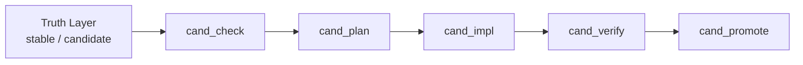

# Advancement Layer Policy

## 1. Purpose

This file defines how Spec Flow may strengthen execution advancement without weakening its existing truth-governance core.

It answers five questions:

1. what "advancement layer" means in this repository
2. which boundaries must stay unchanged while advancement is strengthened
3. which kinds of advancement capability are allowed
4. which kinds of advancement capability are forbidden because they would create semantic conflict
5. what the minimum recommended adoption set is

This is a governance draft for executors and rule authors.
It is not a business-module Spec.

---

## 2. Core Judgment

The repository may strengthen advancement behavior.
It must do so inside the existing command chain rather than beside it.

Plain meaning:

1. keep `stable` and `candidate` as the only formal behavior-truth layers
2. keep the standard command chain as the only formal lifecycle
3. allow stronger sub-steps, gates, and write-back rules inside existing commands
4. do not create a second state system that competes with `_status.md` and `Next Command`

---

## 3. Scope

This policy governs only advancement-layer design for the candidate-side chain:

1. `cand_check`
2. `cand_plan`
3. `cand_impl`
4. `cand_verify`

It may also constrain:

1. shared checkpoint usage
2. plan-file structure
3. verify-evidence structure
4. recovery and fallback wording where advancement behavior affects them

It does not redefine:

1. `stable` / `candidate` truth ownership
2. module registration rules
3. Shared Appendix ownership rules
4. git submission policy

---

## 4. Fixed Boundary

The following boundary is fixed and must not be weakened by any advancement enhancement.

The diagram means:

1. `stable` and `candidate` remain the only formal behavior-truth layers
2. advancement enhancement lives inside command execution, not in a parallel lifecycle
3. `cand_check -> cand_plan -> cand_impl -> cand_verify -> cand_promote` remains the only formal candidate progression path

Additional fixed rules:

1. do not introduce a parallel top-level lifecycle such as `phase`, `milestone`, `roadmap`, or `workflow_state` as a formal command-progress source of truth
2. do not create a new top-level index that competes with `docs/specs/_status.md`
3. do not redefine `Next Command` semantics to mean "suggested direction only"
4. do not create a second promotion gate outside `cand_verify -> cand_promote`
5. do not allow chat-only conclusions to replace Spec write-back

---

## 5. Allowed Advancement Surface

Advancement enhancement is allowed only on these surfaces:

1. pre-planning clarification and research inside `cand_plan`
2. finer-grained plan decomposition inside `_plans/{module}.md`
3. narrower execution slices inside `cand_impl`
4. stronger goal-backward verification inside `cand_verify`
5. stronger checkpoint prompts where the active command already allows checkpoints

Rule:

1. every enhancement must attach to an existing command owner
2. every enhancement must keep the smallest legal fallback explicit
3. every enhancement must reuse existing handoff and snapshot validation rules unless a central contract is updated first

---

## 6. Forbidden Designs

The following designs are forbidden because they create state duplication, responsibility conflict, or command ambiguity.

### 6.1 Parallel State Systems

Do not add a second formal state system such as:

1. a phase-state machine that decides readiness independently of `_status.md`
2. a milestone-state machine that gates candidate progression independently of command rules
3. a roadmap-progress state that can overrule `Next Command`

### 6.2 Parallel Formal Process Objects

Do not add new top-level process objects that behave like peers of:

1. `_check_result`
2. `_plans`
3. `_verify_result`
4. `_status`

unless command policy, snapshot contract, fallback rules, and downstream consumers are all formally updated together.

Plain meaning:

1. an optional helper note is not automatically forbidden
2. but a new file becomes forbidden once downstream commands depend on it like a new gate object

### 6.3 Command Renaming By Drift

Do not keep old command names while silently moving their semantic center elsewhere.

Examples of forbidden drift:

1. `cand_plan` becoming mainly a roadmap manager
2. `cand_impl` becoming an autonomous workflow manager instead of implementation execution
3. `cand_verify` becoming only artifact existence checking

### 6.4 Fake Completion Optimizations

Do not optimize for executor convenience in ways that weaken closure.

Examples:

1. allowing implementation to continue when unresolved research questions still block a stable plan
2. allowing promotion because files exist even when the implementation is not actually wired into the main path
3. using human verification to replace automatable verification that the executor could still run

---

## 7. Minimum Recommended Adoption Set

If the repository adopts only a minimal advancement enhancement round, it should adopt exactly these three capabilities first.

### 7.1 `cand_plan` Research Preflight

`cand_plan` may contain an optional research preflight before final plan write-back.

Rules:

1. use research preflight only when current candidate truth is closed enough to investigate implementation, but important implementation unknowns still prevent a stable plan
2. research preflight remains part of `cand_plan`; it is not a new standard command
3. if research leaves blocking open questions unresolved, do not write a consumable `_plans/{module}.md`
4. unresolved questions that affect behavior truth, boundary truth, or acceptance truth must return to Spec write-back and then fall back to `cand_check`
5. unresolved questions that affect implementation direction only may keep `Next Command=cand_plan`

The purpose of this step is simple:

1. stop plans from pretending certainty they do not have
2. convert unknowns into explicit blockers before implementation starts

### 7.2 Slice-Based Planning And Implementation

`cand_plan` and `cand_impl` should use execution slices rather than one large undifferentiated implementation block.

Rules:

1. `_plans/{module}.md` should decompose work into small slices that a single implementation round can close safely
2. each slice should define at least:
   - objective
   - file scope
   - dependencies
   - verification action
   - done condition
   - current status
3. `cand_impl` should advance slice by slice in plan order unless an explicit dependency rule allows a different order
4. if one slice is blocked, do not falsely claim the whole module is implementation-complete
5. plan write-back must record which slices are complete, blocked, or still pending

The target is not ceremony.
The target is lower implementation risk and easier recovery.

### 7.3 Goal-Backward Verification With Wiring Proof

`cand_verify` should verify from promised outcome backward into implementation evidence.

At minimum, verification should judge three layers for each key acceptance claim:

1. `existence`
   - the required artifact, path, handler, test, or integration point exists
2. `substance`
   - the artifact contains meaningful implementation rather than placeholder structure
3. `wiring`
   - the artifact is actually connected to the main execution path, user path, or protocol path required by the candidate

Rules:

1. verification must not stop at file existence
2. verification evidence should explicitly distinguish missing artifact, hollow artifact, and unwired artifact
3. if the promised outcome depends on cross-file integration, the evidence matrix must name that integration path directly
4. if implementation pieces exist but are not wired into the claimed main path, treat that as `implementation_deviation`
5. promotion must not proceed on the basis of existence-only evidence

---

## 8. Optional But Lower-Priority Enhancement

The repository may later strengthen `cand_check` with a lightweight assumption-closure pass.

This means:

1. surface the implementation assumptions that still matter
2. ask for confirmation only where those assumptions change downstream execution
3. write the conclusion back into candidate truth or appendix truth when required

This enhancement is lower priority than Section 7 because:

1. verification weakness creates the largest false-completion risk
2. overlarge implementation batches create the largest execution risk
3. research uncertainty creates the largest planning risk

---

## 9. Cost And Adoption Rule

Adopt advancement enhancement only when it improves execution closure more than it increases executor burden.

The default cost judgment is:

1. strengthening `cand_verify` is high value and should be prioritized
2. adding slice-based planning is high value if modules regularly exceed one safe implementation round
3. adding research preflight is medium-to-high value when modules often hit unknown implementation space
4. adding a new top-level lifecycle is negative value by default because it duplicates command semantics

Rule:

1. if an enhancement needs a new top-level state object just to be understandable, reject that enhancement by default
2. if an enhancement can be expressed as a stronger command-local procedure, prefer that design

---

## 10. Command-Authoring Rule

When command files are updated to adopt this policy:

1. `cand_plan` should state when research preflight is allowed, what blocks plan write-back, and which fallback code applies
2. `cand_impl` should state how slices are consumed, how blocked slices are reported, and when staying at `cand_impl` is correct
3. `cand_verify` should state how existence, substance, and wiring evidence are recorded and how they affect promotion readiness
4. no command file may claim a new lifecycle stage unless `command_policy.md` is updated first

If process files need new required fields to support these rules:

1. update the relevant process-file README
2. update the relevant command file
3. update any central contract that validates those fields before declaring the new shape active

---

## 11. Relationship To Existing Governance Files

This policy works together with:

1. `specflow/framework/docs/agent_guidelines/spec_policy.md`
2. `specflow/framework/docs/agent_guidelines/command_policy.md`
3. `specflow/framework/docs/agent_guidelines/candidate_handoff_contract.md`
4. `specflow/framework/docs/agent_guidelines/checkpoint_protocol.md`
5. `specflow/framework/docs/agent_guidelines/recovery_policy.md`
6. `specflow/framework/docs/agent_guidelines/process_snapshot_contract.md`

Priority rules:

1. `spec_policy.md` still defines truth ownership and reading scope
2. `command_policy.md` still defines the formal command set and lifecycle
3. this file defines how advancement may become stronger without changing that lifecycle
4. command files define the executable command-local procedure

---

## 12. Non-Goals

This policy does not:

1. replace module Specs
2. create a new command set
3. create a GSD-style phase or milestone system inside Spec Flow
4. authorize executors to store durable truth only in chat
5. require multi-agent orchestration, external AI review, workspace management, or autonomous routing as part of the minimum advancement layer
