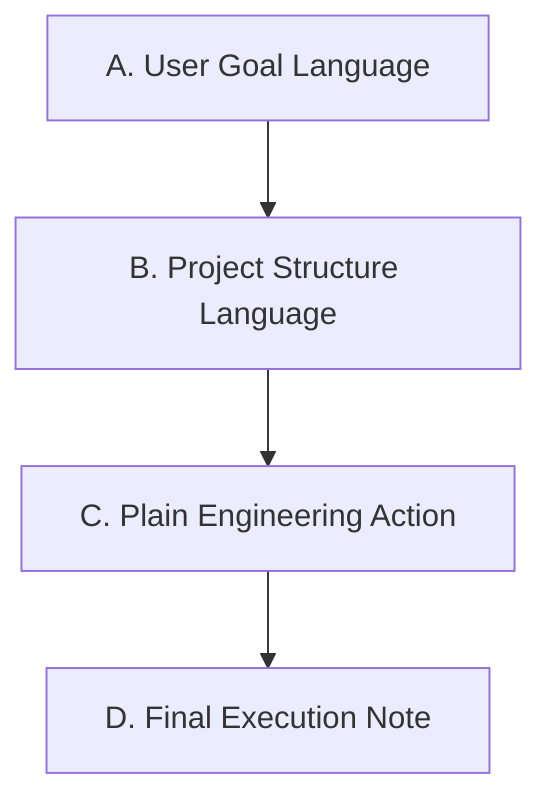

# Natural Language Routing

## 1. Purpose

Natural language routing is the default user entry for `specFlow`.

It exists because users often know the outcome they want, but they usually do not know which command, object family, or governance flow should own that work.

Natural language routing is a user-goal governance entry, not a command-alias system.
It must diagnose the user's goal in ordinary language, read the current repository truth needed for that diagnosis, choose the legal specFlow route internally, and explain the current state and next action in language the user can understand.

It answers seven questions:

1. whether the request belongs to `specFlow`
2. which repository truth must be read before routing
3. which intent fragments are present in the request
4. whether the intent is complete enough to route
5. whether a complex request can be decomposed safely
6. which smallest legal next step owns the first action
7. when routing must stop at a checkpoint instead of guessing

This file defines the routing, goal-diagnosis, chain-assembly, and intent-closure rules for non-exact natural-language requests.
It does not replace standard commands.
It decides which existing command, governance flow, or checkpoint is legal to enter first.

---

## 2. Entry Shape Rule

Users may start `specFlow` work with ordinary natural language.

Examples:

```text
Add rate limiting to the auth unit.
This checkout behavior changed. Update the truth first, then implement it.
Extract the common error protocol used by auth and checkout.
Continue the next step for payment.
Check whether the current governance flow still closes correctly.
```

Rules:

1. users are not required to choose a standard command before work can start
2. users may still use explicit command syntax when they want exact control
3. executors must separate request shape from request intent
4. executors must route by repository truth and intent closure, not by keywords alone
5. when the route is not stable, executors must stop and ask only for the smallest missing input that blocks routing
6. executors must not require users to understand or choose specFlow object-family names before routing
7. executor-facing object names such as `unit`, `scenario`, `shared_contract`, `system_constraints`, and `repository_mapping` may appear only in execution trace notes, not as the user's required decision language

There are only three entry shapes:

1. exact standard command
   - the request matches one `unit` or `scenario` command form defined by `command_policy.md`
   - route through `command_policy.md` and the matching command file
2. exact governance review entry
   - the request is exactly `spec_flow_review` or `spec_flow_design_review`, with or without an explicit narrowing phrase
   - route through the matching review policy
3. natural-language request
   - every non-exact request that describes desired work, including requests that mention implementation, review, shared truth, mapping, or system constraints
   - route through this file first

Direct implementation is not an entry shape.
It is an intent fragment that may appear inside a natural-language request.

---

## 2.1 User-Facing Intake

Natural-language intake must start from the user's goal, not from command names.

The executor must translate user wording into specFlow ownership internally.
It must not ask the user to classify the request as a `unit`, `scenario`, `shared_contract`, `system_constraints`, or `repository_mapping` request unless the user already chose those terms and the route still needs confirmation about their intended meaning.

User-facing communication must use this language priority:



Rules:

1. `A. User Goal Language` answers the user's actual question first.
2. `B. Project Structure Language` uses the current repository's capability areas, delivery surfaces, entry points, and responsibility areas.
3. `C. Plain Engineering Action` describes the action in ordinary engineering terms such as checking whether a design can support development, confirming code and design alignment, or turning confirmed design into a development plan.
4. `D. Final Execution Note` is the only user-visible place where internal routing names, command names, lifecycle state names, or policy-file trace details may appear.
5. project structure language must come from current repository truth or terms already used by the user.
6. project structure language must describe responsibility or delivery meaning, not merely list directory names when a clearer responsibility phrase exists.
7. if current repository truth does not clearly identify the relevant project structure, say that the structure ownership is unclear instead of inventing a friendly label.

For user-facing communication:

1. describe the user's goal in ordinary language
2. describe the current project state through project structure language
3. describe the next action as a plain engineering action
4. describe why that action is required by the current project state
5. describe the expected result of the next action
6. describe only the remaining blocker that the user can answer or verify
7. keep internal trace details out of the main answer body

Examples of allowed user-facing questions:

```text
Do you want to change one local capability, or prove a full user flow from input to final result?
What result should a user see when this works?
Which behavior should stay out of the first version?
Can you confirm whether this manual effect is acceptable after the automated checks have passed?
```

Examples of disallowed user-facing questions:

```text
Is this a unit or a scenario?
Should I route this to shared_bind or shared_topology?
Which specFlow command family owns this?
```

The executor may still name internal object families in final or stop reports when doing so helps traceability, but those names must not be the user's required decision vocabulary.
Those names may appear only in a final execution note after the ordinary project-structure explanation.

When an internal state or command affects user-facing text, translate it before using it in the main answer:

1. `candidate` means a design description that is still being confirmed for the current round.
2. `stable` means an accepted design baseline.
3. `unit_check` means checking whether the design description is strong enough to support the next development step.
4. `unit_plan` means turning the confirmed design into an executable development plan.
5. `unit_impl` means implementing according to the confirmed plan.

---

## 3. Scope

Natural language routing may identify fragments that later route into:

1. standard `unit` commands
2. standard `scenario` commands
3. governance review flows
4. implementation classification through `implementation_change_policy.md`
5. repository mapping handling
6. shared-governance branching into the internal shared flows
7. system-constraint boundary handling through the responsible unit candidate truth
8. framework skills under `specflow/framework/skills/`

Natural language routing does not:

1. create a new lifecycle object
2. create a new user-facing shared command
3. allow implementation before required truth writeback
4. allow chat-only decisions to replace durable truth
5. authorize a full multi-step chain to run automatically just because a sequence can be described
6. make guidance output durable truth before it is written into candidate, appendix, Shared Contract, repository mapping, or system-constraint truth
7. create a persistent `feature`, `project_flow`, or other umbrella lifecycle object above `unit` and `scenario`
8. force every user request into an end-to-end scenario when current repository truth and user wording prove a narrower legal route

---

## 4. Required Read Surface

Before routing, read only the truth needed for the request.

Fixed read rules:

1. if the request is an exact standard command, stop natural-language routing and follow `command_policy.md` plus the matching command file
2. if the request is an exact governance review entry, stop natural-language routing and follow the matching review policy
3. if the request is not an exact entry, identify intent fragments before choosing a command or governance flow
4. if any fragment may modify repo-tracked code, tests, config, migrations, build scripts, or other implementation-side files, read `implementation_change_policy.md` before any implementation-side edit
5. if the request names existing formal `unit` or `scenario` objects, read `docs/specs/_status.md` before resolving their current-layer files
6. if the request depends on path ownership, repository structure, support surfaces, or object boundaries, read `docs/specs/repository_mapping.md`
7. if the request depends on cross-unit shared truth, shared binding, shared topology, or shared impact, use the Shared Governance Branch in this file and read the relevant Shared Contract files plus the selected internal shared-flow file
8. if the request may affect global default rules, shared mechanisms promoted into the global baseline, or explicit global exceptions, read `docs/specs/system_constraints.md`
9. if a governance-review fragment remains after natural-language parsing, read the governance file that defines that review scope before reading unrelated object state
10. if a `guidance` fragment is present, read `specflow/framework/skills/using-specflow-guidance/SKILL.md` and then only the specific guidance skill needed for the current blocker

The executor must not read every file by default.
The executor must read enough current truth to prove the route, the missing blocker, or the safe first step.

---

## 5. Intent Fragments

The executor must break a natural-language request into intent fragments before routing.

An intent fragment is the smallest recognizable part of the request that may need its own governance owner.
Fragments are not mutually exclusive.
One request may contain implementation, unit truth, shared truth, and review fragments at the same time.

Allowed fragment families are:

1. `unit_truth`
   - the request creates, changes, verifies, promotes, or repairs one unit's formal truth
2. `scenario_truth`
   - the request creates, changes, verifies, or promotes an end-to-end trigger-to-outcome chain
3. `shared_truth`
   - the request creates, extracts, binds, restructures, retires, or impact-checks cross-unit shared truth
4. `repository_mapping`
   - the request depends on path ownership, object boundaries, support surfaces, or repository structure truth
5. `system_constraints`
   - the request may change a repository-wide default rule, global mechanism, prohibition, or explicit exception
6. `implementation`
   - the request asks to create, modify, or delete repo-tracked code, tests, config, migrations, build scripts, or other implementation-side files
7. `governance_review`
   - the request asks to review the governance mechanism or design
8. `guidance`
   - the request asks to clarify a vague project idea, cut scope, compare solution directions, review a discussion-stage design, or write an approved guidance conclusion into candidate truth
9. `explanation_only`
   - the request asks only for explanation and does not need repository mutation

Intent fragments are executor-facing.
They are not the user's required vocabulary.
When a user describes a messy or non-technical request, the executor must still infer these fragments from the user's goal and current repository truth instead of asking the user to name them.

For each fragment, the executor must record these facts in working judgment before routing:

1. the recognized intent
2. the possible formal object or governance owner
3. the repository truth used as evidence
4. the missing information, if any
5. whether the fragment may change formal behavior, boundary, acceptance, shared, or system truth

Implementation fragment rules:

1. the presence of an `implementation` fragment does not mean the request may start from code
2. `implementation_change_policy.md` decides whether implementation may continue under current truth
3. if that policy returns `truth_writeback_required` or `boundary_unclear`, route to the required truth or boundary step before implementation
4. if a request has both implementation and truth fragments, truth routing wins unless the policy proves that implementation is already allowed by current truth

Guidance fragment rules:

1. guidance is used before formal truth writeback when the project goal, first-round scope, solution direction, or writeback-ready design is not yet clear enough to become candidate truth
2. guidance must not create `_check_result`, `_plans/active`, `_verify_result`, or `_status.md` updates
3. guidance conclusions remain chat context until written into the correct formal truth target
4. once guidance produces an approved conclusion that affects behavior, boundary, acceptance, shared truth, repository mapping, or system constraints, the next legal step is formal truth writeback followed by rerouting from current truth
5. guidance must not intercept exact standard commands or exact governance review entries

---

## 5.1 Work Shape Classification

Before choosing a formal owner, classify the user request by work shape.
Work shape is the ordinary-language form of the requested work, not the specFlow object that will own it.

Allowed work shapes are:

1. `end_to_end_outcome`
   - the user wants a visible result across a full trigger-to-outcome path
   - typical owner shape: `scenario` plus any affected `unit`, `shared_contract`, or baseline work
2. `local_capability_change`
   - the user wants one bounded capability or behavior changed without asking to prove a full user flow
   - typical owner shape: one `unit`, or repository mapping first when ownership is unclear
3. `flow_verification`
   - the user wants to know whether a declared path, integration, or user flow works
   - typical owner shape: `scenario` verification or stable verification
4. `shared_rule_change`
   - the user wants one rule reused by more than one formal object
   - typical owner shape: shared-governance branch
5. `global_constraint_change`
   - the user wants a repository-wide default, prohibition, mechanism rule, or explicit exception changed
   - typical owner shape: system-constraint handling through the responsible current candidate truth
6. `structure_or_ownership_change`
   - the user asks where paths, boundaries, support surfaces, or object ownership belong
   - typical owner shape: `repository_mapping`
7. `implementation_repair_or_adjustment`
   - the user asks to fix, refactor, optimize, test, or edit code or implementation-side artifacts
   - typical owner shape: implementation classification before any implementation-side edit
8. `governance_mechanism_change`
   - the user asks to change specFlow rules, command behavior, project standards, or governance entry behavior
   - typical owner shape: the relevant framework or standards rule file, with required governance close-out
9. `explanation_only`
   - the user asks to understand current behavior or current governance state without requesting mutation

Rules:

1. classify from the user's desired outcome, stated scope, current repository truth, and required verification meaning
2. do not classify from keywords alone
3. one request may have multiple work shapes
4. when multiple shapes are present, choose the first legal step by the routing procedure and record the remaining chain in `routing_steps_contract` when safe
5. if the user clearly limits the work to a local capability, local path, local rule, or local verification, do not force an `end_to_end_outcome` route unless current truth proves that the local request cannot be safely handled without the broader flow
6. if the user describes a user-visible outcome, a complete workflow, or a trigger-to-result promise, test whether `end_to_end_outcome` is the governing work shape before selecting a local-only route

---

## 6. Routing Procedure

Route in this order:

1. if the request is an exact standard command, leave this file and execute command routing through `command_policy.md`
2. if the request is an exact governance review entry, leave this file and execute the matching review policy
3. otherwise treat the request as natural language and perform goal diagnosis
4. classify the work shape before choosing the formal owner
5. identify all intent fragments needed to route the classified work shapes
6. apply mandatory gates for every fragment, especially `implementation_change_policy.md` for implementation fragments
7. resolve repository mapping boundary checks before claiming `unit` or `scenario` ownership
8. resolve existing `unit` or `scenario` object state through `_status.md`
9. route shared-truth fragments through the Shared Governance Branch in this file
10. route system-constraint boundary handling through the responsible unit candidate truth
11. route guidance fragments through the smallest applicable guidance skill when the request is not yet clear enough for formal truth writeback or a standard command
12. assemble the internal development chain when the request spans more than one formal object or work shape
13. handle explanation-only fragments only after confirming that no mutation, guidance, or governance route is required

This order is a decision order, not permission to skip required reads.
If a later family is needed to decide an earlier family safely, read the later family's truth as input before choosing the route.

---

## 6.1 Goal Diagnosis

Goal diagnosis is mandatory for every non-exact natural-language request.

The executor must record these facts in working judgment before selecting the first route:

1. `user_goal_summary`
   - the requested outcome in ordinary language
2. `success_meaning`
   - what would prove to the user that the work is complete
3. `scope_signal`
   - whether the user described a local capability, an end-to-end flow, a shared rule, a global rule, repository structure, implementation repair, governance change, or only an explanation
4. `current_state_signal`
   - which current repository truth was needed to understand the state
5. `risk_signal`
   - whether proceeding without truth writeback could encode a new behavior, boundary, acceptance, shared, system, or repository-structure decision
6. `missing_user_input`
   - the smallest ordinary-language fact that the user must provide, if any

Rules:

1. do not ask the user for facts that can be derived from repository truth
2. do not ask the user to choose an internal command or governance-flow name
3. when the goal is messy or contradictory, ask only for the missing outcome, boundary, or success fact that blocks routing
4. when a recommended legal route can already be derived from current truth, take that route and explain the reason instead of asking a broad preference question

---

## 6.2 Formal Owner Resolution

After goal diagnosis and work-shape classification, resolve the formal owner from current repository truth.

Formal owner resolution must use:

1. `docs/specs/_status.md` for existing command-target object state
2. `docs/specs/repository_mapping.md` for path ownership, object boundaries, support surfaces, and current formal object maps
3. the current-layer Spec for the candidate or stable object when behavior truth may already exist
4. bound Shared Contract files when shared rules may own or constrain the request
5. `docs/specs/system_constraints.md` when global defaults, shared mechanisms, prohibitions, or exceptions may own or constrain the request
6. the relevant framework or project-standard rule file when the request changes governance behavior

Rules:

1. do not guess formal ownership from directory names, user labels, or keyword matches alone
2. do not ask the user to choose between formal owner names when repository truth can resolve the owner
3. when more than one owner remains plausible and the choice changes formal truth, stop through a `decision` checkpoint using ordinary-language options
4. when ownership depends on missing repository-structure truth, the smallest legal next step is repository mapping writeback
5. when a request is local in user wording but current truth proves a downstream scenario, shared rule, or global baseline is affected, include that impact in the internal chain and explain the user-visible consequence

---

## 6.3 Development Chain Assembly

Development chain assembly is required when one user goal spans multiple formal owners or when one formal owner may invalidate downstream owners.

The chain is an internal execution model.
It must not become a new lifecycle object.

Allowed chain components are existing specFlow routes only:

1. `scenario` chain for trigger-to-outcome truth and end-to-end verification
2. `unit` chain for unit truth, planning, implementation, verification, and promotion
3. shared-governance branch for shared truth and shared impact reconciliation
4. system-constraint handling through the responsible candidate truth or declared governance route
5. repository mapping writeback for ownership and structure truth
6. implementation classification for direct code or test changes

For an `end_to_end_outcome`, the normal internal chain is:

```text
user goal -> scenario truth -> unit_refs -> affected unit chains -> scenario verification -> scenario promotion
```

For a local capability change, the normal internal chain is:

```text
user goal -> formal owner resolution -> current owner lifecycle next step -> downstream impact reconciliation when required
```

For shared or global changes, the normal internal chain is:

```text
user goal -> shared/system owner resolution -> required truth writeback -> downstream impact reconciliation -> affected unit or scenario rerouting
```

Rules:

1. chain assembly may describe the whole likely route, but it authorizes only the current smallest legal step
2. after every truth writeback, lifecycle-state update, or process-file invalidation, rerun natural-language routing from current repository truth before continuing later chain steps
3. `scenario_verify` may report `affected_units`, but those units must re-enter their own legal unit command chain; scenario commands must not perform unit-local repair
4. when a local request is already legally bounded and does not require end-to-end proof, do not create or require a scenario solely because scenarios exist
5. when an end-to-end promise cannot be proven by a local unit result alone, do not claim user-goal closure until the scenario side of the chain is verified or the missing scenario truth is explicitly routed

---

## 7. Intent Closure Rules

### 7.1 Single Clear Intent

When exactly one intent fragment has one stable owner and one legal next step, route directly to that smallest legal step.

Example:

1. the user says "continue payment"
2. `_status.md` shows `unit:payment` has `Next Command=unit_plan`
3. route to `unit_plan:payment`

### 7.1.1 Guidance Intent

When the request is a design or project-shaping request that is not yet ready for formal truth writeback, route to the smallest applicable guidance skill.

Allowed guidance skill entry points are:

1. `using-specflow-guidance`
2. `project-framing`
3. `scope-cutting`
4. `solution-design`
5. `design-quality-review`
6. `spec-writeback-guidance`

Guidance routing rules:

1. use `project-framing` when goal, user, problem, success meaning, or first-version non-goals are unclear
2. use `scope-cutting` when the request is too broad for one candidate round or mixes independent capabilities
3. use `solution-design` when the goal and scope are clear but the solution direction is not locked
4. use `design-quality-review` only before candidate writeback, to review a discussion-stage design
5. use `spec-writeback-guidance` only after the user has approved a design conclusion that must become formal truth
6. if a guidance step produces writeback-ready content, rerun natural-language routing from current repository truth before any implementation step
7. if the request already names an exact standard command, do not route to guidance

### 7.2 Multiple Fragments With Safe Order

When several fragments are present, the executor may decompose the request only when current repository truth proves that the order is safe.

Safe order means:

1. the first step is the smallest legal next step
2. completing the first step cannot make a later step's formal owner ambiguous
3. the sequence does not require choosing between unit-local truth, Shared Contract truth, or system constraints before the first step
4. no implementation step comes before required truth writeback

When safe decomposition exists, the executor must emit an execution-local `routing_steps_contract` and enter only the first legal step.

### 7.3 Multiple Fragments With Unsafe Order

When several fragments are present and their order would change formal truth, the executor must stop with a `decision` checkpoint.

Unsafe order exists when at least one of these holds:

1. the same rule could legally land in unit truth, Shared Contract truth, or system constraints
2. extracting shared truth before unit candidate writeback would change the formal source of truth
3. promoting a system default before shared topology is settled would change downstream responsibility
4. implementation could encode a behavior choice that has not yet been written into truth

### 7.4 Missing Intent

When routing needs a target object, scope boundary, success meaning, acceptance condition, or user decision that cannot be derived from current repository truth, the executor must stop with a `clarification` checkpoint.

The question must ask only for the missing input that blocks routing.
The executor must not ask broad preference questions when a recommended legal path can already be derived from current truth.

### 7.5 Missing Boundary Truth

When path ownership, object boundary, or support-surface ownership is not explicit enough to route safely, the smallest legal next step is repository mapping writeback.

The executor must not guess `unit` or `scenario` ownership from directory shape alone.

### 7.6 Prerequisite Action

When the current route is known but cannot legally continue until one upstream action creates the required writeback target, the executor must stop with a `prerequisite_action` checkpoint.

Typical cases:

1. a stable unit needs candidate truth before shared or implementation writeback can continue
2. repository mapping must be updated before unit or scenario ownership can be claimed
3. a candidate truth target must exist before a decision can become durable truth

---

## 8. `routing_steps_contract`

`routing_steps_contract` is an execution-local contract used only for the current natural-language handling round.

It is not durable truth.
It must be discarded if the handling round stops before final closure.

It must include at least:

1. `recognized_intent`
2. `intent_fragments`
3. `user_goal_summary`
4. `work_shape`
5. `formal_owner_judgment`
6. `internal_chain`
7. `step_order`
8. `current_step`
9. `remaining_steps`
10. `user_visible_next_action`
11. `blocked_question_plain_language`
12. `why_order_is_safe`
13. `durability=execution_local`
14. `resume_rule=rerun_natural_language_routing_from_current_truth_if_interrupted`

Rules:

1. the first step in `step_order` must be the smallest legal next step
2. `remaining_steps` must not be treated as authorization to continue after the first step without rerouting from current truth
3. if the first step changes truth, later steps must be revalidated against the updated truth
4. a contract may describe the whole safe sequence, but it authorizes entry only into `current_step`
5. `internal_chain` records the executor's current chain understanding only; it is not a durable project plan and must not bypass command gates
6. `user_visible_next_action` must be phrased as the action the user can understand, even when `current_step` names an internal command or governance flow
7. `blocked_question_plain_language` must be `none` unless the route is blocked by a user-answerable fact; when present, it must ask for the smallest missing ordinary-language input

---

## 9. Checkpoint Rules

Natural language routing uses `specflow/framework/checkpoint_protocol.md`.

Allowed checkpoint types are:

1. `clarification`
2. `decision`
3. `prerequisite_action`

Rules:

1. `clarification` is used when target, scope, success meaning, acceptance meaning, or boundary intent is missing
2. `decision` is used when two or more legal routes remain and the choice changes formal truth
3. `prerequisite_action` is used when one upstream command or truth writeback target must exist before the route can continue
4. `required_writeback_target` must name the durable target when the answer affects behavior, boundary, shared, system, or acceptance truth
5. `resume_next_step` must be rerunning natural language routing from current repository truth unless a more specific command file declares a narrower legal resume
6. checkpoint questions raised from natural-language routing must be phrased in ordinary user-goal language, not as a demand to choose an internal object family or command name

Natural language routing must not use checkpoints to avoid technical investigation that the executor can perform.

---

## 10. Shared Governance Branch

Shared work is entered through natural language routing.
There is no user-facing shared command shape.
Users describe the shared intent in ordinary language, and this branch decides the smallest legal internal shared flow.

This branch handles only cross-unit shared-truth governance.
It may route into:

1. `shared_new`
2. `shared_extract`
3. `shared_bind`
4. `shared_topology`
5. `shared_sync`
6. `shared_escape`

This branch does not:

1. replace unit command chains
2. replace `unit_check`, `unit_plan`, `unit_impl`, `unit_verify`, or `unit_promote`
3. create an independent `system_constraints` command chain
4. allow the executor to invent an ad hoc shared flow outside the routed internal shared flows listed here

Before routing a shared-governance request:

1. read `specflow/framework/spec_policy.md`
2. read `specflow/framework/command_policy.md`
3. read `specflow/framework/checkpoint_protocol.md` because shared governance may stop through a structured checkpoint
4. read `docs/specs/_status.md` when the request names existing formal units
5. resolve each named existing unit's current layer from `_status.md` before reading its main Spec
6. read the current relevant unit candidate or stable files after current-layer resolution
7. read any explicitly referenced appendix truth needed to judge whether the real source truth is unit-local, shared, or still boundary-unstable
8. if the request names units that do not yet have current-layer Spec files, do not block on that absence before routing
9. read the relevant `shared_contract` files if the request names shared truth directly
10. read `docs/specs/system_constraints.md` when the request may cross the boundary into global-default-rule promotion
11. if the request may route to `shared_sync`, inspect the directly affected current-round Shared Contract files needed to judge whether any of those files changed only in `bound_objects`

The executor must not route by keyword alone when the named files already show a different formal situation.

### 10.1 Shared Flow Routing

Use `shared_new` only when the request clearly means:

1. the user wants to design shared truth from the start, or open the next candidate-layer round for an already-independent shared object
2. that truth is intended to exist independently rather than first living in one unit appendix
3. the main task is shaping shared truth itself rather than binding one unit to it or only checking downstream impact

Use `shared_extract` only when the request clearly means:

1. truth already exists inside one or more units
2. that truth should now be extracted into one independent `shared_contract`
3. the main task is the boundary extraction itself

Use `shared_bind` only when the request clearly means:

1. a `shared_contract` already exists
2. a unit now needs to consume it
3. the main task is binding and unit-side explanation, not redesigning the shared truth itself

Use `shared_sync` only when the request clearly means:

1. a `shared_contract` changed
2. the user wants to know which units or scenarios are affected
3. the main task is state fallback, snapshot invalidation, or impact closure

Use `shared_topology` only when the request clearly means:

1. one or more existing `shared_contract` objects need structural topology change or terminal-state resolution
2. the main task is not simple first-time authoring, extraction, one-unit binding, or impact check
3. the round must decide which touched shared objects stay, which are replaced, and which must be deleted or explicitly kept

Use `shared_escape` when the request cannot be stably routed into exactly one standard shared flow.
This is mandatory when at least one of these holds:

1. one request simultaneously hits more than one standard shared flow and the action order matters to formal truth
2. the request is really redrawing the boundary between unit-local truth and shared truth
3. the request simultaneously involves shared restructuring and `system_constraints_change_proposal`
4. current repository truth is insufficient to stably judge which part belongs to shared and which part stays unit-local

### 10.2 Shared Branch Procedure

The shared-governance branch follows this procedure:

1. confirm the request really belongs to cross-unit shared-truth governance
2. resolve relevant repository truth before routing:
   - use `_status.md` to resolve current layer for any named existing formal unit
   - read current-layer appendix truth whenever the routing decision depends on where the formal truth currently lives or whether unit-local versus shared boundary is already stable
   - read named `shared_contract` files when shared truth is named directly
   - read `system_constraints.md` when the request may cross the shared/system boundary
3. test whether the request belongs to exactly one of `shared_new`, `shared_extract`, `shared_bind`, `shared_topology`, or `shared_sync`
4. if routing to `shared_sync`, decide whether any directly affected current-round Shared Contract file is provably `bound_objects`-only:
   - derive that judgment from current repository truth and the current-round changed shared files
   - treat a file as `bound_objects`-only only when the current round can explicitly prove that no other frontmatter field, body text, layer target, version target, or binding target changed for that file
   - if one or more files satisfy that proof, pass execution-local `bound_objects_only_shared_file_refs=<comma-separated-file-refs>` into `shared_sync` with the exact repository paths for those files
   - if current repository truth is insufficient to prove that a directly affected file is `bound_objects`-only, do not pass that file under the metadata-only exception
5. if exactly one standard shared flow applies, route to that flow
6. if routing is not stable, enter `shared_escape`
7. if the routed flow changes shared truth or unit shared bindings, do not claim closure until required reconciliation through `shared_sync` is complete
8. if the routed work makes a touched shared file lose its last formal binding, do not claim closure until the owner of that binding or topology change has either resolved that file's terminal state or returned control to `shared_escape`
9. if a unit-side command such as `unit_promote` stops because post-promotion Shared Contract topology is unclear, re-enter natural-language routing from current repository truth and let it reach this shared-governance branch instead of guessing a unit-local-only continuation
10. if the request crosses into `system_constraints_change_proposal`, stop through `shared_escape` and raise a checkpoint instead of inventing a shared-side continuation
11. if `shared_escape` emitted a `remaining_steps_contract`, do not claim shared-governance closure until every listed step has finished under that contract

### 10.3 Shared Branch Closure

Fixed closure rules:

1. if `shared_new` or `shared_extract` writes `docs/specs/shared_contracts/**`, it must not claim closure until `shared_sync` has completed
2. if `shared_bind` changes any unit `shared_contract_refs`, it must not claim closure until `shared_sync` has completed
3. if `shared_topology` changes any unit `shared_contract_refs` value or any file under `docs/specs/shared_contracts/**`, it must not claim closure until `shared_sync` has completed
4. if a routed request crosses into `system_constraints_change_proposal`, the shared flow must stop through `shared_escape` and raise a shared-governance checkpoint rather than inventing a shared-side continuation
5. no internal shared flow may guess the unit current layer without resolving it from `_status.md` first when the named unit already exists
6. no internal shared flow may modify unit `stable` truth directly; if a shared request needs unit truth writeback and the target unit is currently at `stable`, the flow must stop at a shared-governance checkpoint and require `unit_fork:{unit}` first
7. if `shared_escape` emits a `remaining_steps_contract`, finishing only the first routed flow does not close shared governance
8. if a routed internal shared flow later discovers that repository truth is insufficient to continue stably, it must stop that flow and return control to `shared_escape` instead of inventing a flow-local checkpoint
9. if a routed internal shared flow changes bindings or topology so a touched shared file would have no formal bindings remaining, that same handling round must resolve the touched file's terminal state or return control to `shared_escape`; shared governance must not leave cleanup ownership implicit
10. when shared governance routes a current-round impact-check request into `shared_sync`, it must pass execution-local `bound_objects_only_shared_file_refs` for every directly affected Shared Contract file whose current-round delta is provably `bound_objects`-only, and it must not invent that metadata-only proof for any other file

### 10.4 Shared Checkpoints

A shared-governance checkpoint must follow `specflow/framework/checkpoint_protocol.md`.

Fixed rules:

1. set `entry=natural_language_routing`
2. set `branch=shared_governance`
3. set `routed_flow` to the internal shared flow that raised or owns the checkpoint
4. set `command` to the same internal shared flow recorded in `routed_flow`
5. set `unit` to the formal unit identifier only when the current stop is truly about exactly one unit
6. otherwise set `unit=none`
7. `required_writeback_target` may point to one or more shared-contract files, unit candidate files, or appendix files when those are the truth targets that must be updated before resume
8. `resume_next_step` must normally be rerunning natural language routing from current repository truth after the required truth writeback
9. when the checkpoint exists because one or more target units are still at `stable`, `required_writeback_target` must point to the future unit candidate main file set rather than the current stable file set
10. when the current flow is blocked on an upstream command creating the legal writeback target first, use `type=prerequisite_action`
11. when a routed internal shared flow raises a shared-governance checkpoint directly, the current shared-governance handling result is `blocked` rather than closed
12. when Rule 11 applies, do not treat the routed internal flow as completed merely because it reached its own stop point; shared governance remains open until the checkpoint is answered and the required follow-up has been rerun from current repository truth

---

## 11. Output Contract

When natural language routing is the active entry, the output must include:

1. a user-facing main answer
2. an execution note when traceability is needed

The user-facing main answer must be understandable without internal specFlow knowledge.
It must use the language priority defined in Section 2.1.
It must not present internal command names, lifecycle state names, object-family names, policy-file names, or formal route names as the recommended action.

The execution note may include:

1. the recognized intent
2. the routed first step or checkpoint type
3. the repository truth used to make the route
4. any missing intent or boundary input that blocked routing
5. any `routing_steps_contract` when safe decomposition was used
6. the smallest legal next step
7. why that next step is legal
8. when guidance was routed, the guidance skill selected and whether its expected result is discussion-only or candidate writeback

Execution note rules:

1. it must appear after the user-facing main answer
2. it must be short enough that it does not become the answer body
3. it must not be required for the user to understand the current state, next action, reason, expected result, or remaining blocker

### 11.1 User-Facing Report Contract

The user-facing part of the output must also include ordinary-language statements for:

1. `current state`
   - what the repository truth says now, expressed through project structure language
2. `next action`
   - what will be done first, expressed as a plain engineering action
3. `why this action`
   - why this is the legal and useful next action
4. `expected result`
   - what should be true after the next action completes
5. `remaining gap`
   - what still cannot be claimed after this step, if anything

The main answer must not make the user understand internal object-family names, command names, lifecycle state names, or governance-flow names before they can evaluate the state or next action.
Internal names may be included only in the execution note after the project-structure explanation.

If the output starts an existing standard command, the command's own output contract controls the final close-out.
That command output must still follow the user-facing language separation required by `specflow/framework/command_policy.md`.

---

## 12. Non-Goals

Natural language routing does not:

1. replace standard command files
2. let executors skip `_status.md`, `repository_mapping.md`, Shared Contract files, or `system_constraints.md` when those files are needed
3. turn user preference into truth without writeback
4. treat a multi-step plan as completed because the first step was routed
5. create a direct user-facing shared command shape
6. create compatibility aliases for retired user-facing shared entries
7. let guidance skills replace candidate truth, command gates, or verification evidence
8. make users responsible for selecting internal specFlow object families or internal shared-governance flow names
9. claim an end-to-end user goal is complete when only a local capability step has been completed and the required chain verification is still missing
