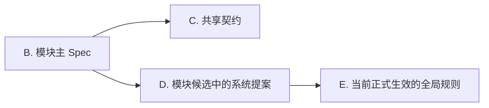

# 图表语法兼容

- 原则：跨渲染器的可移植性优先于“炫技写法”，尽量使用最稳妥、最保守的语法子集。
- 写法：节点统一采用 `ID["label"]`；文案尽量用纯文本，避免在节点文本里混用复杂符号、HTML 标签、深层嵌套标点。
- 节点指代规则：正文说明默认直接使用节点在图里显示出来的文字，不要只用 `A`、`B`、`C` 这类字母代称节点。
- 短代号显示规则：如果为了讲解顺序、分支关系或多次引用，确实需要给节点加短代号，那么短代号必须直接写进节点显示文本里，保证图内和说明里能一眼对上。例如使用 `B["B. 模块主 Spec"]`，不要写成 `B["模块主 Spec"]` 然后在图外单独解释“B 是模块主 Spec”。
- 一致性规则：正文里对节点的称呼，必须和图里可见文本一致。不要出现“图里写完整中文，正文只说字母”或“图里写缩写，正文换另一套简称”这两套名字并存的情况。
- Mermaid 注意：标题文本里避免使用英文分号 `;`（部分渲染器会把它当成语句分隔符，导致解析报错）；需要分隔时用中文逗号 `，`、顿号 `、` 或直接空格。
- 提交前自检：至少做一次渲染校验；若出现解析异常，优先简化文案与结构，再考虑功能性增强。
- 可读性自检：检查图外说明是否能在不猜字母映射的前提下直接读懂。只要说明里出现节点代号，就必须能在图节点文本里直接看到同一个代号。
- 经验抽象要求：记录“可迁移规则”和“预防动作”，避免只写一次性事故细节。

推荐写法示例：

对应说明示例：

- `B. 模块主 Spec` 会引用 `C. 共享契约`。
- `D. 模块候选中的系统提案` 最终受 `E. 当前正式生效的全局规则` 约束。

不推荐写法示例：

- `B` 会引用 `C`。
